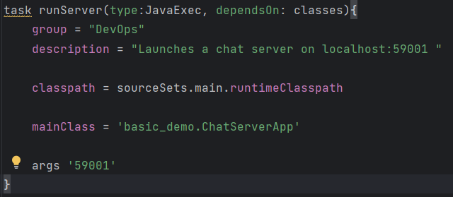
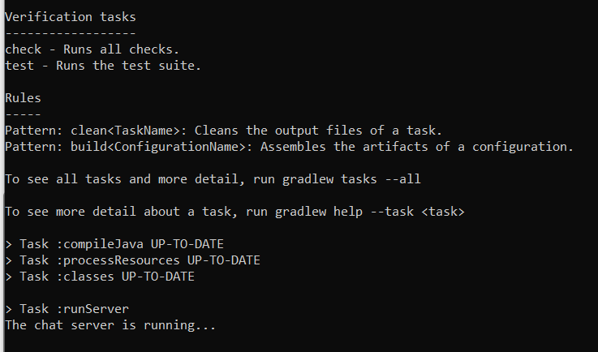
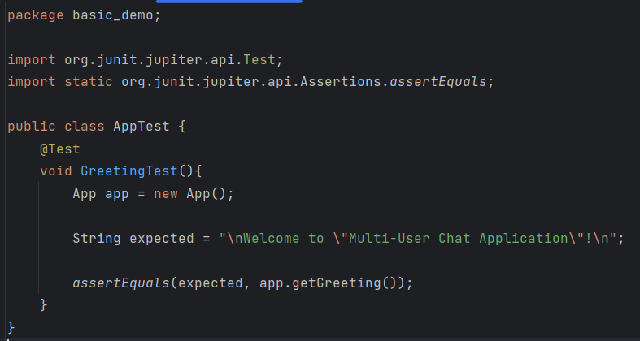
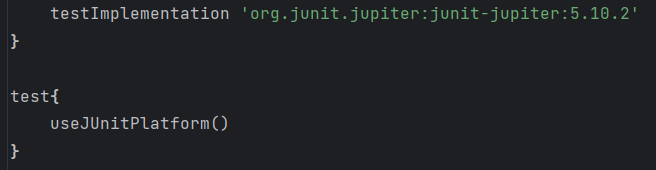
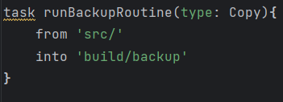
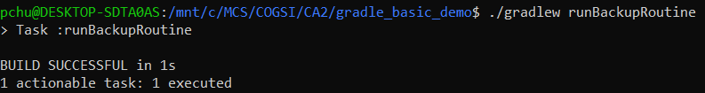
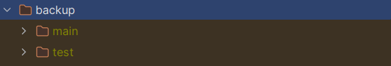
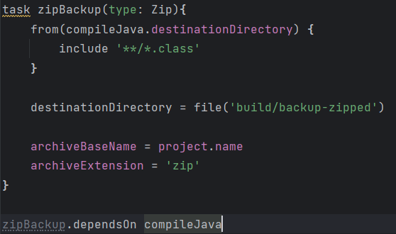
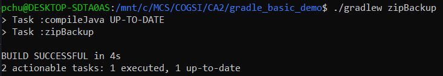
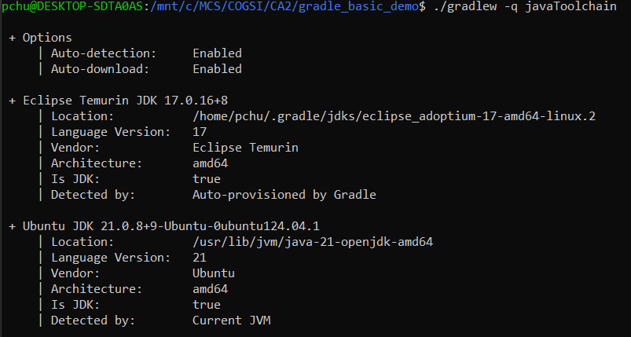

# CA2 - Build Tools (Part I)
After downloading the gradle_basic_demo source code from **"https://github.com/lmpnogueira/gradle_basic_demo"**, we proceeded with the creation of a new branch, in order to solve the first part of class assignment II. To create and start operating in the new branch, the following commands were executed:

```bash
git branch Gradle-W1
git branch
git switch Gradle-W1
```

## Add a tag to mark the application version
You should use a pattern like **major.minor.revision** for your tags (e.g ca2-v1.1.0).
```bash
git tag -a ca2-v1.1.0 4b6bc11 
```
The command above will stage the tag "ca2-v1.1.0" to the commit 4b6bc11, and the following command will push that tag to the remote repository **COGSI2526_1250503_1250506_1250545**
```bash
git push origin ca2-v1.1.0 
```

## Add a runServer task to build.gradle
Start by creating the following task inside build.gradle.



Then, run the command **./gradlew task runServer**. The result should look like this:



When a chatter joins the server, the terminal output should be something like this:


## Add a simple unit test to the source code and change build.gradle to accomodate the test
Create `test/java/basic_demo` directories inside the `src` folder of the source code and create a java file (i.e AppTest). Write the following test:



You'll need to make some changes to your build.gradle in order to add JUnit dependencies. To achieve that, make sure your build.gradle has the following lines of code:



To run the test, use the command **./gradlew test**. The output should be something like this:


## Add a new task of type Copy, to be used to make a backup of the source code of the application 
To add a new task **"runBackupRoutine"**, inside your build.gradle file you'll have to add the following code:



After adding the code to the build.gradle file, execute the command **./gradlew task runBackupRoutine**. The output should look like this:



The runBackupRoutine task will create a new folder named **backup** inside the **build** directory.


## Add a new task of type Zip, to be used to make an archive (i.e .zip) of the backup of the application
To add a new task **"zipBackup"**, inside your build.gradle file you'll have to add the following code:



After adding the code to the build.gradle file, execute the command **./gradlew task zipBackup**. The output should look like this:



The zipBackup task will create a new folder named **backup-zipped** inside the **build** directory.


## Explanation of how the Gradle Wrapper and the JDK Toolchain ensure the correct versions of the Gradle and the JDK are used without requiring manual installation
When you run the command **./gradlew -q javaToolchain** in the terminal you'll get a similar result to the one in the image below.



### Gradle Wrapper
The **Gradle Wrapper** and the **JDK Toolchain** work together to ensure the correct versions of Gradle and JDK are used for a project without requiring manual installation on each machine.

The Graddle Wrapper is a script (`gradlew`/ `gradlew.bat`) included in the project that:

- Automatically downloads and uses the specific Gradle version configured for the project.
- Ensures that all developers and CI environments use the same Gradle version, avoiding version conflicts.
- Works independently of any system-installed Gradle. 

In the image above, Gradle has auto-detected and provisioned:
- Eclipse Temurin JDK 17.0.16+8 
- Location: /home/pchu/.gradle/jdks/eclipse_adoptium-17-amd64-linux.2
- Language Version: 17
- Vendor: Eclipse Temurin
- Architecture: amd64
- Is JDK: true
- Detected by: **Auto-provisioned by Gradle**

### JDK Toolchain
Gradle's JDK Toolchain feature allow specifying the exact version required for compiling and running the project, regardless of the system default.

In the output **two** JDKs are available:
- **Eclipse Temurin JDK 17.0.16+8**, auto-provisioned by Gradle
- **Ubuntu JDK 21.0.8+9**, system installed

Gradle can choose the correct JDK (e.g 17) for the project build, even though the system has JDK 21 installed globally.

### How they work together
1. The Graddle Wrapper ensures the right Gradle version is used.
2. The JDK Toolchain ensures the correct Java version is used for compiling and running the code.
3. Both tools eliminate the need for developers to manually install or configure Gradle and JDK versions.

This ensures **consistency** across all environments, as demonstrated in the output where Gradle auto-provisions JDK 17 for the project, even though JDK 21 is installed on the system.

## Add a new tag, to mark commit <hash> as last of the CA2-Part I


# Self-Evaluation
```bash
Daniel (1250503) - 80%
Diogo (1250506) - 80%
Pedro (1250545) - 100%
```
