# CA2 - Build Tools (Part I)
After downloading the `gradle_basic_demo` source code from **"https://github.com/lmpnogueira/gradle_basic_demo"**, create a new branch to address the first part of the Class Assignment II. The following commands were executed to create the branch and start working in it:
```bash
git branch Gradle-W1 # Create a new branch named "Gradle-W1".
git branch # Verify the branches and confirm which one is active.
git switch Gradle-W1 # Switch from current branch ("main") to the "Gradle-W1" branch.
```

## Add a tag to mark the application version
It is recommended to use a **major.minor.revision** pattern for your tags (e.g., `ca2-v1.1.0`).
```bash
git tag -a ca2-v1.1.0 4b6bc11 
```
This command stages the tag `ca2-v1.1.0` on commit `4b6bc11`. To push the tag to the remote repository **COGSI2526_1250503_1250506_1250545**, execute:
```bash
git push origin ca2-v1.1.0 
```

## Add a runServer task to build.gradle
First, create the following task inside `build.gradle`.


This task will execute the code in `ChatServerApp.java` and has `59001` as argument (which will be the server port).
 
Then, in the terminal, run the command **./gradlew runServer** to rune the previously created task. The result should look like this:


The output indicates the server is up and running.

When a chatter joins the server, the terminal output should be something like this:

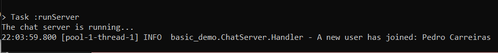

## Add a simple unit test to the source code and change build.gradle to accomodate the test
Create `test/java/basic_demo` directories inside the `src` folder of the source code and create a java file (i.e AppTest). Write the following test:


This unit test verifies that the `getGreeting()` method inside App.java returns the string `Welcome to Multi-User Chat Application!`. If it does, the test succeds and the application is executed.

You'll need to make some changes to your `build.gradle` in order to add **JUnit dependencies**. For that purpose, make sure your `build.gradle` contains these lines of code:


To run the test, inside the terminal, use the command **./gradlew test**. The output should be something like this:

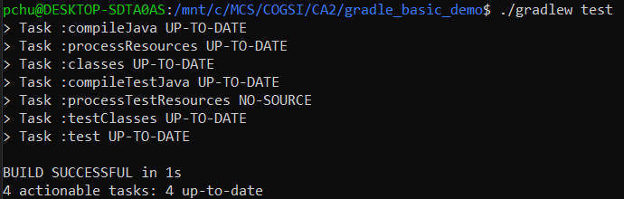

## Add a new task of type Copy, to be used to make a backup of the source code of the application 
To add a new task **"runBackupRoutine"**, you must place the following code in your `build.gradle` file:


This task copies the code from `src/` directory and pastes it into the `build/backup` directory. If the folder `backup` doesn't exist, a new one is created.

After adding the code to the `build.gradle` file, execute the command **./gradlew runBackupRoutine**, in the terminal. The output should look like this:


The **runBackupRoutine** task will create a new folder named `backup`, if it doesn't exist, inside the `build` directory.


## Add a new task of type Zip, to be used to make an archive (i.e .zip) of the backup of the application
To add a new task **"zipBackup"**, you must place the following code in your `build.gradle` file:


This snippet of code will include all the `.class` file in the newly created archive, and save it in the `build/backup-zipped` directory.

After adding the code to the `build.gradle` file, execute the command **./gradlew zipBackup**. The output should look like this:


The zipBackup task will create a new folder named `backup-zipped` inside the `build` directory.


## Explanation of how the Gradle Wrapper and the JDK Toolchain ensure the correct versions of the Gradle and the JDK are used without requiring manual installation
When you run the command **./gradlew -q javaToolchain** in the terminal you'll get a similar result to the one in the image below.


### Gradle Wrapper
The **Gradle Wrapper** and the **JDK Toolchain** work together to ensure the correct versions of Gradle and JDK are used for a project without requiring manual installation on each machine.

The Graddle Wrapper is a script (`gradlew`/ `gradlew.bat`) included in the project that:

- Automatically downloads and uses the specific Gradle version configured for the project.
- Ensures that all developers and CI environments use the same Gradle version, avoiding version conflicts.
- Works independently of any system-installed Gradle. 

In the image above, Gradle has auto-detected and provisioned:
- Eclipse Temurin JDK 17.0.16+8 
- Location: /home/pchu/.gradle/jdks/eclipse_adoptium-17-amd64-linux.2
- Language Version: 17
- Vendor: Eclipse Temurin
- Architecture: amd64
- Is JDK: true
- Detected by: **Auto-provisioned by Gradle**

### JDK Toolchain
Gradle's JDK Toolchain feature allow specifying the exact version required for compiling and running the project, regardless of the system default.

In the output **two** JDKs are available:
- **Eclipse Temurin JDK 17.0.16+8**, auto-provisioned by Gradle
- **Ubuntu JDK 21.0.8+9**, system installed

Gradle can choose the correct JDK (e.g 17) for the project build, even though the system has JDK 21 installed globally.

### How they work together
1. The Graddle Wrapper ensures the right Gradle version is used.
2. The JDK Toolchain ensures the correct Java version is used for compiling and running the code.
3. Both tools eliminate the need for developers to manually install or configure Gradle and JDK versions.

This ensures **consistency** across all environments, as demonstrated in the output where Gradle auto-provisions JDK 17 for the project, even though JDK 21 is installed on the system.

## Add a new tag, to mark commit d12d44b, as last of the CA2-Part I
To mark the first part of the Class Assignment II as concluded, create the tag `ca2-part1` with the command. The `-a` attribute stages the tag to the `d12d44b` commit.
```bash
git tag -a ca2-part1 d12d44b
```
To push the tag to the remote repository **COGSI2526_1250503_1250506_1250545**, execute:
```bash
git push origin ca2-part1
```

# CA2 - Build Tools (Part II)
After downloading the `tut_rest` source code from **"https://github.com/spring-guides/tut_rest"**, a new branch was created to address the second part of the CA2. The following commands were executed to create and switch to the new branch:
```bash
git branch Gradle-W2 # Create a new branch named "Gradle-W2".
git branch # Verify the branches and confirm which one is active.
git switch Gradle-W2 # Switch from current branch ("Gradle-W1") to the "Gradle-W2" branch.
```
## Move to the `links` folder and execute the application from the command line 
To run the application from the command line, execute the command `../mvnw spring-boot:run`. Once the command is executed, the terminal should display an output similar to the example shown in the image below:

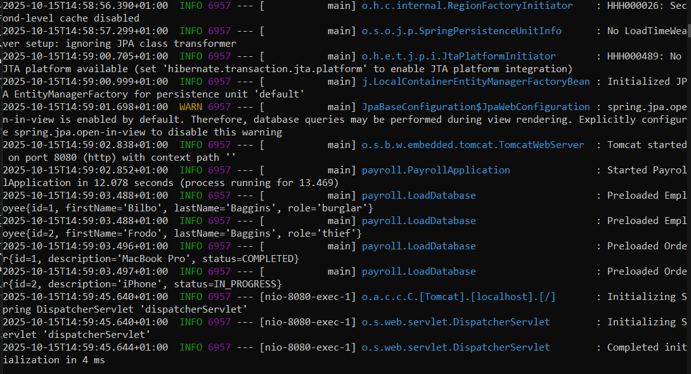 

Next, open your browser and navigate to `localhost:808/employees`. The page should display a result similar to the following image:
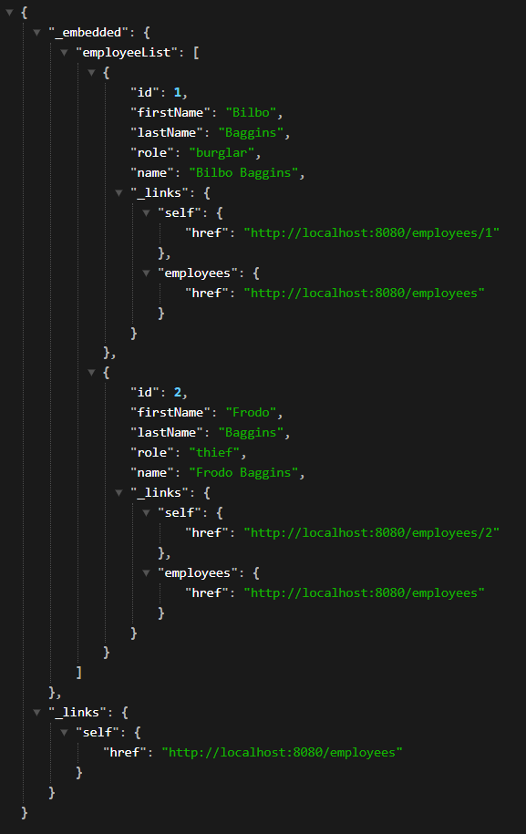

## Create a new Gradle project and integrate `tut_rest` source code
In your terminal run the command
```bash
gradle init
```
This will create a new gradle project with the default settings.
Replace the existing `App.java` with the `tut_rest` source code.
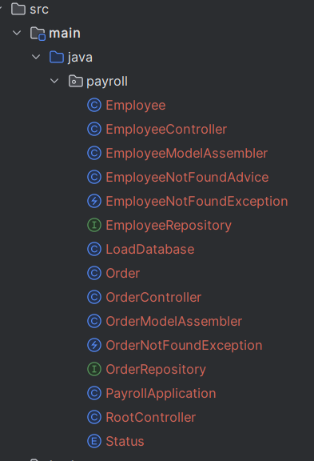

Update the build.gradle with the needed dependencies and plugins. Your build file should look similar to the following:
```bash
import org.apache.tools.ant.filters.ReplaceTokens

// Apply the java plugin to add support for Java
plugins {
    id 'java'
    id 'application'
    id 'org.springframework.boot' version '3.5.6'
    id 'io.spring.dependency-management' version '1.1.7'
}

version = '1.1.0'

// In this section you declare where to find the dependencies of your project
repositories {
    // Use jcenter for resolving your dependencies.
    // You can declare any Maven/Ivy/file repository here.
    mavenCentral()
}

dependencies {
    // This dependency is found on compile classpath of this component and consumers.
    implementation 'com.google.guava:guava:23.0'
    implementation 'org.springframework.boot:spring-boot-starter-web'
    implementation 'org.springframework.boot:spring-boot-starter-hateoas'
    implementation 'org.springframework.boot:spring-boot-starter-data-jpa'
    implementation 'jakarta.persistence:jakarta.persistence-api'


    // Use JUnit test framework
    testImplementation 'org.springframework.boot:spring-boot-starter-test'

    runtimeOnly 'com.h2database:h2'
}

test{
    useJUnitPlatform()
}
```

After performing these changes, in the terminal run the command `./gradlew clean build`. The result should resemble the image shown below:
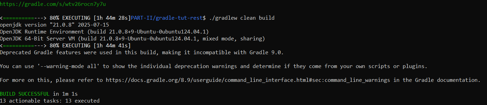

When the build process is finished, you're going to execute the command `./gradlew bootRun`, and after the command is executed, your terminal should look similar to what is shown in the example below:

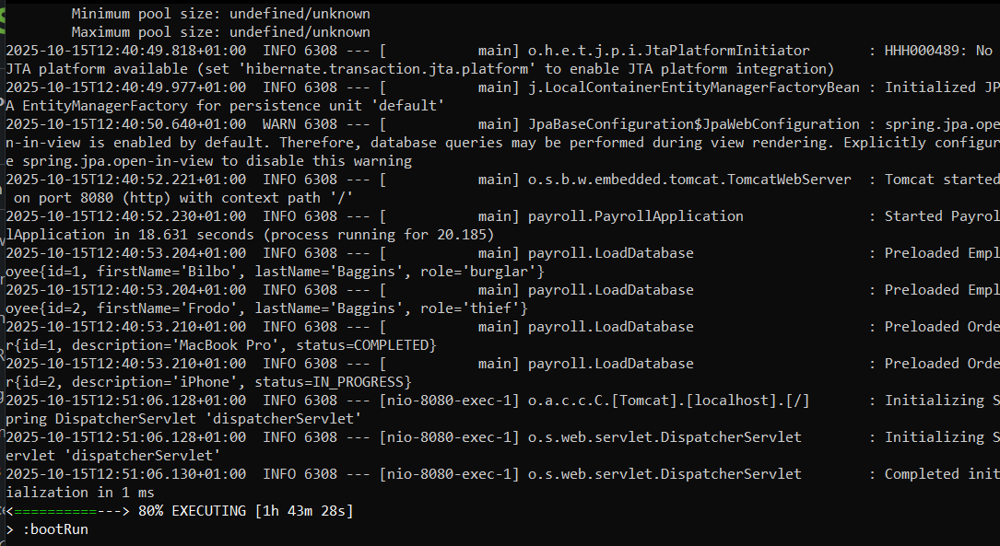

To fully confirm your code is successfully running, in your browser, visit the URL `localhost:8080/employees`. The final result should be this:
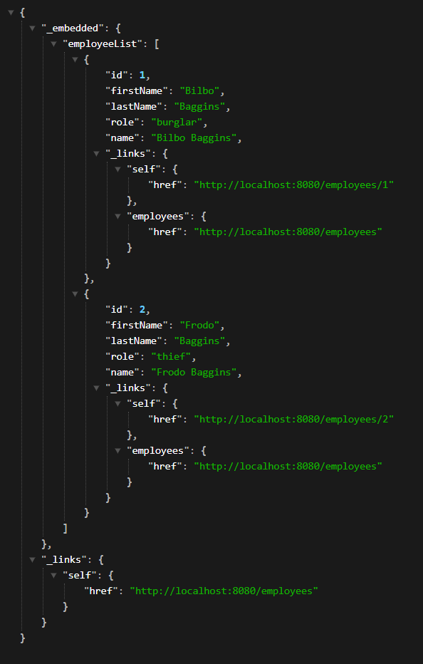

## Custom Gradle Task: deployToDev – Automated Deployment Process
This task can be implemented as a single block of code, or divided in smaller, modular tasks. We opted for a modular approach to improve readability, maitainability and reusability. To achieve this goal, we created **four** separate tasks - **cleanDeployment**, **copyJar**, **copyRuntimeDependencies**, and **copyConfigurations**. The implementation of this tasks is shown below.

```bash
tasks.register("cleanDeployment", Delete){
    group = 'deployment'
    description = 'Deletes the deployment directory for dev environment'

    delete layout.buildDirectory.dir("deployment/dev")
}
```

```bash
tasks.register("copyJar", Copy){
    group = 'deployment'
    description = 'Copies the built jar into the deployment directory'
    dependsOn tasks.named("build")

    from layout.buildDirectory.dir("libs/${project.name}-${project.version}.jar")
    into layout.buildDirectory.dir("deployment/dev")
}
```

```bash
tasks.register("copyRuntimeDependencies", Copy){
    group = 'deployment'
    description = 'Copies runtime dependencies into the deployment directory'
    dependsOn tasks.named("build")

    from configurations.runtimeClasspath
    into layout.buildDirectory.dir("deployment/dev/lib")
}
```

```bash
tasks.register("copyConfigurations", Copy){
    group = 'deployment'
    description = 'Copies configurations (and replaces tokens) into the deployment directory'
    dependsOn tasks.named("build")

    from ('src/main/resources/*.properties') {
        filter(ReplaceTokens, tokens: [
                timestamps: new Date().format('dd-MM-yyyy HH:mm:ss'),
                version   : project.version
        ])
    }
    into layout.buildDirectory.dir("deployment/dev")
}
```

If you decide to follow a modular approach like ours, your final `deployToDev` task should resemble the example shown below.
```bash
tasks.register("deployToDev"){
    group = 'deployment'
    description = 'Deploys the dev build with JARs and comfigurations'

    dependsOn tasks.named("build")
    dependsOn tasks.named("cleanDeployment")
    dependsOn tasks.named("copyJar")
    dependsOn tasks.named("copyRuntimeDependencies")
    dependsOn tasks.named("copyConfigurations")
}
```

To confirm the task is working correctly, execute `./gradlew deployToDev` in the terminal. The output should resemble the image shown below:
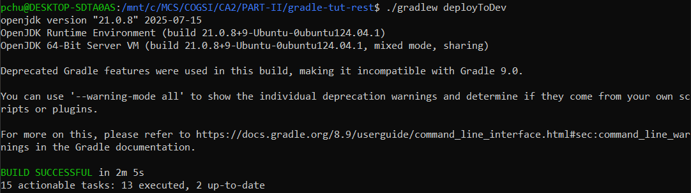

After a successful execution, a new `.jar` file will be generated, and the deployment directory should contain the structure ilustrated below:
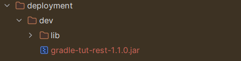.jar file" width="500"/>

## Custom Gradle task: generateScript 
When building an application using Gradle using the `application` plugin, it can generate distribution scripts through the `installDist` task. These scripts allow you to run the application using `gradle run`, by executing them.

The custom task `generateScript` works as follow:
- It starts to ensure itself only runs after `installDist` has completed.
- Then, it checks the running operating system to determine which script to execute, `.bat` on Windows or a `.sh` file in Unix-based systems
- Finally, it executes the appropriate script, shich simulates how the application would run in a production eñvironment.

This is helpful for testing the packaged application before deployment. The example task you'll find below does exactly what was previously described: 

```bash
tasks.register("generateScript", Exec){
    group = 'application'
    description = 'Generates an executable script based on the operating system'
    dependsOn tasks.named("installDist")

    def exe

    if(System.getProperty("os.name").toLowerCase().contains("windows")){
        exe = file("${buildDir}/install/${project.name}/bin/${project.name}.bat")
        commandLine 'cmd.exe', '/d', '/c', exe
    } else {
        exe = file("${buildDir}/install/${project.name}/bin/${project.name}")
        commandLine exe
    }
}
```
To confirm the task is working correctly, execute `./gradlew generateScript` in the terminal. The output should resemble the image shown below:

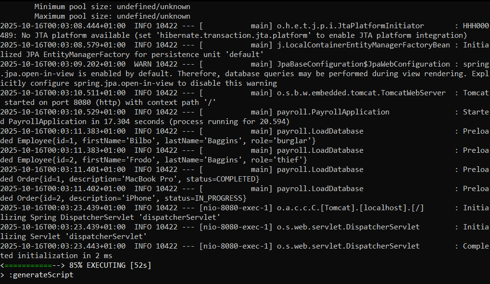

After a successful execution, in your browser, visit the URL `localhost:8080/employees`. The final result should be similar to this:
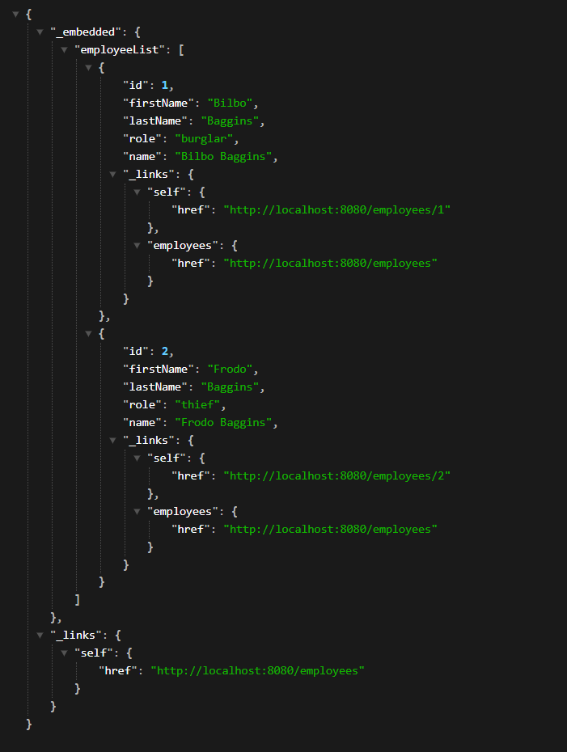

## Custom Gradle task: packageJavadoc
Javadoc is a decomentation tool that generates HTML documentation from Java source code. It reads special Javadoc comments, and produces a structured, browsable reference for classes, methods, fields, and packages.
When using Gradle, you can generate Javadoc for your project with the build it `javadoc` task. To package the generated documentation into a `.zip` file, you can create a custom task that depends on `javadoc`, ensuring that the documentation is generated before the archive is created.
The example below demonstrates how to define such task:
 
```bash
tasks.register("packageJavadoc", Zip){
    group = 'documentation'
    description = 'Generates Javadoc and packages it into a zip file'
    dependsOn tasks.named("javadoc")

    from layout.buildDirectory.dir("docs/javadoc")
    destinationDirectory.set(layout.buildDirectory.dir("docs"))

    def date = new SimpleDateFormat("ddMMyyyy-HHmmss").format(new Date())

    archiveBaseName = "${project.name}-javadoc-${date}"
    archiveExtension = 'zip'
}
```
After creating the custom task, open your terminal and run teh command `./gradlew packageJavadoc`. The output should be similar to the one shown below:

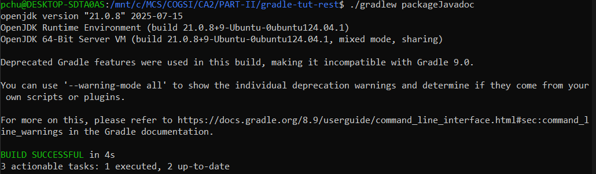

After successfully executing the prior command, in your building directory, inside `docs/javadoc`, you'll find the archive containing your project documentation.

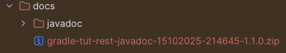

## Create a new SourceSet for Integration Tests
Creating a separate SourceSet for integration test helps organize test by purpose, keeping unit and integration tests separate. You can run them independently or as part of the build, and it ensures your application works correctly.

Below, you'll find and example of a custom source set for integration testing.
```bash
sourceSets {
    integrationTest {
        java {
            srcDir 'src/integrationTest/java'
        }
        resources {
            srcDir 'src/integrationTest/resources'
        }

        compileClasspath += sourceSets.main.output
        runtimeClasspath += sourceSets.main.output

        configurations {
            integrationTestImplementation.extendsFrom implementation
            integrationTestRuntimeOnly.extendsFrom runtimeOnly
        }

        dependencies {
            integrationTestImplementation 'org.junit.jupiter:junit-jupiter'
            integrationTestRuntimeOnly 'org.junit.platform:junit-platform-launcher'
        }
    }
}

tasks.register("integrationTest", Test){
    group = 'verification'
    description = 'Runs the integration tests'

    testClassesDirs = sourceSets.integrationTest.output.classesDirs
    classpath = sourceSets.integrationTest.runtimeClasspath

    shouldRunAfter(tasks.named("test"))
}

check.dependsOn(tasks.named("integrationTest"))
```

After implementing the previous changes to your `build.gradle`, open the terminal and run the command `./gradlew integrationTest`, the output should be similar to the example below:

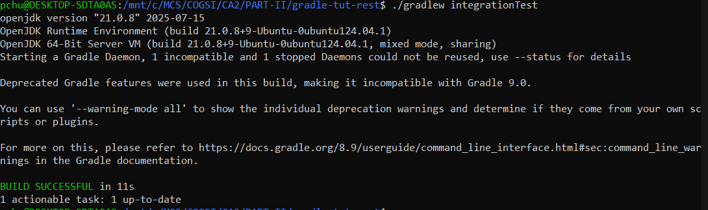

## Merge `Gradle-W2` branch into `main` branch
Before merging `Gradle-W2` into main it's necessary to change the working branch.
```bash
git switch main
```
After changing the working branch, we started the merging process.
```bash
git merge Gradle-W2 # Initiates the merge process of branch "email-field" into branch "main"
```

Git reported **Fast-Forward** since there were no merge conflicts, what means the was simply moved forward.
Finally, we pushed the staged changes to the remote repository `COGSI2526_1250503_1250506_1250545`.
```bash
git push origin main
```

In order to keep our repository fully organized, both branches used to complete CA2 were deleted.
```bash
git push -d Gradle-W1
git push -d Gradle-W2
```

## Add the tag `ca2-part2` to the `d3c99aa` commit
```bash
git tag -a ca2-part2 d3c99aa # Create the tag "ca2-part2" and add that same tag to the d3c99aa commit.
git push origin ca2-part2 # Push the tag "ca2-part2" to the repository "COGSI2526_1250503_1250506_1250545".
```

# Alternative technologies to Gradle (Maven not included)
## Ant
Created in 2000 by Apache Software Foundation, **Ant** is a Java build automation tool developed as an alternative to Unix **Make**. It was designed to simplify the complex scripts required when using Make. Like **Maven**, Ant uses XML to define builds, but unlike Maven, you must define each step of the build process explicitly.

Below is an implementation of this class assignment using Ant along with **Ivy**, Ant's dependency management tool.

Ivy.xml
```bash
<?xml version="1.0"?>
<ivy-module version="2.0">
    <info organisation="com.example" module="payroll" revision="1.1.0"/>
    
    <configurations>
        <conf name="compile"/>
        <conf name="runtime" extends="compile"/>
        <conf name="test" extends="runtime"/>
    </configurations>
    
    <dependencies>
        <dependency org="com.google.guava" name="guava" rev="23.0"/>
        <dependency org="org.springframework.boot" name="spring-boot-starter-web" rev="3.5.6"/>
        <dependency org="org.springframework.boot" name="spring-boot-starter-hateoas" rev="3.5.6"/>
        <dependency org="org.springframework.boot" name="spring-boot-starter-data-jpa" rev="3.5.6"/>
        <dependency org="jakarta.persistence" name="jakarta.persistence-api" rev="3.1.0"/>
        <dependency org="com.h2database" name="h2" rev="2.3.0" conf="runtime"/>
        <dependency org="org.junit.jupiter" name="junit-jupiter" rev="5.11.2" conf="test"/>
        <dependency org="org.junit.platform" name="junit-platform-launcher" rev="1.11.3" conf="test"/>
    </dependencies>
</ivy-module>

```

build.xml
```bash
<?xml version="1.0"?>
<project name="payroll" default="deploy" basedir=".">
    
    <property name="src.dir" value="src/main/java"/>
    <property name="resources.dir" value="src/main/resources"/>
    <property name="build.dir" value="build"/>
    <property name="classes.dir" value="${build.dir}/classes"/>
    <property name="lib.dir" value="lib"/>
    <property name="deployment.dir" value="${build.dir}/deployment/dev"/>
    <property name="version" value="1.1.0"/>
    <property name="main.class" value="payroll.PayrollApplication"/>
    
    <target name="init">
        <mkdir dir="${classes.dir}"/>
        <mkdir dir="${deployment.dir}"/>
        <mkdir dir="${deployment.dir}/lib"/>
        <mkdir dir="${build.dir}/docs"/>
    </target>
    
    <taskdef name="ivy" classname="org.apache.ivy.ant.IvyResolve"/>
    <taskdef name="ivycachepath" classname="org.apache.ivy.ant.IvyCachePath"/>
    <taskdef name="ivypublish" classname="org.apache.ivy.ant.IvyPublish"/>
    
    <target name="resolveIvy">
        <ivy:resolve file="ivy.xml"/>
        <ivy:cachepath pathid="project.classpath"/>
    </target>

    <target name="compileApplication" depends="init, resolveIvy">
        <javac srcdir="${src.dir}" destdir="${classes.dir}" includeantruntime="false">
            <classpath refid="project.classpath"/>
        </javac>
        <copy todir="${classes.dir}">
            <fileset dir="${resources.dir}" includes="**/*.properties"/>
        </copy>
    </target>

    <target name="test" depends="compileApplication">
        <junit printsummary="on" haltonfailure="yes" fork="yes">
            <classpath>
                <path refid="project.classpath"/>
                <pathelement location="${classes.dir}"/>
            </classpath>

            <formatter type="plain"/>

            <batchtest>
                <fileset dir="src/test/java">
                    <include name="**/*Test.java"/>
                </fileset>
            </batchtest>
        </junit>
    </target>

    <target name="cleanDeployment">
        <delete dir="${deployment.dir}"/>
        <echo message="Deployment directory cleaned"/>
    </target>
    
    <target name="copyJar" depends="compileApplication">
        <jar destfile="${build.dir}/libs/payroll-${version}.jar" basedir="${classes.dir}">
            <manifest>
                <attribute name="mainClass" value="${main.class}"/>
            </manifest>
        </jar>
    </target>
    
    <target name="copyRuntimeDependencies" depends="resolveDependencies">
        <copy todir="${deployment.dir}/lib">
            <path refid="runtime.classpath"/>
        </copy>
    </target>
    
    <target name="copyConfigurations">
        <copy todir="${deployment.dir}" filtering="true">
            <fileset dir="${resources.dir}" includes="*.properties"/>
            <filterset>
                <filter token="version" value="${version}"/>
                <filter token="timestamp" value="${DSTAMP}-${TSTAMP}"/>
            </filterset>
        </copy>
    </target>
    
    <target name="deployToDev" depends="cleanDeployment, copyJar, copyRuntimeDependencies, copyConfigurations">
        <echo message="Application Deplyed inside ${deployment.dir}"/>
    </target>

    <target name="generateScript" depends="jar, copyRuntimeDependencies">
        <echo file: "${build.dir}/run.sh">
            #!/bin/bash
            java -cp "${build.dir}/libs/payroll-${version}.jar:${deployment.dir}/lib/*" ${main.class}
        </echo>
        <chmod file="${build.dir}/run.sh" perm="755"/>
    </target>
    
    <target name="packageJavadoc">
        <javadoc sourcepath="${src.dir}" destdir="${build.dir}/docs/javadoc"
                 classpathref="project.classpath" author="true" version="true"/>
    </target>
 
    <target name="integrationTest" depends="compileApplication, test">
        <junit printsummary="on" haltonfailure="yes" fork="yes">
            <classpath>
                <path refid="project.classpath"/>
                <pathelement location="${classes.dir}"/>
                <pathelement location="build/integrationTest/classes"/>
            </classpath>

            <formatter type="plain"/>
            
            <batchtest>
                <fileset dir="src/integrationTest/java">
                    <include name="**/*IntegrationTest.java"/>
                </fileset>
            </batchtest>
        </junit>
    </target>
</project>
```
 
# Self-Evaluation
```bash
Daniel (1250503) - 80%
Diogo (1250506) - 80%
Pedro (1250545) - 100%
```
