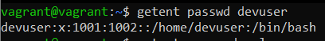
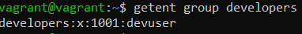
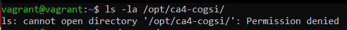
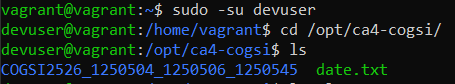
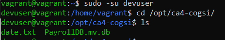
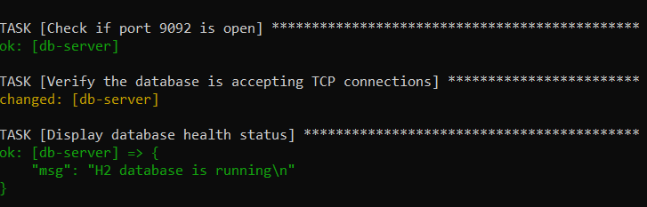
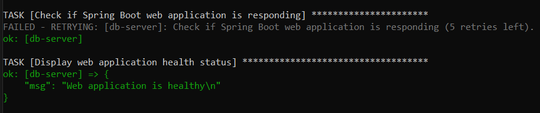

# CA4 - Configuration Management
The goal for this CA is to **install Ansible** and use it to **provision the two VMs** (`web-app` and`db-server`) that 
were created in CA3. Ansible's playbooks must be **idempotent**, guaranteeing that executing them multiple times 
preserves the intended system state without unwanted changes.

In this assignment, you will also:
- **Implement complex password policies** on the VMs utilizing `libpam-pwquality`.
- **Establish user groups and accounts** on the VMs.

## Install Ansible
Ansible is a free, open-source automation tool designed for managing configurations, deploying applications, and IT 
orchestration. It facilitates **infrastructure as code**, enabling you to define and manage your IT ecosystem through 
code. 

Unlike many automation tools, Ansible is an agentless, only needing you to **install it on a single machine**, known as
the **control node**, which is capable of managing **multiple machines or devices** (**managed nodes**) remotely using 
SSH, Powershell remoting, or other supported protocols. Ansible functions through the command-line interface and does 
not need daemons or databases.

The control node can be **any UNIX-like system with Python installed**, such as:
- Red Hat;
- Debian;
- Ubuntu;
- macOS;
- BSD systems;
- Windows within a Windows Subsystem for Linux (WSL) environment

**NOTE**: **Windows without WSL is not supported as a control node**.

### How Ansible Works
Ansible utilizes playbooks based in `YAML` to define automation workflows. These playbooks are:
- Human-readable and easy to learn, even for those without much programming experience.
- Idempotent, meaning that executing them multiple times guarantees the system reaches the same state without unintended 
changes.

Ansible is capable of managing a wide range of environments, including bare-metal servers, virtual machines, cloud 
services, and hybrid setups. 

### Installing Ansible
You can install Ansible through `pip` or `pipx`. Utilizing `pipx` is recommended as it **isolates Ansible and its 
dependencies from your system Python environment**.

As we used `pipx`, bellow you'll find an example of the necessary steps to complete the installation:

```bash
# Install pipx if not already installed
sudo apt-get install pipx -y

# Install Ansible with dependencies
pipx install --include-deps ansible

# Upgrade Ansible (optional)
pipx upgrade --include-injected ansible

# Enable shell completion for Ansible
pipx inject --include-apps ansible argcomplete
```

After running the commands above, Ansible is ready to use, enabling you to start managing your infrastructure via 
playbooks.

## Provision `web-app` and `db-server` VMs with Ansible
Before configuring your `playbook.yaml`, you need to **update the Vagrantfile from CA3**. In the last CA, the VMs were 
provisioned using inline shell scripts.

Replace the old provisioning method entirely with Ansible for your `db-server` and `web-app` VMs, respectively. Take the 
examples below as reference:

```bash
db.vm.provision "ansible" do |ansible|
  ansible.playbook = "./playbook.yaml"
  ansible.compatibility_mode = "2.0"
end
```

```bash
web.vm.provision "ansible" do |ansible|
  ansible.playbook = "./playbook.yaml"
  ansible.compatibility_mode = "2.0"
end
```

By replacing the inline shell script with ansible as your VMs provisioner you will simplify your provisioning and take 
advantage of Ansible’s automation features. 

Additionally, you can indicate the playbook Ansible will use to provision the guest machine - in our case, 
`playbook.yaml` - and create an inventory file (utilized to manage Ansible hosts), compatible with Ansible's version 2.0
and above.

## Ensuring your `playbook.yaml` is idempotent
Your playbook should be **idempotent**, meaning it can be executed **multiple times**, and each execution will result in 
the same state as the initial run, without unwanted behaviour.

The provided `playbook.yaml` serves as an example of an **idempotent** playbook since it mostly uses `package` and `apt` 
for package installation, and these which are **inherently idempotent**, automatically checking the current system state 
prior making changes. This `.yaml` file includes conditional checks that, for instance, verify whether the repository 
has already been cloned before pulling. It also displays certain debug messages for a clearer understanding of what is 
happening during provision.

```yaml
---
- name: Provision db-server VM
  hosts: db-server
  become: true
  become_method: sudo
  tasks:
    - name: Update apt cache
      become: true
      apt:
        update_cache: yes
        cache_valid_time: 3600

    - name: Install Git
      package:
        name: git
        state: present

    - name: Install Java
      package:
        name: default-jre
        state: present

    - name: Install JDK
      package:
        name: openjdk-17-jdk
        state: present

    - name: Install UFW
      package:
        name: ufw
        state: present

    - name: Deny incoming
      ufw:
        direction: incoming
        policy: deny

    - name: Allow outgoing
      ufw:
        direction: outgoing
        policy: allow

    - name: Allow SSH on port 22
      ufw:
        rule: allow
        port: 22
        proto: tcp

    - name: Allow incoming form 192.168.56.10:9092 via TCP
      ufw:
        rule: allow
        port: 9092
        proto: tcp
        from_ip: 192.168.56.10

    - name: Ensure UFW is running
      ufw:
        state: enabled

    - name: Run H2 Database
      shell: |
        nohup java -cp /home/vagrant/libs/h2-2.3.232.jar org.h2.tools.Server -tcp -tcpAllowOthers -tcpPort 9092 -baseDir /home/vagrant
      args:
        chdir: /home/vagrant


- name: Provision web-app VM
  hosts: web-app
  become: true
  tasks:
    - name: Update apt cache
      become: true
      apt:
        update_cache: yes
        cache_valid_time: 3600

    - name: Install Git
      package:
        name: git
        state: present

    - name: Install Java
      apt:
        name: default-jre
        state: present

    - name: Install JDK
      apt:
        name: openjdk-17-jdk
        state: present

    - name: Ensure if the repository exists
      stat:
        path: /home/vagrant/COGSI2526_1250503_1250506_1250545/.git
      register: repo_status

    - name: Clone the Git repository
      git:
        repo: https://github.com/pchu22/COGSI2526_1250503_1250506_1250545-copy
        dest: /home/vagrant/COGSI2526_1250503_1250506_1250545
        version: main
        update: no
      register: git_clone
      when: not repo_status.stat.exists

    - name: Pull from the Git repository
      git:
        repo: https://github.com/pchu22/COGSI2526_1250503_1250506_1250545-copy
        dest: /home/vagrant/COGSI2526_1250503_1250506_1250545
        version: main
        update: yes
        force: yes
      register: git_pull
      when: git_clone is not changed or git_clone is skipped

    - name: Repository clone debug message
      debug:
        msg: "Repository successfully cloned!"
      when: git_clone.changed

    - name: Repository existence debug message
      debug:
        msg: "Repository already exists. Skipping clone.."
      when: git_clone is skipped

    - name: Up-to-dated project debug message
      debug:
        msg: "Repository successfully updated!"
      when: not git_pull.changed

    - name: Ensure project directory has the right ownership
      file:
        path: /home/vagrant/COGSI2526_1250503_1250506_1250545
        state: directory
        owner: vagrant
        group: vagrant

    - name: Ensure gradlew has correct permissions
      file:
        path: /home/vagrant/COGSI2526_1250503_1250506_1250545/CA2/PART-II/gradle-tut-rest/gradlew
        state: file
        owner: vagrant
        group: vagrant
        mode: '0744'

    - name: Wait for DB to be ready
      wait_for:
        host: 192.168.56.11
        port: 9092
        timeout: 180
        state: started

    - name: Run Spring Boot Rest Application
      shell: |
        ./gradlew bootRun
      args:
        chdir: /home/vagrant/COGSI2526_1250503_1250506_1250545/CA2/PART-II/gradle-tut-rest/
```

nonetheless, the `shell` and `command` modules **aren't idempotent by default**, since they run commands without 
considering  the current state. To ensure incompetency, you should use the following conditions:
- `creates` – Avoid running if a file or directory already exists.
- `removes` – Skip execution if a file or directory is no longer present.
- `changed_when` – Clearly define the conditions under which a task is considered “changed.”

**NOTE**: You may have noticed that we've mainly used idempotent modules (such as `package`, `apt` and `ufw`), but 
we had to use `shell` for running both services. We also did not employ any of the previously mentioned conditions 
because, even when using those conditions, Ansible would consider the service initialization to be a change. Therefore, 
to keep the playbook's simplicity, we decided not to implement any condition.

### web-app
If you used the previously provided `playbook.yaml` as your guide, your output should resemble the example below. In  
the `web-app` run, you'll notice you have some tasks marked as **changed**. 

You may notice the tasks responsible for pulling the repository, changing the `gradlew` permissions, and execution the
service are labeled as **changed** for the following reasons:
- The `force: yes` parameter ensure the system's state matches the playbook's, forcing an update of the repository even 
when local changes exists, resulting in the task being marked as **changed**. 
- Changing `gradlew` permission is labeled as **changed** because due to how VirtualBox manages file permissions on 
guest machines, often causing Ansible to detect permission differences on every run.
- The service execution is marked as **changed** because it runs the application everytime the playbook is executed.

#### first run
```bash
==> web-app: Running provisioner: ansible...
    web-app: Running ansible-playbook...
[WARNING]: Deprecation warnings can be disabled by setting `deprecation_warnings=False` 
in ansible.cfg.
[DEPRECATION WARNING]: The '--inventory-file' argument is deprecated. This feature will 
be removed from ansible-core version 2.23.

PLAY [Provision db-server VM] **************************************************
skipping: no hosts matched

PLAY [Provision web-app VM] ****************************************************

TASK [Gathering Facts] *********************************************************
ok: [web-app]
[WARNING]: Host 'web-app' is using the discovered Python interpreter at 
'/usr/bin/python3.8', but future installation of another Python interpreter could cause 
a different interpreter to be discovered. See 
https://docs.ansible.com/ansible-core/2.19/reference_appendices/interpreter_discovery.html 
for more information.

TASK [Update apt cache] ********************************************************
ok: [web-app]

TASK [Install Git] *************************************************************
ok: [web-app]

TASK [Install Java] ************************************************************
ok: [web-app]

TASK [Install JDK] *************************************************************
ok: [web-app]

TASK [Ensure if the repository exists] *****************************************
ok: [web-app]

TASK [Clone the Git repository] ************************************************
skipping: [web-app]

TASK [Pull from the Git repository] ********************************************
changed: [web-app]

TASK [Repository clone debug message] ******************************************
skipping: [web-app]

TASK [Repository existence debug message] **************************************
ok: [web-app] => {
    "msg": "Repository already exists. Skipping clone.."
}

TASK [Up-to-dated project debug message] ***************************************
skipping: [web-app]

TASK [Ensure project directory has the right ownership] ************************
ok: [web-app]

TASK [Ensure gradlew has correct permissions] **********************************
changed: [web-app]

TASK [Wait for DB to be ready] *************************************************
ok: [web-app]

TASK [Run Spring Boot Rest Application] ****************************************
changed: [web-app]

PLAY RECAP *********************************************************************
web-app: ok=12   changed=3    unreachable=0    failed=0    skipped=3    rescued=0    
ignored=0
```

#### second run
```bash
==> web-app: Running provisioner: ansible...
    web-app: Running ansible-playbook...
[WARNING]: Deprecation warnings can be disabled by setting `deprecation_warnings=False` 
in ansible.cfg.
[DEPRECATION WARNING]: The '--inventory-file' argument is deprecated. This feature will 
be removed from ansible-core version 2.23.

PLAY [Provision db-server VM] **************************************************
skipping: no hosts matched

PLAY [Provision web-app VM] ****************************************************

TASK [Gathering Facts] *********************************************************
ok: [web-app]
[WARNING]: Host 'web-app' is using the discovered Python interpreter at 
'/usr/bin/python3.8', but future installation of another Python interpreter could cause a 
different interpreter to be discovered. See 
https://docs.ansible.com/ansible-core/2.19/reference_appendices/interpreter_discovery.html 
for more information.

TASK [Update apt cache] ********************************************************
ok: [web-app]

TASK [Install Git] *************************************************************
ok: [web-app]

TASK [Install Java] ************************************************************
ok: [web-app]

TASK [Install JDK] *************************************************************
ok: [web-app]

TASK [Ensure if the repository exists] *****************************************
ok: [web-app]

TASK [Clone the Git repository] ************************************************
skipping: [web-app]

TASK [Pull from the Git repository] ********************************************
changed: [web-app]

TASK [Repository clone debug message] ******************************************
skipping: [web-app]

TASK [Repository existence debug message] **************************************
ok: [web-app] => {
    "msg": "Repository already exists. Skipping clone.."
}

TASK [Up-to-dated project debug message] ***************************************
skipping: [web-app]

TASK [Ensure project directory has the right ownership] ************************
ok: [web-app]

TASK [Ensure gradlew has correct permissions] **********************************
changed: [web-app]

TASK [Wait for DB to be ready] *************************************************
ok: [web-app]

TASK [Run Spring Boot Rest Application] ****************************************
changed: [web-app]

PLAY RECAP *********************************************************************
web-app: ok=12   changed=3    unreachable=0    failed=0    skipped=3    rescued=0    
ignored=0
```

### db-server
In the `db-server` run, the only task marked as **changed** is the service execution, because it runs the h2 database 
service each time the playbook is executed, which Ansible interprets as a modification to the system’s state.

#### first run
```bash
==> db-server: Running provisioner: file...
    db-server: /mnt/c/MCS/COGSI/CA2/PART-II/gradle-tut-rest/CA2-Part2/PayrollDB.mv.db => 
    /home/vagrant/
==> db-server: Running provisioner: ansible...
    db-server: Running ansible-playbook...
[WARNING]: Deprecation warnings can be disabled by setting `deprecation_warnings=False` 
in ansible.cfg.
[DEPRECATION WARNING]: The '--inventory-file' argument is deprecated. This feature will 
be removed from ansible-core version 2.23.

PLAY [Provision db-server VM] **************************************************

TASK [Gathering Facts] *********************************************************
[WARNING]: Host 'db-server' is using the discovered Python interpreter at 
'/usr/bin/python3.8', but future installation of another Python interpreter could cause 
a different interpreter to be discovered. See 
https://docs.ansible.com/ansible-core/2.19/reference_appendices/interpreter_discovery.html 
for more information.
ok: [db-server]

TASK [Update apt cache] ********************************************************
ok: [db-server]

TASK [Install Git] *************************************************************
ok: [db-server]

TASK [Install Java] ************************************************************
ok: [db-server]

TASK [Install JDK] *************************************************************
ok: [db-server]

TASK [Ensure UFW is installed] *************************************************
ok: [db-server]

TASK [Deny incoming] ***********************************************************
ok: [db-server]

TASK [Allow outgoing] **********************************************************
ok: [db-server]

TASK [Allow SSH on port 22] ****************************************************
ok: [db-server]

TASK [Allow incoming form 192.168.56.10:9092 via TCP] **************************
ok: [db-server]

TASK [Ensure UFW is running] ***************************************************
ok: [db-server]

TASK [Run H2 Database] *********************************************************
changed: [db-server]

PLAY [Provision web-app VM] ****************************************************
skipping: no hosts matched

PLAY RECAP *********************************************************************
db-server: ok=12   changed=1    unreachable=0    failed=0    skipped=0    rescued=0    
ignored=0
```

#### second run
```bash
==> db-server: Running provisioner: file...
    db-server: /mnt/c/MCS/COGSI/CA2/PART-II/gradle-tut-rest/CA2-Part2/PayrollDB.mv.db => 
    /home/vagrant/
==> db-server: Running provisioner: ansible...
    db-server: Running ansible-playbook...
[WARNING]: Deprecation warnings can be disabled by setting `deprecation_warnings=False` 
in ansible.cfg.
[DEPRECATION WARNING]: The '--inventory-file' argument is deprecated. This feature will 
be removed from ansible-core version 2.23.

PLAY [Provision db-server VM] **************************************************

TASK [Gathering Facts] *********************************************************
ok: [db-server]
[WARNING]: Host 'db-server' is using the discovered Python interpreter at 
'/usr/bin/python3.8', but future installation of another Python interpreter could cause 
a different interpreter to be discovered. See 
https://docs.ansible.com/ansible-core/2.19/reference_appendices/interpreter_discovery.html 
for more information.

TASK [Update apt cache] ********************************************************
ok: [db-server]

TASK [Install Git] *************************************************************
ok: [db-server]

TASK [Install Java] ************************************************************
ok: [db-server]

TASK [Install JDK] *************************************************************
ok: [db-server]

TASK [Ensure UFW is installed] *************************************************
ok: [db-server]

TASK [Deny incoming] ***********************************************************
ok: [db-server]

TASK [Allow outgoing] **********************************************************
ok: [db-server]

TASK [Allow SSH on port 22] ****************************************************
ok: [db-server]

TASK [Allow incoming form 192.168.56.10:9092 via TCP] **************************
ok: [db-server]

TASK [Ensure UFW is running] ***************************************************
ok: [db-server]

TASK [Run H2 Database] *********************************************************
changed: [db-server]

PLAY [Provision web-app VM] ****************************************************
skipping: no hosts matched

PLAY RECAP *********************************************************************
db-server: ok=12   changed=1    unreachable=0    failed=0    skipped=0    rescued=0    
ignored=0
```

## Configure PAM to enforce a complex password policy within both VMs
To utilize **Ansible** to configure **Pluggable Authentication Modules** (**PAM**) for implementing a strong password 
policy on both the `web-app` and `db-server` VMs. The objective is to enhance system security by establishing criteria 
for password complexity, history, and limitation on login attempts.

### Enforce password complexity and deny passwords containing the username or parts of it
Passwords must meet the following criteria:
- Minimum length: 12 characters
- Must include at least three of four character classes: uppercase letters, lowercase letters, digits, and symbols
- Reject passwords containing common dictionary words
- Deny passwords that include the username or parts of it

In the task provided below you'll find diverse options. These options are responsible for defining the password policy
criteria. These options are:
- **minlen=12**: The minimum acceptable size for the new password.
- **lcredit=-1**: This is the minimum number of lower case letters characters that must be met for a new password.
- **lucredit=-1**: This is the minimum number of upper case letters characters that must be met for a new password.
- **dcredit=-1**: This is the minimum number of digits characters that must be met for a new password.
- **ocredit=-1**: This is the minimum number of other characters that must be met for a new password.
- **minclass=3**: The minimum amount of required character classes (lowercase, uppercase, digits, and others) for the 
new password. 
- **dictpath=/usr/share/dict/words**: This options allows for specification of non-default path to the cracklib 
dictionaries.
- **usercheck=1**: Check whether the password contains the username in some form.
- **usersubstr=4**: Check whether the password contains a substring of the username of at least 4 length in some form.

Your `playbook.yaml` task responsible for configuring `libpam-pwquality` should resemble the example below:

```yaml
    - name: Configure libpam-pwquality
      lineinfile:
        path: "/etc/pam.d/common-password"
        regexp: "pam_pwquality.so"
        line: "password required pam_pwquality.so minlen=12 lcredit=-1 ucredit=-1 dcredit=-1 ocredit=-1 minclass=3 
        dictpath=/usr/share/dict/words usercheck=1 usersubstr=4"
        state: present
```

### Prevent reuse of recent passwords
To enforce password history and prevent users from reusing their last **five** passwords, use the configuration below as 
example:

```yaml
    - name: Configure pam_pwhistory
      lineinfile:
        path: "/etc/pam.d/common-password"
        regexp: "pam_pwhistory.so"
        line: "pam_pwhistory.so retry=5 remember=5 use_authtok"
        state: present
```

The option **remember=5** ensures the last five passwords cannot be reused, and the option **retry=5** allows users five 
attempts before failing. **use_authtok** is used to force the module to not prompt the user for a new password but use 
the one provided by the previously stacked password module.

### Lock the account after failed login attempts
To protect against brute-force attacks, lock accounts after five consecutive failed login attempts for 10 minutes:

```yaml
    - name: Configure pam_faillock
      lineinfile:
        path: "/etc/pam.d/common-auth"
        regexp: "pam_faillock.so"
        line: "pam_faillock.so audit deny=5 unlock_time=600"
        state: present
```

The option **deny=5** specifies the number of allowed failed attempts, and **unlock_time=600** sets the lockout duration 
to 10 minutes (**600 seconds**).

### Notes for Idempotency
- Using `lineinfile` guarantees that tasks are **idempotent**, modifying the configuration solely when the desired line 
is absent or differs.
- Avoid duplicating tasks - each `regexp` ensures that the designated line is correctly handled.

## Verify Ansible inventory with `ansible-inventory`
Ansible utilizes an **inventory file** to specify the hosts it manages and how they are grouped. This can be a **static 
inventory file** (e.g., `inventory.ini`), or the **Vagrant auto-generated inventory file**, which Vagrant 
generates automatically when using the Ansible provisioner.

For this task, we decided to utilize a static inventory file named `inventory.ini`. Consider the configuration provided 
below as a reference:

```bash
[web-app]
192.168.56.10 ansible_user=vagrant

[db-server]
192.168.56.11 ansible_user=vagrant
```

This file defines two groups - `web-app` and `db-server` - each containing one VM with its corresponding IP address 
(**192.168.56.10** and **192.168.56.11**, respectively) and the SSH user.

### Verify inventory configuration
To confirm that Ansible recognizes the defined hosts, the command `ansible-inventory --list -i inventory.ini` was 
executed. This command produces the parsed layout of your inventory in JSON format, verifying that Ansible accurately 
identifies both the `web-app` and `db-server` hosts.

After executing the command mentioned above, your output should resemble the reference below.


## Create user groups and account inside both of `web-app` and `db-server` VMs using Ansible
To automate the creation of user groups and accounts on both the `web-app` and `db-server` VMs, you can define the 
following tasks in your playbook.

### Create user `devuser`
This task creates the user account `devuser`. To ensure the user exists on both machines, include this task in the 
provisioning of the `web-app` and `db-server` VMs.

To generate a secure password, install `pwgen` and `whois` using the command `sudo apt-get install pwgen whois`. Then, 
generate and hash a password with `pass='pwgen --secure --capitalize --numerals --symbols 12 1'` and 
`echo $pass | mkpasswd --stdin --method=sha-512; echo $pass` commands.

**NEVER INCLUDE PASSWORD HASHES OR OTHER SECRETS DIRECTLY IN YOUR PLAYBOOKS!** Store them securely (e.g, in Ansible 
vault) if needed.

Below you will find an example task for creating a user using Ansible. 
```yaml
    - name: Create the user 'devuser'
      user:
        name: devuser
        shell: /bin/bash
        password: $6$T1n5wQWz8OI8tCwD$DXoks8shpdOD.2hDTkon5ar6NmyLLREpiAhLoTv4W3FKW2iFxAbDW28YbFZEfoUa6ZIvLojKg9MfHlzoPL2mk.^T~CjAk;.]a7
```

After creating the user account, login into either VM and run the command `getent passwd devuser`. If the output 
resembles the example below, the user was successfully created.



### Create group `developers`
This task creates the `developers` user group. The `state: present` parameter ensures its only created if it doesn't 
already exist. 

```yaml
    - name: Ensure group 'developers' exists
      group:
        name: developers
        state: present
```

After connecting to the guest machine via SSH, verify the group was successfully created running the command
`getent group developers`.

You should see the output indicating that `devuser` belongs to the `developers` user group.



### Creating `ca4-cogsi` directory and Copying files
Next, you'll prepare the environment for both `web-app` and `db-server` VMs.

Start by creating a new directory called `/opt/c4-cogsi` with the proper permissions and group ownership. Use the 
provided task as an example.

#### Creating `ca4-cogsi` directory
Add this task to both VM provisioning to create `/opt/c4-cogsi` in both `web-app` and `db-server` machines

```yaml
    - name: Create a directory named 'ca4-cogsi'
      file:
        path: /opt/ca4-cogsi
        state: directory
        mode: 0750
        group: developers
```
This ensures that only members of the `developers` group can access the directory.

### Copying `Spring Boot Rest Application` to `/opt/ca4-cogsi`
Add this task to copy the application project from the VM’s home directory to `/opt/ca4-cogsi`.

```yaml
    - name: Copy Spring Boot Rest Application Project from /home/vagrant to /opt/ca4-cogsi
      copy:
        src: "/home/vagrant/"
        dest: /opt/ca4-cogsi/COGSI2526_1250504_1250506_1250545
        remote_src: yes
        owner: root
        group: developers
        mode: '0750'
```
The `remote_src: yes` tells Ansible the source already exists on the VM. Ownership and permissions are set to allow 
proper access to authorized users.

### Copying `PayrollDb.mv.db` to `/opt/ca4-cogsi`
Add this task to copy the `PayrollDb.mv.db` file from th VM home directory into `/opt/ca4-cogsi`.

```yaml
    - name: Copy database file from /home/vagrant to /opt/ca4-cogsi
      copy:
        src: "/home/vagrant/PayrollDB.mv.db"
        dest: /opt/ca4-cogsi/
        remote_src: yes
        owner: root
        group: developers
        mode: '0750'
```

### Confirming /opt/ca4-cogsi directory permissions
After creating `/opt(ca4-cogsi` directory and copying the application and database file, it's important to verify that 
permissions and ownership are correctly set.

Log into your VMs using the default `vagrant` and run `ls -la /opt/ca4-cogsi`. This command displays the directory
content along with ownership and permissions. If your result is similar to the one in the image below it means your 
`vagrant` default user has no access to `ca4-cogsi` (which is the expected behaviour). 



Next, switch users from the `vagrant` default user to `devuser` and try changing directories to 
`/opt/c4-cogsi`, running the command `cd /opt/c4-cogsi`. The result should resemble the example below:

#### web-app


#### db-server


`devuser` should be able to access the directory and its contents without issues, confirming that the group membership 
and permissions are correctly applied. These checks ensure that both the application and database files are accessible 
to authorized users while maintaining security for the VM environment.

## Add a Health-Check to `playbook.yaml` to verify that both services are running correctly
Health-check tasks were incorporated into the `playbook.yaml` to confirm that the H2 database and the Spring Boot Rest 
Application are operating correctly after provisioning. These verifications automatically confirm that every service is 
active and accessible after being launched.

### db-server
The health-check for the `db-server` ensures that the H2 database port is active and receiving TCP connections.

Below you can find an example of the implemented health-check. This task starts waits for the loopback address become 
available on port 9092. Next, it tries to contact that same address (127.0.0.1) on the same port. If everything is 
working just fine it returns a success message, otherwise it returns the message "H2 database is not reachable".
```yaml
    - name: Check if port 9092 is open
      wait_for:
        host: 127.0.0.1
        port: 9092
        timeout: 30
        state: started

    - name: Verify the database is accepting TCP connections
      shell: |
        nc -zv 127.0.0.1 9092
      register: h2_check
      ignore_errors: yes

    - name: Display database health status
      debug:
        msg: >
          H2 database is {{ 'running' if h2_check.rc == 0 else 'not reachable' }}
```

The output of your health-check should resemble the following example:



### web-app
The health-check on the `web-app` machine verifies that the Spring Boot Rest Application successfully responds to HTTP 
requests, signifying that the application has launched properly.

Below you can find an example of the implemented health-check. This task makes `GET` request to 
`http://192.168.56.10:8080/employees` each 10 second, and performs this action 5 times. If the return status is not 
**200** the health-check displays an error message.

```yaml
    - name: Check if Spring Boot Rest Application is responding
      uri:
        url: http://192.168.56.10:8080/employees
        method: GET
        return_content: no
        status_code: 200
      register: webapp_health
      retries: 5
      delay: 10
      until: webapp_health.status == 200

    - name: Display web application health status
      debug:
        msg: >
          Web application is {{ 'healthy' if webapp_health.status == 200 else 'unhealthy' }}
```

The output of your health-check should resemble the following example:




Incorporating these checks within the playbook guarantees that the deployment process not only facilitates the 
installation and configuration of necessary components but also verifies their operational status prior to completion, 
thereby enhancing reliability and consistency in automation

## Explanation of the final `playbook.yaml`
Both machines were provisioned within `playbook.yaml` and they share a lot of similar configurations. 

Starting with the first task, ensures the system package database is up-to-date (but it was defined that the system 
should not refresh it if the database was updated in the last hour). This task is present both in `web-app` and 
`db-server` provisioning.

```yaml
    - name: Update apt cache
      become: true
      apt:
        update_cache: yes
        cache_valid_time: 3600
```

Next, we defined the installation of packages such as `git`, `java`,`jdk`, `ufw` and `libpam-pwqaulity` using `package`,
that automatically detects the right package manager of the guest machine OS. This task is present both in `web-app` and
`db-server` provisioning.

```yaml
    - name: Install Git
      package:
        name: git
        state: present

    - name: Install Java
      package:
        name: default-jre
        state: present

    - name: Install JDK
      package:
        name: openjdk-17-jdk
        state: present

    - name: Install UFW
      package:
        name: ufw
        state: present

    - name: Install libpam-pwquality
      package:
        name: libpam-pwquality
        state: present
```

Within the `web-app` VM was necessary to clone the remote GitHub repository to access the project. To successfully clone
the remote repository the following tasks were defined:
```yaml
    - name: Ensure if the repository exists
      stat:
        path: /home/vagrant/COGSI2526_1250503_1250506_1250545/.git
      register: repo_status

    - name: Clone the Git repository
      git:
        repo: https://github.com/pchu22/COGSI2526_1250503_1250506_1250545-copy
        dest: /home/vagrant/COGSI2526_1250503_1250506_1250545
        version: main
        update: no
      register: git_clone
      when: not repo_status.stat.exists

    - name: Pull from the Git repository
      git:
        repo: https://github.com/pchu22/COGSI2526_1250503_1250506_1250545-copy
        dest: /home/vagrant/COGSI2526_1250503_1250506_1250545
        version: main
        update: yes
        force: yes
      register: git_pull
      when: git_clone is not changed or git_clone is skipped
```
The first task makes sure `COGSI2526_1250503_1250506_1250545` is a repo and registers the result in the `repo_status` 
variable. Then, it proceeds cloning the remote repository from GitHub if it hasn't been cloned yet, storing the result 
in a variable defined as `git_clone`. Finally, it ends up by pulling the most recent version of the application from the 
repository only if the cloning process is skipped or if `git_clone` has the same value as before executing the cloning 
task.

Then we proceeded with the creation of strong password policies ensuring only passwords that follow de defined criteria 
are authorized to be used. This task is present both in `web-app` and
`db-server` provisioning.

```yaml
    - name: Configure libpam-pwquality
      lineinfile:
        path: "/etc/pam.d/common-password"
        regexp: "pam_pwquality.so"
        line: "password required pam_pwquality.so minlen=12 lcredit=-1 ucredit=-1 dcredit=-1 ocredit=-1 minclass=3 
        dictpath=/usr/share/dict/words usercheck=1 usersubstr=4"
        state: present

    - name: Configure pam_pwhistory
      lineinfile:
        path: "/etc/pam.d/common-password"
        regexp: "pam_pwhistory.so"
        line: "pam_pwhistory.so retry=5 remember=5 use_authtok"
        state: present

    - name: Configure pam_faillock
      lineinfile:
        path: "/etc/pam.d/common-auth"
        regexp: "pam_faillock.so"
        line: "pam_faillock.so audit deny=5 unlock_time=600"
        state: present
```

Next, we created the user group `developers` and the user account `devuser`, and assigned `devuser` to the developers 
group. This task is present both in `web-app` and `db-server` provisioning.

```yaml
    - name: Ensure group 'developers' exists
      group:
        name: developers
        state: present

    - name: Create the user 'devuser'
      user:
        name: devuser
        shell: /bin/bash
        password: $6$jbry93Vk0uFO/Rbh$VmHVYZBpNQQmt5YDyhN7.zFZK6/maorqygYjecjcFZwgcxUb.08FwgwGQkrfRcHa8leYCAqXBMMGqDatKcsNJ/b)M2Q9vH]psb

    - name: Assign 'devuser' to the 'developers' group
      user:
        name: devuser
        groups: developers
        append: yes

```

Then, we defined a task to create a new directory `ca4-cogsi` in both VMs, and copied `PayrollDB.mv.db` and 
`COGSI2526_1250503_1250506_1250545` to the newly created folder.

```yaml
    - name: Create a directory named 'ca4-cogsi'
      file:
        path: /opt/ca4-cogsi
        state: directory
        mode: 0750
        group: developers
```

### db-server
```yaml
    - name: Copy database file from /home/vagrant to /opt/ca4-cogsi
      copy:
        src: "/home/vagrant/PayrollDB.mv.db"
        dest: /opt/ca4-cogsi/
        remote_src: yes
        owner: root
        group: developers
        mode: '0750'
```
### web-app
```yaml
    - name: Copy Spring Boot Rest Application Project from /home/vagrant to /opt/ca4-cogsi
      copy:
        src: "/home/vagrant/"
        dest: /opt/ca4-cogsi/COGSI2526_1250504_1250506_1250545
        remote_src: yes
        owner: root
        group: developers
        mode: '0750'
```

The `remote_src: yes` tells Ansible the source already exists on the VM. Ownership and permissions are set to allow
proper access to authorized users.

In the `db-server` VM, we defined a couple of firewall rules using `ufw` in order to deny all the incoming traffic and 
allow all the outgoing traffic. We defined 2 more rules, one to allow traffic on port 22 (SSH), and other to allow 
traffic from the IP address 192.168.56.10 on port 9092 in order for the Spring Boot Rest Application to connect to the 
database via TCP.

```yaml
    - name: Deny incoming
      ufw:
        direction: incoming
        policy: deny

    - name: Allow outgoing
      ufw:
        direction: outgoing
        policy: allow

    - name: Allow SSH on port 22
      ufw:
        rule: allow
        port: 22
        proto: tcp

    - name: Allow incoming form 192.168.56.10:9092 via TCP
      ufw:
        rule: allow
        port: 9092
        proto: tcp
        from_ip: 192.168.56.10

    - name: Ensure UFW is running
      ufw:
        state: enabled
```

Before starting the `web-app` service, we ensured it waits for the H2 database to start its service with the following 
task:
```yaml
    - name: Wait for DB to be ready
      wait_for:
        host: 192.168.56.11
        port: 9092
        timeout: 180
        state: started
```

Finally, we ran both services and added health-checks (explained in the previous section) in order to track if they are 
running correctly or not.
### db-server

```yaml
    - name: Run H2 Database
      shell: |
        nohup java -cp /home/vagrant/libs/h2-2.3.232.jar org.h2.tools.Server -tcp -tcpAllowOthers -tcpPort 9092 -baseDir /home/vagrant &
      args:
        chdir: /home/vagrant
```

### web-app

```yaml
    - name: Run Spring Boot Rest Application
      shell: |
        ./gradlew bootRun &
      args:
        chdir: /home/vagrant/COGSI2526_1250503_1250506_1250545/CA2/PART-II/gradle-tut-rest/
```

# Alternative technologies to Ansible
## Chef
**Chef** is an open-source configuration management tool that automates infrastructure as code using **Ruby**. It allows 
you to define the desired state of your systems in recipes and cookbooks, which can install packages, manage files, 
create users, and configure services. Chef uses a client-server model:
- **Chef Server** stores all configuration data.
- **Workstations** are where code is developed and tested.
- **Nodes** are the machines managed by Chef via the **Chef-Client**.

Users interact with the server using knife or the Chef CLI. Cookbooks are the main building blocks and include recipes, 
templates, files, and attributes to define and enforce the configuration of nodes. This approach enables automation, 
repeatability, and continuous deployment.

## Puppet
**Puppet** is a configuration management tool that automates server deployment and maintenance using a declarative 
domain-specific language (DSL). Puppet follows a client-server architecture:
- **Puppet Master** stores configuration manifests and modules.
- **Puppet Agents** run on nodes to apply these configurations.

Puppet uses **manifests** to define the desired state of resources (`packages`, `users`, `services`, etc.) and 
**Facter** to gather system facts for platform-specific decisions. **Hiera** provides external configuration data for 
site-specific settings. Puppet supports idempotency, ensuring the same configuration is applied consistently, and its 
modular structure allows reuse of code and prebuilt modules from Puppet Forge.

### Implementation of CA4 using Puppet
To provision both machines using Puppet manifests create a file `site.pp`, which will be your Puppet configuration file.

#### System Update and Package Installation
Ensure the system packages are updated. Use `apt::update` class, which is similar to running apt-get update. 

```bash
  exec { 'apt_update':
    command => '/usr/bin/apt-get update',
    path    => ['/usr/bin', '/usr/sbin'],
    unless  => 'test $(find /var/lib/apt/periodic/update-success-stamp -mmin -60)',
  }
```

Next, define the installation of the necessary packages such as `git`, `default-jre`, `openjdk-17-jdk`, `ufw`, and
`libpam-pwquality`. You can use Puppet's `package` resource to automatically detect the correct package manager of the 
OS you're using.

For `db-server`
```bash
include apt

package { ['git', 'default-jre', 'openjdk-17-jdk', 'ufw', 'libpam-pwquality']:
  ensure => installed,
}
```

For `web-app`
```bash
include apt

package { ['git', 'default-jre', 'openjdk-17-jdk', 'libpam-pwquality']:
  ensure => installed,
}
```

#### Repository Cloning
In the `web-app` node, use Puppet’s `vcsrepo` to clone the remote GitHub repository if it doesn't exist.

```bash
vcsrepo { '/home/vagrant/COGSI2526_1250503_1250506_1250545':
  ensure   => present,
  provider => git,
  source   => 'https://github.com/pchu22/COGSI2526_1250503_1250506_1250545-copy',
  revision => 'main',
  user     => 'vagrant',
}
```

#### Password policy configuration
Use Puppet’s `file_line` resource, to modify `/etc/pam.d/common-password` and `/etc/pam.d/common-auth`.

The following configuration enforce password complexity, prevent password reuse, and temporarily lock accounts after 
multiple failed login attempts.

```bash
file_line { 'configure_pwquality':
  path  => '/etc/pam.d/common-password',
  match => 'pam_pwquality.so',
  line  => 'password required pam_pwquality.so minlen=12 lcredit=-1 ucredit=-1 dcredit=-1 ocredit=-1 minclass=3 dictpath=/usr/share/dict/words usercheck=1 usersubstr=4',
}

file_line { 'configure_pwhistory':
  path  => '/etc/pam.d/common-password',
  match => 'pam_pwhistory.so',
  line  => 'password required pam_pwhistory.so retry=5 remember=5 use_authtok',
}

file_line { 'configure_faillock':
  path  => '/etc/pam.d/common-auth',
  match => 'pam_faillock.so',
  line  => 'auth required pam_faillock.so audit deny=5 unlock_time=600',
}
```

#### User groups and accounts management
Create a users group named `developers` and a user named `devuser`. Next assign `devuser` to the `developers` group. 
Apply this configuration to both machines.

```bash
group { 'developers':
ensure => present,
}

user { 'devuser':
ensure   => present,
  shell    => '/bin/bash',
  password => '$6$jbry93Vk0uFO/Rbh$VmHVYZBpNQQmt5YDyhN7.zFZK6/maorqygYjecjcFZwgcxUb.08FwgwGQkrfRcHa8leYCAqXBMMGqDatKcsNJ/b)M2Q9vH]psb',
  groups   => ['developers'],
}
```

#### File creation and copy
Use the following configuration to create the `/opt/ca4-cogsi` on both nodes.

```bash
file { '/opt/ca4-cogsi':
  ensure => directory,
  mode   => '0750',
  owner  => 'root',
  group  => 'developers',
}
```

For `db-server`
Then copy the database file `PayrollDB.mv.db` from `/home/vagrant` to `/opt/ca4-cogsi` directory.

```bash
file { '/opt/ca4-cogsi/PayrollDB.mv.db':
  ensure => file,
  source => '/home/vagrant/PayrollDB.mv.db',
  owner  => 'root',
  group  => 'developers',
  mode   => '0750',
}
```

For `web-app`
Next, copy the Spring Boot Rest Application project directory from `/home/vagrant` to `/opt/c4-cogsi` directory.

```bash
file { '/opt/ca4-cogsi/COGSI2526_1250503_1250506_1250545':
  ensure => directory,
  recurse => true,
  source  => '/home/vagrant/COGSI2526_1250503_1250506_1250545',
  owner   => 'root',
  group   => 'developers',
  mode    => '0750',
}
```

#### Firewall Configuration (db-server)
Define firewall rules using the `ufw` module to replicate the rules applied using Ansible's `playbook.yaml`.

```bash
exec { 'deny_incoming':
  command => '/usr/sbin/ufw default deny incoming',
  unless  => '/usr/sbin/ufw status | grep -q "deny (incoming)"',
}

exec { 'allow_outgoing':
  command => '/usr/sbin/ufw default allow outgoing',
  unless  => '/usr/sbin/ufw status | grep -q "allow (outgoing)"',
}

exec { 'allow_ssh':
  command => '/usr/sbin/ufw allow 22/tcp',
  unless  => '/usr/sbin/ufw status | grep -q "22/tcp"',
}

exec { 'allow_db_from_webapp':
  command => '/usr/sbin/ufw allow from 192.168.56.10 to any port 9092 proto tcp',
  unless  => '/usr/sbin/ufw status | grep -q "9092/tcp"',
}

service { 'ufw':
  ensure => running,
  enable => true,
}
```

#### Service Startup
Before starting the web application, ensure the database is ready by checking if the port 9092 is open.

For `db-server`
```bash
exec { 'run_h2_database':
  command => 'nohup java -cp /home/vagrant/libs/h2-2.3.232.jar org.h2.tools.Server -tcp -tcpAllowOthers -tcpPort 9092 -baseDir /home/vagrant &',
  cwd     => '/home/vagrant',
  unless  => 'nc -z 127.0.0.1 9092',
}

```

For `web-app`
```bash
exec { 'wait_for_db':
  command => 'bash -c "until nc -z 192.168.56.11 9092; do sleep 5; done"',
  timeout => 180,
}

exec { 'run_spring_boot_app':
  command => './gradlew bootRun &',
  cwd     => '/home/vagrant/COGSI2526_1250503_1250506_1250545/CA2/PART-II/gradle-tut-rest/',
  unless  => 'nc -z 127.0.0.1 8080',
}

```

# Self-Evaluation
```bash
Daniel (1250503) - 80%
Diogo (1250506) - 80%
Pedro (1250545) - 100%
```