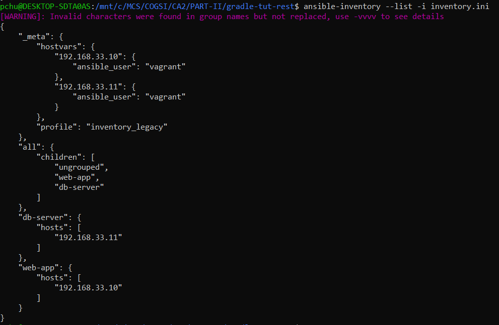

# CA4 - Configuration Management
The goal for this CA is to **install Ansible** and use it to **provision the two VMs** (`web-app` and`db-server`) that 
were created in CA3. Ansible's playbooks must be **idempotent**, guaranteeing that executing them multiple times 
preserves the intended system state without unwanted changes.

In this assignment, you will also:
- **Implement complex password policies** on the VMs utilizing `libpam-pwquality`.
- **Establish user groups and accounts** on the VMs.

## Install Ansible
Ansible is a free, open-source automation tool designed for managing configurations, deploying applications, and IT 
orchestration. It facilitates **infrastructure as code**, enabling you to define and manage your IT ecosystem through 
code. 

Unlike many automation tools, Ansible is an agentless, only needing you to **install it on a single machine**, known as
the **control node**, which is capable of managing **multiple machines or devices** (**managed nodes**) remotely using 
SSH, Powershell remoting, or other supported protocols. Ansible functions through the command-line interface and does 
not need daemons or databases.

The control node can be **any UNIX-like system with Python installed**, such as:
- Red Hat;
- Debian;
- Ubuntu;
- macOS;
- BSD systems;
- Windows within a Windows Subsystem for Linux (WSL) environment

**NOTE**: **Windows without WSL is not supported as a control node**.

### How Ansible Works
Ansible utilizes playbooks based in `YAML` to define automation workflows. These playbooks are:
- Human-readable and easy to learn, even for those without much programming experience.
- Idempotent, meaning that executing them multiple times guarantees the system reaches the same state without unintended 
changes.

Ansible is capable of managing a wide range of environments, including bare-metal servers, virtual machines, cloud 
services, and hybrid setups. 

### Installing Ansible
You can install Ansible through `pip` or `pipx`. Utilizing `pipx` is recommended as it **isolates Ansible and its 
dependencies from your system Python environment**.

As we used `pipx`, bellow you'll find an example of the necessary steps to complete the installation:

```bash
# Install pipx if not already installed
sudo apt-get install pipx -y

# Install Ansible with dependencies
pipx install --include-deps ansible

# Upgrade Ansible (optional)
pipx upgrade --include-injected ansible

# Enable shell completion for Ansible
pipx inject --include-apps ansible argcomplete
```

After running the commands above, Ansible is ready to use, enabling you to start managing your infrastructure via 
playbooks.

## Provision `web-app` and `db-server` VMs with Ansible
Before configuring your `playbook.yaml`, you need to **update the Vagrantfile from CA3**. In the last CA, the VMs were 
provisioned using inline shell scripts.

Replace the old provisioning method entirely with Ansible for your `db-server` and `web-app` VMs, respectively. Take the 
examples below as reference:

```bash
db.vm.provision "ansible" do |ansible|
  ansible.playbook = "./playbook.yaml"
  ansible.compatibility_mode = "2.0"
end
```

```bash
web.vm.provision "ansible" do |ansible|
  ansible.playbook = "./playbook.yaml"
  ansible.compatibility_mode = "2.0"
end
```

By replacing the inline shell script with ansible as your VMs provisioner you will simplify your provisioning and take 
advantage of Ansible’s automation features. 

Additionally, you can indicate the playbook Ansible will use to provision the guest machine - in our case, 
`playbook.yaml` - and create an inventory file (utilized to manage Ansible hosts), compatible with Ansible's version 2.0
and above.

## Ensuring your `playbook.yaml` is idempotent
Your playbook should be **idempotent**, meaning it can be executed **multiple times**, and each execution will result in 
the same state as the initial run, without unwanted behaviour.

The provided `playbook.yaml` serves as an example of an **idempotent** playbook since it mostly uses `package` and `apt` 
for package installation, and these which are **inherently idempotent**, automatically checking the current system state 
prior making changes. This `.yaml` file includes conditional checks that, for instance, verify whether the repository 
has already been cloned before pulling. It also displays certain debug messages for a clearer understanding of what is 
happening during provision.

```yaml
---
- name: Provision db-server VM
  hosts: db-server
  become: true
  become_method: sudo
  tasks:
    - name: Update apt cache
      become: true
      apt:
        update_cache: yes
        cache_valid_time: 3600

    - name: Install Git
      package:
        name: git
        state: present

    - name: Install Java
      package:
        name: default-jre
        state: present

    - name: Install JDK
      package:
        name: openjdk-17-jdk
        state: present

    - name: Install UFW
      package:
        name: ufw
        state: present

    - name: Deny incoming
      ufw:
        direction: incoming
        policy: deny

    - name: Allow outgoing
      ufw:
        direction: outgoing
        policy: allow

    - name: Allow SSH on port 22
      ufw:
        rule: allow
        port: 22
        proto: tcp

    - name: Allow incoming form 192.168.56.10:9092 via TCP
      ufw:
        rule: allow
        port: 9092
        proto: tcp
        from_ip: 192.168.56.10

    - name: Ensure UFW is running
      ufw:
        state: enabled

    - name: Run H2 Database
      shell: |
        nohup java -cp /home/vagrant/libs/h2-2.3.232.jar org.h2.tools.Server -tcp -tcpAllowOthers -tcpPort 9092 -baseDir /home/vagrant
      args:
        chdir: /home/vagrant


- name: Provision web-app VM
  hosts: web-app
  become: true
  tasks:
    - name: Update apt cache
      become: true
      apt:
        update_cache: yes
        cache_valid_time: 3600

    - name: Install Git
      package:
        name: git
        state: present

    - name: Install Java
      apt:
        name: default-jre
        state: present

    - name: Install JDK
      apt:
        name: openjdk-17-jdk
        state: present

    - name: Ensure if the repository exists
      stat:
        path: /home/vagrant/COGSI2526_1250503_1250506_1250545/.git
      register: repo_status

    - name: Clone the Git repository
      git:
        repo: https://github.com/pchu22/COGSI2526_1250503_1250506_1250545-copy
        dest: /home/vagrant/COGSI2526_1250503_1250506_1250545
        version: main
        update: no
      register: git_clone
      when: not repo_status.stat.exists

    - name: Pull from the Git repository
      git:
        repo: https://github.com/pchu22/COGSI2526_1250503_1250506_1250545-copy
        dest: /home/vagrant/COGSI2526_1250503_1250506_1250545
        version: main
        update: yes
        force: yes
      register: git_pull
      when: git_clone is not changed or git_clone is skipped

    - name: Repository clone debug message
      debug:
        msg: "Repository successfully cloned!"
      when: git_clone.changed

    - name: Repository existence debug message
      debug:
        msg: "Repository already exists. Skipping clone.."
      when: git_clone is skipped

    - name: Up-to-dated project debug message
      debug:
        msg: "Repository successfully updated!"
      when: not git_pull.changed

    - name: Ensure project directory has the right ownership
      file:
        path: /home/vagrant/COGSI2526_1250503_1250506_1250545
        state: directory
        owner: vagrant
        group: vagrant

    - name: Ensure gradlew has correct permissions
      file:
        path: /home/vagrant/COGSI2526_1250503_1250506_1250545/CA2/PART-II/gradle-tut-rest/gradlew
        state: file
        owner: vagrant
        group: vagrant
        mode: '0744'

    - name: Wait for DB to be ready
      wait_for:
        host: 192.168.56.11
        port: 9092
        timeout: 180
        state: started

    - name: Run Spring Boot Rest Application
      shell: |
        ./gradlew bootRun
      args:
        chdir: /home/vagrant/COGSI2526_1250503_1250506_1250545/CA2/PART-II/gradle-tut-rest/
```

nonetheless, the `shell` and `command` modules **aren't idempotent by default**, since they run commands without 
considering  the current state. To ensure incompetency, you should use the following conditions:
- `creates` – Avoid running if a file or directory already exists.
- `removes` – Skip execution if a file or directory is no longer present.
- `changed_when` – Clearly define the conditions under which a task is considered “changed.”

**NOTE**: You may have noticed that we've mainly used idempotent modules (such as `package`, `apt` and `ufw`), but 
we had to use `shell` for running both services. We also did not employ any of the previously mentioned conditions 
because, even when using those conditions, Ansible would consider the service initialization to be a change. Therefore, 
to keep the playbook's simplicity, we decided not to implement any condition.

### web-app
If you used the previously provided `playbook.yaml` as your guide, your output should resemble the example below. In  
the `web-app` run, you'll notice you have some tasks marked as **changed**. 

You may notice the tasks responsible for pulling the repository, changing the `gradlew` permissions, and execution the
service are labeled as **changed** for the following reasons:
- The `force: yes` parameter ensure the system's state matches the playbook's, forcing an update of the repository even 
when local changes exists, resulting in the task being marked as **changed**. 
- Changing `gradlew` permission is labeled as **changed** because due to how VirtualBox manages file permissions on 
guest machines, often causing Ansible to detect permission differences on every run.
- The service execution is marked as **changed** because it runs the application everytime the playbook is executed.

#### first run
```bash
==> web-app: Running provisioner: ansible...
    web-app: Running ansible-playbook...
[WARNING]: Deprecation warnings can be disabled by setting `deprecation_warnings=False` 
in ansible.cfg.
[DEPRECATION WARNING]: The '--inventory-file' argument is deprecated. This feature will 
be removed from ansible-core version 2.23.

PLAY [Provision db-server VM] **************************************************
skipping: no hosts matched

PLAY [Provision web-app VM] ****************************************************

TASK [Gathering Facts] *********************************************************
ok: [web-app]
[WARNING]: Host 'web-app' is using the discovered Python interpreter at 
'/usr/bin/python3.8', but future installation of another Python interpreter could cause 
a different interpreter to be discovered. See 
https://docs.ansible.com/ansible-core/2.19/reference_appendices/interpreter_discovery.html 
for more information.

TASK [Update apt cache] ********************************************************
ok: [web-app]

TASK [Install Git] *************************************************************
ok: [web-app]

TASK [Install Java] ************************************************************
ok: [web-app]

TASK [Install JDK] *************************************************************
ok: [web-app]

TASK [Ensure if the repository exists] *****************************************
ok: [web-app]

TASK [Clone the Git repository] ************************************************
skipping: [web-app]

TASK [Pull from the Git repository] ********************************************
changed: [web-app]

TASK [Repository clone debug message] ******************************************
skipping: [web-app]

TASK [Repository existence debug message] **************************************
ok: [web-app] => {
    "msg": "Repository already exists. Skipping clone.."
}

TASK [Up-to-dated project debug message] ***************************************
skipping: [web-app]

TASK [Ensure project directory has the right ownership] ************************
ok: [web-app]

TASK [Ensure gradlew has correct permissions] **********************************
changed: [web-app]

TASK [Wait for DB to be ready] *************************************************
ok: [web-app]

TASK [Run Spring Boot Rest Application] ****************************************
changed: [web-app]

PLAY RECAP *********************************************************************
web-app: ok=12   changed=3    unreachable=0    failed=0    skipped=3    rescued=0    
ignored=0
```

#### second run
```bash
==> web-app: Running provisioner: ansible...
    web-app: Running ansible-playbook...
[WARNING]: Deprecation warnings can be disabled by setting `deprecation_warnings=False` 
in ansible.cfg.
[DEPRECATION WARNING]: The '--inventory-file' argument is deprecated. This feature will 
be removed from ansible-core version 2.23.

PLAY [Provision db-server VM] **************************************************
skipping: no hosts matched

PLAY [Provision web-app VM] ****************************************************

TASK [Gathering Facts] *********************************************************
ok: [web-app]
[WARNING]: Host 'web-app' is using the discovered Python interpreter at 
'/usr/bin/python3.8', but future installation of another Python interpreter could cause a 
different interpreter to be discovered. See 
https://docs.ansible.com/ansible-core/2.19/reference_appendices/interpreter_discovery.html 
for more information.

TASK [Update apt cache] ********************************************************
ok: [web-app]

TASK [Install Git] *************************************************************
ok: [web-app]

TASK [Install Java] ************************************************************
ok: [web-app]

TASK [Install JDK] *************************************************************
ok: [web-app]

TASK [Ensure if the repository exists] *****************************************
ok: [web-app]

TASK [Clone the Git repository] ************************************************
skipping: [web-app]

TASK [Pull from the Git repository] ********************************************
changed: [web-app]

TASK [Repository clone debug message] ******************************************
skipping: [web-app]

TASK [Repository existence debug message] **************************************
ok: [web-app] => {
    "msg": "Repository already exists. Skipping clone.."
}

TASK [Up-to-dated project debug message] ***************************************
skipping: [web-app]

TASK [Ensure project directory has the right ownership] ************************
ok: [web-app]

TASK [Ensure gradlew has correct permissions] **********************************
changed: [web-app]

TASK [Wait for DB to be ready] *************************************************
ok: [web-app]

TASK [Run Spring Boot Rest Application] ****************************************
changed: [web-app]

PLAY RECAP *********************************************************************
web-app: ok=12   changed=3    unreachable=0    failed=0    skipped=3    rescued=0    
ignored=0
```

### db-server
In the `db-server` run, the only task marked as **changed** is the service execution, because it runs the h2 database 
service each time the playbook is executed, which Ansible interprets as a modification to the system’s state.

#### first run
```bash
==> db-server: Running provisioner: file...
    db-server: /mnt/c/MCS/COGSI/CA2/PART-II/gradle-tut-rest/CA2-Part2/PayrollDB.mv.db => 
    /home/vagrant/
==> db-server: Running provisioner: ansible...
    db-server: Running ansible-playbook...
[WARNING]: Deprecation warnings can be disabled by setting `deprecation_warnings=False` 
in ansible.cfg.
[DEPRECATION WARNING]: The '--inventory-file' argument is deprecated. This feature will 
be removed from ansible-core version 2.23.

PLAY [Provision db-server VM] **************************************************

TASK [Gathering Facts] *********************************************************
[WARNING]: Host 'db-server' is using the discovered Python interpreter at 
'/usr/bin/python3.8', but future installation of another Python interpreter could cause 
a different interpreter to be discovered. See 
https://docs.ansible.com/ansible-core/2.19/reference_appendices/interpreter_discovery.html 
for more information.
ok: [db-server]

TASK [Update apt cache] ********************************************************
ok: [db-server]

TASK [Install Git] *************************************************************
ok: [db-server]

TASK [Install Java] ************************************************************
ok: [db-server]

TASK [Install JDK] *************************************************************
ok: [db-server]

TASK [Ensure UFW is installed] *************************************************
ok: [db-server]

TASK [Deny incoming] ***********************************************************
ok: [db-server]

TASK [Allow outgoing] **********************************************************
ok: [db-server]

TASK [Allow SSH on port 22] ****************************************************
ok: [db-server]

TASK [Allow incoming form 192.168.56.10:9092 via TCP] **************************
ok: [db-server]

TASK [Ensure UFW is running] ***************************************************
ok: [db-server]

TASK [Run H2 Database] *********************************************************
changed: [db-server]

PLAY [Provision web-app VM] ****************************************************
skipping: no hosts matched

PLAY RECAP *********************************************************************
db-server: ok=12   changed=1    unreachable=0    failed=0    skipped=0    rescued=0    
ignored=0
```

#### second run
```bash
==> db-server: Running provisioner: file...
    db-server: /mnt/c/MCS/COGSI/CA2/PART-II/gradle-tut-rest/CA2-Part2/PayrollDB.mv.db => 
    /home/vagrant/
==> db-server: Running provisioner: ansible...
    db-server: Running ansible-playbook...
[WARNING]: Deprecation warnings can be disabled by setting `deprecation_warnings=False` 
in ansible.cfg.
[DEPRECATION WARNING]: The '--inventory-file' argument is deprecated. This feature will 
be removed from ansible-core version 2.23.

PLAY [Provision db-server VM] **************************************************

TASK [Gathering Facts] *********************************************************
ok: [db-server]
[WARNING]: Host 'db-server' is using the discovered Python interpreter at 
'/usr/bin/python3.8', but future installation of another Python interpreter could cause 
a different interpreter to be discovered. See 
https://docs.ansible.com/ansible-core/2.19/reference_appendices/interpreter_discovery.html 
for more information.

TASK [Update apt cache] ********************************************************
ok: [db-server]

TASK [Install Git] *************************************************************
ok: [db-server]

TASK [Install Java] ************************************************************
ok: [db-server]

TASK [Install JDK] *************************************************************
ok: [db-server]

TASK [Ensure UFW is installed] *************************************************
ok: [db-server]

TASK [Deny incoming] ***********************************************************
ok: [db-server]

TASK [Allow outgoing] **********************************************************
ok: [db-server]

TASK [Allow SSH on port 22] ****************************************************
ok: [db-server]

TASK [Allow incoming form 192.168.56.10:9092 via TCP] **************************
ok: [db-server]

TASK [Ensure UFW is running] ***************************************************
ok: [db-server]

TASK [Run H2 Database] *********************************************************
changed: [db-server]

PLAY [Provision web-app VM] ****************************************************
skipping: no hosts matched

PLAY RECAP *********************************************************************
db-server: ok=12   changed=1    unreachable=0    failed=0    skipped=0    rescued=0    
ignored=0
```

## Configure PAM to enforce a complex password policy within both VMs
To utilize **Ansible** to configure **Pluggable Authentication Modules** (**PAM**) for implementing a strong password 
policy on both the `web-app` and `db-server` VMs. The objective is to enhance system security by establishing criteria 
for password complexity, history, and limitation on login attempts.

### Enforce password complexity and deny passwords containing the username or parts of it
Passwords must meet the following criteria:
- Minimum length: 12 characters
- Must include at least three of four character classes: uppercase letters, lowercase letters, digits, and symbols
- Reject passwords containing common dictionary words
- Deny passwords that include the username or parts of it

In the task provided below you'll find diverse options. These options are responsible for defining the password policy
criteria. These options are:
- **minlen=12**: The minimum acceptable size for the new password.
- **lcredit=-1**: This is the minimum number of lower case letters characters that must be met for a new password.
- **lucredit=-1**: This is the minimum number of upper case letters characters that must be met for a new password.
- **dcredit=-1**: This is the minimum number of digits characters that must be met for a new password.
- **ocredit=-1**: This is the minimum number of other characters that must be met for a new password.
- **minclass=3**: The minimum amount of required character classes (lowercase, uppercase, digits, and others) for the 
new password. 
- **dictpath=/usr/share/dict/words**: This options allows for specification of non-default path to the cracklib 
dictionaries.
- **usercheck=1**: Check whether the password contains the username in some form.
- **usersubstr=4**: Check whether the password contains a substring of the username of at least 4 length in some form.

Your `playbook.yaml` task responsible for configuring `libpam-pwquality` should resemble the example below:

```yaml
    - name: Configure libpam-pwquality
      lineinfile:
        path: "/etc/pam.d/common-password"
        regexp: "pam_pwquality.so"
        line: "password required pam_pwquality.so minlen=12 lcredit=-1 ucredit=-1 dcredit=-1 ocredit=-1 minclass=3 
        dictpath=/usr/share/dict/words usercheck=1 usersubstr=4"
        state: present
```

### Prevent reuse of recent passwords
To enforce password history and prevent users from reusing their last **five** passwords, use the configuration below as 
example:

```yaml
    - name: Configure pam_pwhistory
      lineinfile:
        path: "/etc/pam.d/common-password"
        regexp: "pam_pwhistory.so"
        line: "pam_pwhistory.so retry=5 remember=5 use_authtok"
        state: present
```

The option **remember=5** ensures the last five passwords cannot be reused, and the option **retry=5** allows users five 
attempts before failing. **use_authtok** is used to force the module to not prompt the user for a new password but use 
the one provided by the previously stacked password module.

### Lock the account after failed login attempts
To protect against brute-force attacks, lock accounts after five consecutive failed login attempts for 10 minutes:

```yaml
    - name: Configure pam_faillock
      lineinfile:
        path: "/etc/pam.d/common-auth"
        regexp: "pam_faillock.so"
        line: "pam_faillock.so audit deny=5 unlock_time=600"
        state: present
```

The option **deny=5** specifies the number of allowed failed attempts, and **unlock_time=600** sets the lockout duration 
to 10 minutes (**600 seconds**).

### Notes for Idempotency
- Using `lineinfile` guarantees that tasks are **idempotent**, modifying the configuration solely when the desired line 
is absent or differs.
- Avoid duplicating tasks - each `regexp` ensures that the designated line is correctly handled.

## Verify Ansible inventory with `ansible-inventory`
Ansible utilizes an **inventory file** to specify the hosts it manages and how they are grouped. This can be a **static 
inventory file** (e.g., `inventory.ini`), or the **Vagrant auto-generated inventory file**, which Vagrant 
generates automatically when using the Ansible provisioner.

For this task, we decided to utilize a static inventory file named `inventory.ini`. Consider the configuration provided 
below as a reference:

```bash
[web-app]
192.168.56.10 ansible_user=vagrant

[db-server]
192.168.56.11 ansible_user=vagrant
```

This file defines two groups - `web-app` and `db-server` - each containing one VM with its corresponding IP address 
(**192.168.56.10** and **192.168.56.11**, respectively) and the SSH user.

### Verify inventory configuration
To confirm that Ansible recognizes the defined hosts, the command `ansible-inventory --list -i inventory.ini` was 
executed. This command produces the parsed layout of your inventory in JSON format, verifying that Ansible accurately 
identifies both the `web-app` and `db-server` hosts.

After executing the command mentioned above, your output should resemble the reference below.



## Create groups and users inside both of `web-app` and `db-server` VMs using Ansible

### Create group `developers`

```yaml
    - name: Ensure group 'developers' exists
      group:
        name: developers
        state: present
```

**NEVER INCLUDE PASSWORD HASHES OR OTHER SECRETS DIRECTLY IN PLAYBOOKS OR VERSION CONTROL**

## Add a Health-Check to `playbook.yaml` to verify that both services are running correctly

# Alternative technologies to Ansible
## Chef
Chef is an open-source configuration management tool that uses Ruby to develop essential building blocks like recipes 
and cookbooks. It is an automation tool that converts infrastructure to code. It focuses on writing code instead of 
using the manual process. This feature enables Chef to manage and configure multiple systems with ease. The code can be 
tested and continuously deployed using Chef.

### How Chef works
Chef basically consists of three components, Chef Server, workstations, and Nodes. The chef server is the central hub 
of all the operations where changes are stored. The workstation is the place all the codes are created or changed. Nodes 
are a machine that the chef manages. The user can interact with the chef and chef server through Chef Workstation. 
Knife and Chef command line tools are used for interacting with Chef Server. The chef node is a virtual or a cloud 
machine managed by the chef and each node is configured by Chef-Client installed on it. The chef server stores all parts 
of the configuration. It ensures all the elements are in the right place and are working as expected.

### Chef Cookbooks
Cookbooks are fundamental working units of Chef, which consist of all the details related to working units, having the 
capability to modify the configuration and the state of any system configured as a node on Chef infrastructure. 
Cookbooks can perform multiple tasks. Cookbooks contain values about the desired state of the node.

## Puppet
Puppet is a software configuration management tool used to manage the stages of the IT infrastructure lifecycle, 
enabling the automation of server deployment, configuration, and maintenance across diverse environments. It operates on 
a client-server architecture, where the Puppet Master (server) stores configuration code and the Puppet Agent (client) 
applies these configurations to managed nodes. Puppet uses a declarative, domain-specific language (DSL) to define the 
desired state of systems, allowing administrators to specify what configurations should exist without detailing the 
exact steps to achieve them. This approach ensures consistency, scalability, and repeatability across large 
infrastructures, supporting multiple operating systems including Linux, Windows, and Unix-like systems

### Hou Puppet works
Puppet uses a declarative language that models the infrastructure as a series of resources. "Manifests," consisting of 
a set of JSON files, pull together these resources and define the desired state of the final platform. Puppet stores 
manifests on the servers and uses them to create compiled configuration instructions as needed, feeding them to the 
agents via REST APIs.

A Puppet tool called Facter discovers and reports "facts" about nodes, which are then used to create the manifests and 
configurations. Facts include built-in details of the overall platform and its nodes obtained directly via Puppet, 
custom information the user defines and provides, or external details written in another programming language, such as 
Perl or C -- or even in plain text. These facts become variables available in the Puppet manifest. 

With facts and manifests, users can create platform-agnostic configurations and reference different OSes on different 
machine configurations from a single resource. The Puppet configuration management tool then ensures the desired outcome 
occurs on each platform. 

This overall approach to create a heavily hardware-agnostic environment is known as 
infrastructure as code. The user needs little to no knowledge of what physically exists in terms of servers, network 
items or storage. Instead, the user declares what is required, and the configuration management tool converts the 
requirements into reality. This also encompasses a capability known as idempotency, which creates instructions that 
ensure the same result is created time after time, no matter where the results are created.

Certain situations may require a manual override, such as a service dependency on an OS patch or device driver. 
Puppet accommodates this via Hiera, a system that provides storage for site-specific configuration data as external 
information in a key-value pair lookup table. This system supports JSON, YAML and EYAML files, as well as providing 
back-end support for other systems, such as PostgreSQL. This lets a user create a manifest that calls specific 
configuration data through Hiera, and bypasses Facter, to create a highly specific runtime instance.

Nearly all aspects of Puppet code are maintained in modules that contain both code and data. Each module manages 
specific tasks, such as installing and managing apps across the IT platform. Most of the items to do with Puppet are 
then saved by the server in PuppetDB, a database that enables fast operations and access to data via APIs for other 
applications.

Puppet also provides thousands of prebuilt modules, from itself or its large group of third-party and individual 
developers, through its Puppet Forge repository. Puppet facilitates and maintains the Puppet community, but many of the 
thousands of people involved are completely independent of the company.

# Self-Evaluation
```bash
Daniel (1250503) - ??%
Diogo (1250506) - ??%
Pedro (1250545) - 100%
```