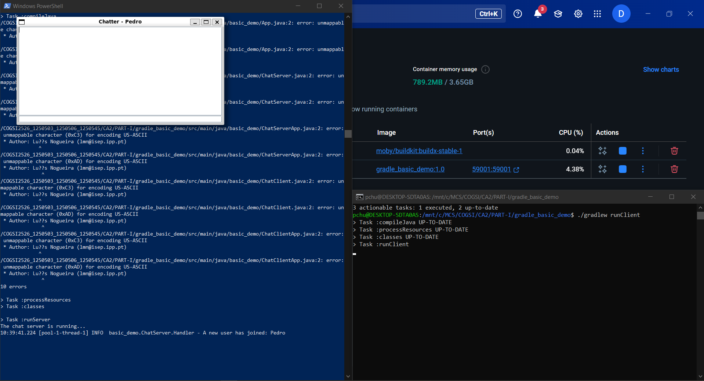

# CA5 - Containers
This class assignment will teach you how to work with containerization tools. As a container orchestration tool we will 
be using **Docker**.

Docker is

### How to install Docker

## Part I
The goal for the first part of the class assignment is to create separate images and containers for each CA2 application 
(the Simple Chat Application and the Spring Boot Rest Application).

You'll have two provide two versions for each one of the implementations, being the **first version** the one where you're 
going to build the server inside the `Dockerfile` - clone your repository and compile the application within the 
container, and the **second version** the one where you're going to build the server on the host machine and copy the 
resulting JAR file into the Docker image

### Simple Chat Application

#### Version 1
```dockerfile
# syntax=docker/dockerfile:1
FROM ubuntu:22.04

RUN apt-get update && apt-get install -y git openjdk-17-jdk openssh-client
RUN mkdir -p ~/.ssh && ssh-keyscan github.com >> ~/.ssh/known_hosts
RUN --mount=type=ssh git clone git@github.com:pchu22/COGSI2526_1250503_1250506_1250545.git /COGSI2526_1250503_1250506_1250545

WORKDIR /COGSI2526_1250503_1250506_1250545/CA2/PART-I/gradle_basic_demo

RUN chmod +x gradlew

EXPOSE 59001

CMD ["./gradlew", "runServer"]
```
```bash
docker buildx build --ssh default --load -t gradle_basic_demo:1.0 .
```
```bash
docker run --name simple-chat-application -p 59001:59001 gradle_basic_demo:1.0
```


#### Version 2

### Spring Boot Rest Application

#### Version 1

#### Version 2

## Part II
The goal for the second part of the class assignment is to create a containerized environment for running the Spring 
Boot Rest Application. You will implement a solution similar to CA3-P2, but this time using Docker instead of Vagrant.

To achieve this goal, you'll be using **Docker Compose** to create **two** containers. One of the containers will host 
the Spring Boot Rest Application and the other will run the H2 database server.

Additionally, ensure both containers can resolve each other's hostname, and configure a health-check on the db 
container, so that the web service only starts after the database is available.

Next, use a Docker volume in the db container to persist the database file. That way you ensure that the data is stored 
outside the container’s filesystem and can be retained and reused across container restarts.

Define environment variables in both containers to store sensitive information (database configurations to 
Spring Boot Rest Application, such as DB URL, username, password, etc...)

Finally, publish both images (db and web) to **Docker Hub**.

# Alternative Technologies

## Kubernetes

## Podman

# Self-Evaluation
```bash
Daniel (12500503) - ??%
Diogo (1250506) - ??%
Pedro (1250545) - 100%
```