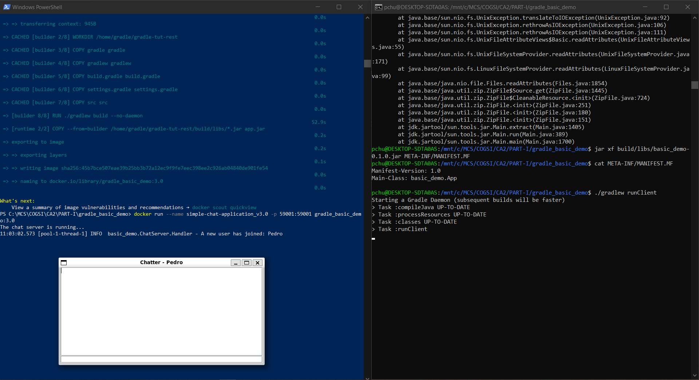
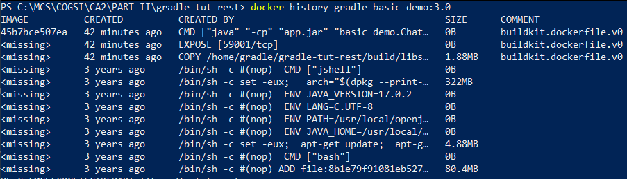
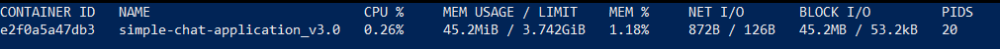
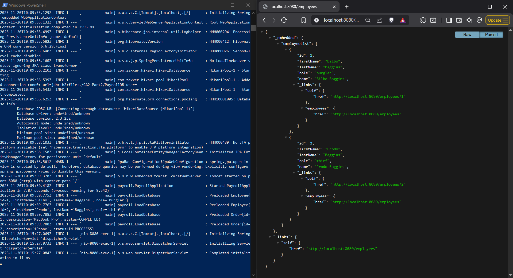
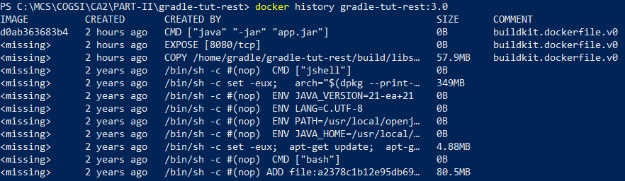
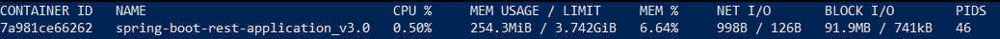
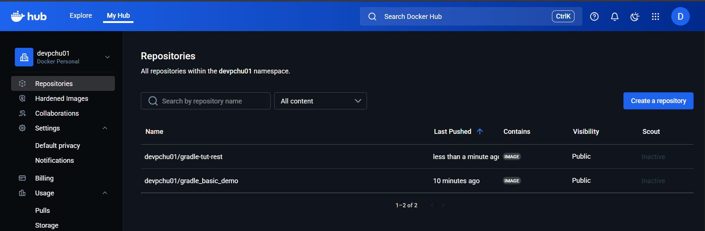
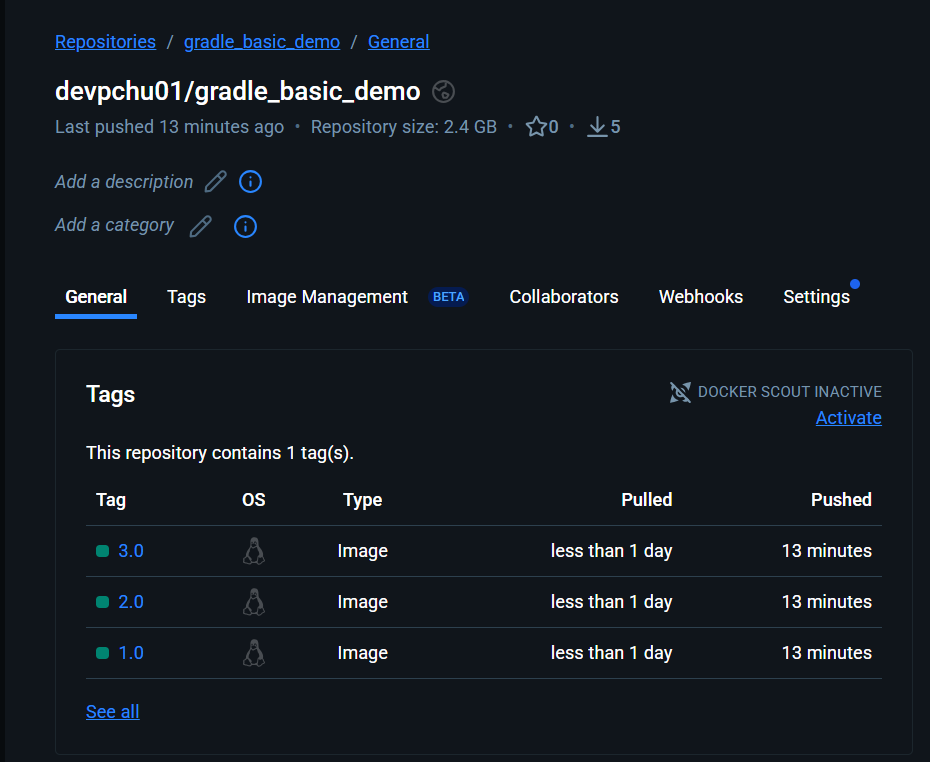
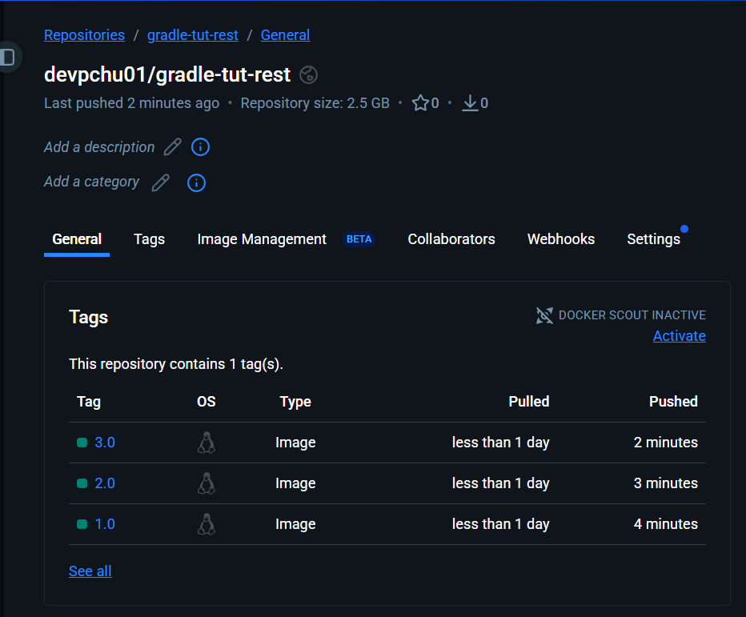

# CA5 - Containers
This class assignment will teach you how to work with containerization tools. As a container orchestration tool we will 
be using **Docker**.

Docker is

### Docker Desktop
**Docker Desktop** is a one-click-install application for Mac, Linux, or Windows environment that lets you build, 
share, and run containerized applications and microservices. It provides a straightforward Graphical User Interface 
(GUI) that lets you manage your containers, applications, and images directly from your machine.

Docker takes care of port mappings, file system concerns, and other default settings, and is regularly updated with bug 
fixes and security updates.

**Key features**:
- Ability to containerize and share any application on any cloud platform, in multiple languages and frameworks.
- Quick installation and setup of a complete Docker development environment.
- Includes the latest version of Kubernetes.
- On Windows, the ability to toggle between Linux and Windows containers to build applications.
- Fast and reliable performance with native Windows Hyper-V virtualization.
- Ability to work natively on Linux through WSL 2 on Windows machines.
- Volume mounting for code and data, including file change notifications and easy access to running containers on the 
localhost network.

### How to install Docker
This section provides the step-by-step installation instructions for Docker Desktop on Windows.

#### Install interactively
1. Download the installer from the release notes.
2. Double-click `Docker Desktop Installer.exe` to run the installer. By default, Docker Desktop is installed at 
`C:\Program Files\Docker\Docker`.
3. When prompted, ensure the **Use WSL 2 instead of Hyper-V** option on the Configuration page  is selected or not 
depending on your choice of backend - on systems that support only one backend, Docker Desktop automatically selects the 
available option.
4. Follow the instructions on the installation wizard to authorize the installer and proceed with the installation.
5. When the installation is successful, select Close to complete the installation process.

**Congratulations**! You have successfully installed Docker Desktop.

If your **administrator account is different to your user account**, you must add the user to the **docker-users group** 
to access features that require higher privileges, such as creating and managing the Hyper-V VM, or using Windows 
containers:
1. Run Computer Management as an **administrator**.
2. Navigate to **Local Users** and **Groups > Groups > docker-users**.
3. Right-click to add the user to the group.
4. Sign out and sign back in for the changes to take effect.

#### Install from the command line
After downloading `Docker Desktop Installer.exe`, run the following command in a terminal to install Docker Desktop:
```bash
"Docker Desktop Installer.exe" install
```

**If you’re using PowerShell you should run it as**:
```bash
Start-Process 'Docker Desktop Installer.exe' -Wait install
```

**NOTE**: If you're using PowerShell, you need to use the `ArgumentList` parameter before any flags.

**If using the Windows Command Prompt**:
```bash
start /w "" "Docker Desktop Installer.exe" install
```

By default, Docker Desktop is installed at `C:\Program Files\Docker\Docker`.

If your **admin account is different to your user account**, you must add the user to the **docker-users group** to 
access features that require higher privileges, such as creating and managing the Hyper-V VM, or using Windows 
containers.

```bash
net localgroup docker-users <user> /add
```

## Part I
The goal for the first part of the class assignment is to create separate images and containers for each CA2 application 
(the Simple Chat Application and the Spring Boot Rest Application).

You'll have two provide two versions for each one of the implementations, being the **first version** the one where 
you're going to build the server inside the `Dockerfile` - clone your repository and compile the application within the 
container, and the **second version**, the one where you're going to build the server on the host machine and copy the 
resulting JAR file into the Docker image.

Additionally, you'll have to implement a **multi-stage build** to separate the build and runtime stages.

Finally, publish all images to **Docker Hub**.

### Simple Chat Application
As previously mentioned, you'll be developing two versions of the Simple Chat Application for this part of the class 
assignment. Find below a reference for each one of the versions with the respective description of the used `dockerfile` 
and respective executed commands in the powershell console.

#### Version 1
In your `Dockerfile`, start by defining the **parser directive**. The **parser directive** specifies which `Dockerfile` 
syntax version to use, and is primarily required when building images with `BuildKit`.

Next, the `FROM` instruction to select the base image. In this case, we are using `Ubuntu 22.04`.

Then, utilizing the `RUN` instruction, update the existing packages and install the packages you need - in this case it 
was `git`, `openjdk-17-jdk`, and `openssh-client`. These actions can be concatenated into a single command to reduce the 
number of layers in the final Docker image and to ensure that the package installation occurs only after updating the 
system is updated.

Afterward, still with `RUN`, execute the following commands:
```bash
mkdir -p ~/.ssh
ssh-keyscan github.com >> ~/.ssh/known_hosts
```

- The first command **creates the `.ssh` directory in the container's `home` directory**. The `-p` flag ensures the 
command doesn't fail if the directory already exists. This directory store SSH configuration, private keys, and known 
hosts.
- The second command **fetches the GitHub's public SSH host key and appends it to the `known_hosts` file**.

These commands were concatenated to create only one layer and to ensure the `ssh-keyscan` command runs only if the 
`~/.ssh` directory exists.

Then, still using `RUN`, clone your repository. For **private repositories**, use the `--mount=type=ssh` flag. **This 
temporarily mounts the SSH agent or the private key only for this build step, allowing the container to authenticate 
with GitHub without embedding your private key into the final image**.

The `WORKDIR /COGSI2526_1250503_1250506_1250545/CA2/PART-I/gradle_basic_demo` instruction set the working directory 
for any `RUN`, `CMD`, `ENTRYPOINT`, `COPY`, and `ADD` instructions that follow it within the `Dockerfile`.

The `EXPOSE` instruction doesn't open any port by itself; it is primarily used to documenting which ports the container  
is expected to expose.

Next, `RUN chmod +x gradlew` is utilized to add executable permissions to the `gradlew` file, allowing the root user to 
run this script. 

Finally, the `CMD` instruction defines the default program that is run once you start the container based on this image. 
Each `Dockerfile` only has one `CMD` instance.

For the first version, your `Dockerfile` should follow the structure outlined below.

```dockerfile
# syntax=docker/dockerfile:1
FROM ubuntu:22.04

RUN apt-get update && apt-get install -y git openjdk-17-jdk openssh-client
RUN mkdir -p ~/.ssh && ssh-keyscan github.com >> ~/.ssh/known_hosts
RUN --mount=type=ssh git clone git@github.com:pchu22/COGSI2526_1250503_1250506_1250545.git /COGSI2526_1250503_1250506_1250545

WORKDIR /COGSI2526_1250503_1250506_1250545/CA2/PART-I/gradle_basic_demo

RUN chmod +x gradlew

EXPOSE 59001

CMD ["./gradlew", "runServer"]
```

After having a robust and well-structured `Dockerfile`, run the following command to build your image: 

```bash
docker buildx build --ssh default --load -t gradle_basic_demo:1.0 .
```

This command uses `docker buildx` to build a Docker image.

- The `docker buildx` extends the functionality of the `docker build` command utilizing **BuildKit**. BuildKit offers 
improved performance, better caching, and the ability to build multi-architecture images. The `build` subcommand 
instructs `buildx` to perform a build operation.
- The `--ssh default` 
- The `--load` tells BuildKit to load the built image into the local Docker image cache. Without this flag, image 
will not appear in your local docker images list
- The `-t gradle_basic_demo:1.0` assigns a tag (name:version) to the final image.
- The `.` in the final part of the command indicates the current working directory. This directory is recursively sent 
to the Docker daemon/BuildKit builder.

Once the image is built, create and start a container utilizing  the following command:

```bash
docker run --name simple-chat-application -p 59001:59001 gradle_basic_demo:1.0
```

- The flag `--name` assigns a name to the newly created container.
- The flag `-p 59001:59001` set up port forwarding. Its format is The format is `[HOST_IP:]HOST_PORT:CONTAINER_PORT` 
(if HOST_IP isn't defined, it forwards the indicated por in every interface).

After your container is running, start one (or more) client(s) by executing the `runClient` task. Your output should 
resemble the example below:


##### Image layers
By running the command `docker history gradle_basic_demo:1.0` you can display the layer-by-layer history of the 
`gradle_basic_demo:1.0` image, showing details such as the **creation time**, **size**, **command used to create 
each layer**, and **any associated comments**. 

This command helps to understand how an image is constructed, which is useful for **troubleshooting**, **auditing**, and 
**optimizing image builds**. 

Each layer corresponds to a step in the Dockerfile, and the output reveals the sequence of 
commands that built the image.

The following image is the expected output you should get after running the previously mentioned command.


##### Container resource usage
The `docker stats simple-chat-application` command provides real-time resource usage statistics for the 
`simple-chat-application` container, including **CPU percentage**, **memory usage relative to the limit**, **network 
input/output**, **block device input/output**, and the **number of processes or threads (PIDs) created by the 
container**.

The following image is the expected output you should get after running the previously mentioned command.


#### Version 2
In your `Dockerfile`, start by defining the **parser directive**. The **parser directive** specifies which `Dockerfile`
syntax version to use, and is primarily required when building images with `BuildKit`.

Next, the `FROM` instruction to select the base image. In this case, we are using `cimg/openjdk:17.0`. `cimg/openjdk` is 
a Docker image created by CircleCI. Each tag contains a version of OpenJDK and any binaries and tools that are required 
for builds to complete successfully.

Then, the `COPY` instruction **copies new files or directories from `<src>`** and **adds them to the filesystem of the 
container at the path `<dest>`**. In this case, we are copying from `/build/libs/*.jar` to `app.jar`.

The `EXPOSE` instruction doesn't open any port by itself; it is primarily used to documenting which ports the container  
is expected to expose.

Finally, the `CMD` instruction defines the default program that is run once you start the container based on this image.
Each `Dockerfile` only has one `CMD` instance.

For the second version, your `Dockerfile` should follow the structure outlined below.

```dockerfile
# syntax=docker/dockerfile:1
FROM cimg/openjdk:17.0

COPY build/libs/*.jar app.jar

EXPOSE 59001

CMD ["java", "-cp", "app.jar", "basic_demo.ChatServerApp", "59001"]
```

After having a robust and well-structured `Dockerfile`, run the following command to build your image:

```bash
docker build -t gradle_basic_demo:2.0 .
```

This command uses `docker build` to build a Docker image.

- The `-t gradle_basic_demo:2.0` assigns a tag (name:version) to the final image.
- The `.` in the final part of the command indicates the current working directory. This directory is recursively sent
  to the Docker daemon/BuildKit builder.

Once the image is built, create and start a container utilizing  the following command:

```bash
docker run --name simple-chat-application_v2.0 -p 59001:59001 gradle_basic_demo:2.0
```

- The flag `--name` assigns a name to the newly created container.
- The flag `-p 59001:59001` set up port forwarding. Its format is The format is `[HOST_IP:]HOST_PORT:CONTAINER_PORT`
  (if HOST_IP isn't defined, it forwards the indicated por in every interface).

After your container is running, start one (or more) client(s) by executing the `runClient` task. Your output should
resemble the example below:


##### Image layers
By running the command `docker history gradle_basic_demo:2.0` you can display the layer-by-layer history of the
`gradle_basic_demo:2.0` image, showing details such as the **creation time**, **size**, **command used to create
each layer**, and **any associated comments**.

This command helps to understand how an image is constructed, which is useful for **troubleshooting**, **auditing**, and
**optimizing image builds**.

Each layer corresponds to a step in the Dockerfile, and the output reveals the sequence of
commands that built the image.

The following image is the expected output you should get after running the previously mentioned command.


##### Container resource usage
The `docker stats simple-chat-application_v2.0` command provides real-time resource usage statistics for the
`simple-chat-application_v2.0` container, including **CPU percentage**, **memory usage relative to the limit**, 
**network input/output**, **block device input/output**, and the **number of processes or threads (PIDs) created by the
container**.

The following image is the expected output you should get after running the previously mentioned command.


#### Comparison between versions 1 and version 2


### Spring Boot Rest Application
As previously mentioned, you'll be developing two versions of the Spring Boot Rest Application for this part of the 
class assignment. Find below a reference for each one of the versions with the respective description of the used 
`dockerfile` and respective executed commands in the powershell console.

#### Version 1
In your `Dockerfile`, start by defining the **parser directive**. The **parser directive** specifies which `Dockerfile`
syntax version to use, and is primarily required when building images with `BuildKit`.

Next, the `FROM` instruction to select the base image. In this case, we are using `Ubuntu 22.04`.

Then, utilizing the `RUN` instruction, update the existing packages and install the packages you need - in this case it
was `git`, `openjdk-17-jdk`, and `openssh-client`. These actions can be concatenated into a single command to reduce the
number of layers in the final Docker image and to ensure that the package installation occurs only after updating the
system is updated.

Afterward, still with `RUN`, execute the following commands:
```bash
mkdir -p ~/.ssh
ssh-keyscan github.com >> ~/.ssh/known_hosts
```

- The first command **creates the `.ssh` directory in the container's `home` directory**. The `-p` flag ensures the
  command doesn't fail if the directory already exists. This directory store SSH configuration, private keys, and known
  hosts.
- The second command **fetches the GitHub's public SSH host key and appends it to the `known_hosts` file**.

These commands were concatenated to create only one layer and to ensure the `ssh-keyscan` command runs only if the
`~/.ssh` directory exists.

Then, still using `RUN`, clone your repository. For **private repositories**, use the `--mount=type=ssh` flag. **This
temporarily mounts the SSH agent or the private key only for this build step, allowing the container to authenticate
with GitHub without embedding your private key into the final image**.

The `WORKDIR /COGSI2526_1250503_1250506_1250545/CA2/PART-II/gradle-tut-rest` instruction set the working directory
for any `RUN`, `CMD`, `ENTRYPOINT`, `COPY`, and `ADD` instructions that follow it within the `Dockerfile`.

The `EXPOSE` instruction doesn't open any port by itself; it is primarily used to documenting which ports the container  
is expected to expose.

Next, `RUN chmod +x gradlew` is utilized to add executable permissions to the `gradlew` file, allowing the root user to
run this script.

Finally, the `CMD` instruction defines the default program that is run once you start the container based on this image.
Each `Dockerfile` only has one `CMD` instance.

For the first version, your `Dockerfile` should follow the structure outlined below.

```dockerfile
# syntax=docker/dockerfile:1
FROM ubuntu:22.04

RUN apt-get update && apt-get install -y git openjdk-17-jdk openssh-client
RUN mkdir -p ~/.ssh && ssh-keyscan github.com >> ~/.ssh/known_hosts
RUN --mount=type=ssh git clone git@github.com:pchu22/COGSI2526_1250503_1250506_1250545.git /COGSI2526_1250503_1250506_1250545

WORKDIR /COGSI2526_1250503_1250506_1250545/CA2/PART-II/gradle-tut-rest

RUN chmod +x gradlew

EXPOSE 8080

CMD ["./gradlew", "bootRun"]
```

After having a robust and well-structured `Dockerfile`, run the following command to build your image:

```bash
docker buildx build --ssh default --load --no-cache -t gradle-tut-rest:1.0 .
```

This command uses `docker buildx` to build a Docker image.

- The `docker buildx` extends the functionality of the `docker build` command utilizing **BuildKit**. BuildKit offers
  improved performance, better caching, and the ability to build multi-architecture images. The `build` subcommand
  instructs `buildx` to perform a build operation.
- The `--ssh default`
- The `--load` tells BuildKit to load the built image into the local Docker image cache. Without this flag, image
  will not appear in your local docker images list
- The `--no-cache` flag forces Docker to **rebuild every layer from scratch, ignoring all previously cached build 
steps**.
- The `-t gradle-tut-rest:1.0` assigns a tag (name:version) to the final image.
- The `.` in the final part of the command indicates the current working directory. This directory is recursively sent
  to the Docker daemon/BuildKit builder.

Once the image is built, create and start a container utilizing  the following command:

```bash
docker run --name spirng-boot-rest-application -p 8080:8080 gradle-tut-rest:1.0
```

- The flag `--name` assigns a name to the newly created container.
- The flag `-p 8080:8080` set up port forwarding. Its format is The format is `[HOST_IP:]HOST_PORT:CONTAINER_PORT`
  (if HOST_IP isn't defined, it forwards the indicated por in every interface).

After your container is running, open your web browser and navigate to `localhost:8080/employees`. Your output should 
resemble the example below:


##### Image layers
By running the command `docker history gradle-tut-rest:1.0` you can display the layer-by-layer history of the
`gradle-tut-rest:1.0` image, showing details such as the **creation time**, **size**, **command used to create
each layer**, and **any associated comments**.

This command helps to understand how an image is constructed, which is useful for **troubleshooting**, **auditing**, and
**optimizing image builds**.

Each layer corresponds to a step in the Dockerfile, and the output reveals the sequence of
commands that built the image.

The following image is the expected output you should get after running the previously mentioned command.


##### Container resource usage
The `docker stats spring-boot-rest-application` command provides real-time resource usage statistics for the 
`sping-boot-rest-application` container, including **CPU percentage**, **memory usage relative to the limit**, **network 
input/output**, **block device input/output**, and the **number of processes or threads (PIDs) created by the 
container**.

The following image is the expected output you should get after running the previously mentioned command.


#### Version 2
In your `Dockerfile`, start by defining the **parser directive**. The **parser directive** specifies which `Dockerfile`
syntax version to use, and is primarily required when building images with `BuildKit`.

Next, the `FROM` instruction to select the base image. In this case, we are using `cimg/openjdk:21.0.9`. `cimg/openjdk` 
is a Docker image created by CircleCI. Each tag contains a version of OpenJDK and any binaries and tools that are 
required for builds to complete successfully.

Then, the `COPY` instruction **copies new files or directories from `<src>`** and **adds them to the filesystem of the
container at the path `<dest>`**. In this case, we are copying from `/build/libs/*.jar` to `app.jar`.

The `EXPOSE` instruction doesn't open any port by itself; it is primarily used to documenting which ports the container  
is expected to expose.

Finally, the `CMD` instruction defines the default program that is run once you start the container based on this image.
Each `Dockerfile` only has one `CMD` instance.

For the second version, your `Dockerfile` should follow the structure outlined below.

```dockerfile
# syntax=docker/dockerfile:1
FROM cimg/openjdk:21.0.9

COPY build/libs/*.jar app.jar

EXPOSE 8080

CMD ["java", "-jar", "app.jar"]
```

After having a robust and well-structured `Dockerfile`, run the following command to build your image:

```bash
docker build -t gradle-tut-rest:2.0 .
```

This command uses `docker build` to build a Docker image.

- The `-t gradle-tut-rest:2.0` assigns a tag (name:version) to the final image.
- The `.` in the final part of the command indicates the current working directory. This directory is recursively sent
  to the Docker daemon/BuildKit builder.

Once the image is built, create and start a container utilizing  the following command:

```bash
docker run --name sping-boot-rest-application_v2.0 -p 8080:8080 gradle-tut-rest:2.0
```

- The flag `--name` assigns a name to the newly created container.
- The flag `-p 8080:8080` set up port forwarding. Its format is The format is `[HOST_IP:]HOST_PORT:CONTAINER_PORT`
  (if HOST_IP isn't defined, it forwards the indicated por in every interface).

After your container is running, open your web browser and navigate to `localhost:8080/employees`. Your output should
resemble the example below:


##### Image layers
By running the command `docker history gradle-tut-rest:2.0` you can display the layer-by-layer history of the
`gradle-tut-rest:2.0` image, showing details such as the **creation time**, **size**, **command used to create
each layer**, and **any associated comments**.

This command helps to understand how an image is constructed, which is useful for **troubleshooting**, **auditing**, and
**optimizing image builds**.

Each layer corresponds to a step in the Dockerfile, and the output reveals the sequence of
commands that built the image.

The following image is the expected output you should get after running the previously mentioned command.


##### Container resource usage
The `docker stats spring-boot-rest-application_v2.0` command provides real-time resource usage statistics for the
`sping-boot-rest-application_v2.0` container, including **CPU percentage**, **memory usage relative to the limit**, 
**network input/output**, **block device input/output**, and the **number of processes or threads (PIDs) created by the
container**.

The following image is the expected output you should get after running the previously mentioned command.


### Multi-Stage builds
**Multi-Stage builds reduce image size and improve security by separating build and runtime environments**. With 
Multi-Stage builds, you use multiple `FROM` statements in your `Dockerfile`. Each `FROM` instruction can use a different 
base image, and each of them begins a new stage of the build. You can selectively copy artifacts from one stage to 
another, leaving behind everything you don't want in the final image.

By default, the stages aren't named, and you refer to them by their integer number, starting with 0 for the first `FROM` 
instruction. However, you can name your stages, by adding an `AS <NAME>` to the `FROM` instruction. 

**Benefits of a Multi-Stage build**:
- Final image is smaller and contains only what’s needed to run
- Keeps build tools and intermediate files out of production images
- Improves security, performance, and portability

In the following subsections, you'll find a Multi-Stage build implementation (and a detailed explanation) of the 
previously developed `Dockerfile`.

#### Simple Chat Application
In your `Dockerfile`, start by defining the **parser directive**. The **parser directive** specifies which `Dockerfile`
syntax version to use, and is primarily required when building images with `BuildKit`.

Next, the first `FROM` instruction selects the base image for the builder stage. In this case, we are using 
`gradle:8.9-jdk17-focal`.

The `WORKDIR /home/gradle/gradle-tut-rest` instruction set the working directory for any `RUN`, `CMD`, `ENTRYPOINT`, 
`COPY`, and `ADD` instructions that follow it within the `Dockerfile`.

Then, the five `COPY` instructions copy all the files needed to build the project.

- `gradle/`: Contains the Gradle Wrapper binaries.
- `gradlew`: The wrapper script.
- `build.gradle` and `settings.gradle`: Build configuration.
- `src/`: The application source code.

Next, `./gradlew build --no-daemon` is utilized to run the Gradle Wrapper inside the container to build the application 
fat JAR (`bootJar`). The `--no-daemon` flag is used because Gradle's daemon is unnecessary inside Docker's environment, 
where it can waste **permission issues**, **waste resources**, and **interfere with Multi-Stage build**, so disabling 
it ensures a clean one-time build.

Afterward, the second `FROM` instruction selects the base image for the runtime stage. In this case, we are using 
`openjdk:17.0.2-jdk-slim`.

Then, the `COPY` instruction copies the generated `.jar` during the builder stage into the runtime stage.

The `EXPOSE` instruction doesn't open any port by itself; it is primarily used to documenting which ports the container  
is expected to expose.

Finally, the `CMD` instruction defines the default program that is run once you start the container based on this image.
Each `Dockerfile` only has one `CMD` instance.

For the Multi-Stage build of the Simple Chat Application, your `Dockerfile` should follow the structure outlined below.

```dockerfile
# syntax=docker/dockerfile:1
FROM gradle:8.9-jdk17-focal AS builder

WORKDIR /home/gradle/gradle-tut-rest

COPY gradle gradle
COPY gradlew gradlew
COPY build.gradle build.gradle
COPY settings.gradle settings.gradle

COPY src src

RUN ./gradlew build --no-daemon

FROM openjdk:17.0.2-jdk-slim AS runtime

COPY --from=builder /home/gradle/gradle-tut-rest/build/libs/*.jar app.jar

EXPOSE 59001

CMD ["java", "-cp", "app.jar", "basic_demo.ChatServerApp", "59001"]
```

After having a robust and well-structured `Dockerfile`, run the following command to build your image:

```bash
docker build -t gradle_basic_demo:3.0 .
```

This command uses `docker build` to build a Docker image.

- The `-t gradle_basic_demo:3.0` assigns a tag (name:version) to the final image.
- The `.` in the final part of the command indicates the current working directory. This directory is recursively sent
  to the Docker daemon/BuildKit builder.

Once the image is built, create and start a container utilizing  the following command:

```bash
docker run --name simple-chat-application_v3.0 -p 59001:59001 gradle_basic_demo:3.0
```

- The flag `--name` assigns a name to the newly created container.
- The flag `-p 59001:59001` set up port forwarding. Its format is The format is `[HOST_IP:]HOST_PORT:CONTAINER_PORT`
  (if HOST_IP isn't defined, it forwards the indicated por in every interface).

After your container is running, start one (or more) client(s) by executing the `runClient` task. Your output should
resemble the example below:



##### Image layers
By running the command `docker history gradle_basic_demo:3.0` you can display the layer-by-layer history of the
`gradle_basic_demo:3.0` image, showing details such as the **creation time**, **size**, **command used to create
each layer**, and **any associated comments**.

This command helps to understand how an image is constructed, which is useful for **troubleshooting**, **auditing**, and
**optimizing image builds**.

Each layer corresponds to a step in the Dockerfile, and the output reveals the sequence of
commands that built the image.

The following image is the expected output you should get after running the previously mentioned command.



##### Container resource usage
The `docker stats simple-chat-application_v3.0` command provides real-time resource usage statistics for the
`simple-chat-application_v3.0` container, including **CPU percentage**, **memory usage relative to the limit**,
**network input/output**, **block device input/output**, and the **number of processes or threads (PIDs) created by the
container**.

The following image is the expected output you should get after running the previously mentioned command.



#### Spring Boot Rest Application
In your `Dockerfile`, start by defining the **parser directive**. The **parser directive** specifies which `Dockerfile`
syntax version to use, and is primarily required when building images with `BuildKit`.

Next, the first `FROM` instruction selects the base image for the builder stage. In this case, we are using
`gradle:8.9-jdk17-focal`.

The `WORKDIR /home/gradle/gradle-tut-rest` instruction set the working directory for any `RUN`, `CMD`, `ENTRYPOINT`,
`COPY`, and `ADD` instructions that follow it within the `Dockerfile`.

Then, the five `COPY` instructions copy all the files needed to build the project.

- `gradle/`: Contains the Gradle Wrapper binaries.
- `gradlew`: The wrapper script.
- `build.gradle` and `settings.gradle`: Build configuration.
- `src/`: The application source code.

Next, `./gradlew clean bootJar --no-daemon` is utilized to generate only the application fat JAR (`bootJar`). The 
`--no-daemon` flag is used because Gradle's daemon is unnecessary inside Docker's environment, where it can waste 
**permission issues**, **waste resources**, and **interfere with Multi-Stage build**, so disabling it ensures a clean 
one-time build.

Afterward, the second `FROM` instruction selects the base image for the runtime stage. In this case, we are using
`openjdk:21-ea-21-jdk-slim`.

Then, the `COPY` instruction copies the generated `.jar` during the builder stage into the runtime stage.

The `EXPOSE` instruction doesn't open any port by itself; it is primarily used to documenting which ports the container  
is expected to expose.

Finally, the `CMD` instruction defines the default program that is run once you start the container based on this image.
Each `Dockerfile` only has one `CMD` instance.

For the Multi-Stage build of the Spring Boot Rest Application, your `Dockerfile` should follow the structure outlined 
below.

```dockerfile
# syntax=docker/dockerfile:1
FROM gradle:8.9-jdk17-focal AS builder

WORKDIR /home/gradle/gradle-tut-rest

COPY gradle gradle
COPY gradlew gradlew
COPY build.gradle build.gradle
COPY settings.gradle settings.gradle

COPY src src

RUN ./gradlew clean bootJar --no-daemon

FROM openjdk:21-ea-21-jdk-slim AS runtime

COPY --from=builder /home/gradle/gradle-tut-rest/build/libs/*.jar app.jar

EXPOSE 8080

CMD ["java", "-jar", "app.jar"]
```

After having a robust and well-structured `Dockerfile`, run the following command to build your image:

```bash
docker build -t gradle-tut-rest:3.0 .
```

This command uses `docker build` to build a Docker image.

- The `-t gradle-tut-rest:3.0` assigns a tag (name:version) to the final image.
- The `.` in the final part of the command indicates the current working directory. This directory is recursively sent
  to the Docker daemon/BuildKit builder.

Once the image is built, create and start a container utilizing  the following command:

```bash
docker run --name sping-boot-rest-application_v3.0 -p 8080:8080 gradle-tut-rest:3.0
```

- The flag `--name` assigns a name to the newly created container.
- The flag `-p 8080:8080` set up port forwarding. Its format is The format is `[HOST_IP:]HOST_PORT:CONTAINER_PORT`
  (if HOST_IP isn't defined, it forwards the indicated por in every interface).

After your container is running, open your web browser and navigate to `localhost:8080/employees`. Your output should
resemble the example below:



##### Image layers
By running the command `docker history gradle-tut-rest:3.0` you can display the layer-by-layer history of the
`gradle-tut-rest:3.0` image, showing details such as the **creation time**, **size**, **command used to create
each layer**, and **any associated comments**.

This command helps to understand how an image is constructed, which is useful for **troubleshooting**, **auditing**, and
**optimizing image builds**.

Each layer corresponds to a step in the Dockerfile, and the output reveals the sequence of
commands that built the image.

The following image is the expected output you should get after running the previously mentioned command.



##### Container resource usage
The `docker stats spring-boot-rest-application_v3.0` command provides real-time resource usage statistics for the
`spring-boot-rest-application_v3.0` container, including **CPU percentage**, **memory usage relative to the limit**,
**network input/output**, **block device input/output**, and the **number of processes or threads (PIDs) created by the
container**.

The following image is the expected output you should get after running the previously mentioned command.



### Publish all images to Docker Hub
Before publishing any images, authenticate to Docker Hub using the command `docker login`.

Next, proceed by tagging your images because Docker Hub requires images to be tagged with using the format 
`username/repository:tag`. Replace `username`, `repository`, and `tag` with your own values.

To tag all the images you created during this part of the class assignment run the following command:

```bash
docker tag NAME:[TAG] USERNAME/REPOSITORY:[TAG]
```

To tag the images we created during this part of the class assignment we ran the following commands:

```bash
docker tag gradle_basic_demo:1.0 devpchu01/gradle_basic_demo:1.0
docker tag gradle_basic_demo:2.0 devpchu01/gradle_basic_demo:2.0
docker tag gradle_basic_demo:3.0 devpchu01/gradle_basic_demo:3.0
docker tag gradle-tut-rest:1.0 devpchu01/gradle-tut-rest:1.0
docker tag gradle-tut-rest:2.0 devpchu01/gradle-tut-rest:2.0
docker tag gradle-tut-rest:3.0 devpchu01/gradle-tut-rest:3.0
```

Finally, push the images to your repository using the following command:

```bash
docker push USERNAME/REPOSITORY:[TAG]
```

To push the images to Docker Hub ran the following commands:

```bash
docker push devpchu01/gradle_basic_demo:1.0
docker push devpchu01/gradle_basic_demo:2.0
docker push devpchu01/gradle_basic_demo:3.0
docker push devpchu01/gradle-tut-rest:1.0
docker push devpchu01/gradle-tut-rest:2.0
docker push devpchu01/gradle-tut-rest:3.0
```

Your Docker Hub repositories page should look similar to the one in the image below:



The following images take are a more detailed illustration of both the `gradle_basic_demo` and the `gradle-tut-rest` 
repositories, respectively.

#### gradle_basic_demo


#### gradle-tut-rest



## Part II
The goal for the second part of the class assignment is to create a containerized environment for running the Spring 
Boot Rest Application. You will implement a solution similar to CA3-P2, but this time using Docker instead of Vagrant.

To achieve this goal, you'll be using **Docker Compose** to create **two** containers. One of the containers will host 
the Spring Boot Rest Application and the other will run the H2 database server.

Additionally, ensure both containers can resolve each other's hostname, and configure a health-check on the db 
container, so that the web service only starts after the database is available.

Next, use a Docker volume in the db container to persist the database file. That way you ensure that the data is stored 
outside the container’s filesystem and can be retained and reused across container restarts.

Define environment variables in both containers to store sensitive information (database configurations to 
Spring Boot Rest Application, such as DB URL, username, password, etc...)

Finally, publish both images (db and web) to **Docker Hub**.

# Alternative Technologies
In this section you'll be introduced to some alternative technologies to Docker and how one could implement 
**CA5-Part2**. 

In our case, we used `Podman` and incorporated a few additional features. Since Docker and Podman are 
very similar, the difference between the two implementations would be minimal without the additional features. 

To conclude this class assignment, we will also give an honourable mention to **Kubernetes (K8s)**. 

## Rocket
Rocket is an application container runtime developed for modern, cloud-native production environments. It offers a 
pod-native approach, a pluggable execution environment, and a well-defined surface area, making it ideal for integration 
with other systems.

The central execution unit in rkt is the pod, a set of one or more applications running in a shared context (rkt pods 
follow the same concept as Kubernetes orchestration pods). With rkt, users can apply different configurations (such as 
isolation parameters) both at the pod level and per application for more granular control. Thanks to rkt’s architecture, 
each pod runs directly in the classic Unix process model (i.e., without a central daemon), in an isolated and 
independent environment.

rkt implements an open and modern container format standard, the App Container (appc) specification, but it can also run 
other container images, such as those created with Docker.

## Podman
**Podman**, short for **pod manager**, is a **daemonless**, open source Linux native tool for developing, managing and 
running containers, designed to make it easy to find, run, build, share and deploy applications using **Open Containers 
Initiative** (**OCI**) containers and containers images. 

Podman makes it an accessible, security-focused option for container management. Its accompanying tools and features, 
such as **Buildah** and **Skopeo**, let developers customize their container environments to suit their needs. 

Podman provides a command line interface (CLI) that creates and supports OCI containers, which are designed to meet 
industry standards for container runtimes and formats. More advanced building capabilities are available in the related 
project, Buildah. Developers can also take advantage of **Podman Desktop**, a graphical user interface (GUI) for using 
Podman in local environments. Most users can simply alias Docker to Podman without any problems. Similar to other common 
Container Engines, Podeman relies on an OCI compliant Container Runtime to interface with the operating system and 
create the running containers. 

This make the running containers created by Podman nearly indistinguishable from those 
created by any other common container engine. Users can run Podman on various Linux distribution, sucha as Red Hat 
Enterprise Linux, Fedora, CentOS and Ubuntu. Containers under the control of Podman can either be run by root or by a 
non-privilaged user. Podman manages the entire container ecosystem which includes pods, container images, and container 
volumes using the libpod library. Podman specializes in all the commands and functions that help to maintain and 
modify OCI container images, such as pulling and tagging. It allows to create, run and maintain those containers and 
container images in a production environment.

### What are Pods
Pods are groups of containers that run together and share the same resources, similar to Kubernetes pods. Podman manages 
these pods via a simple CLI and the libpod library, which provides application programming interfaces (APIs) for 
managing containers, pods, container images and volumes.

Each pod is composed of one infra container and any number of regular containers. The infra container keeps the pod 
running and maintains user namespaces, which isolate containers form the host. The other containers each have a monitor 
to keep track of their processes and look out for dead containers, nonfunctioning containers that can not be taken outo 
of the environment because some of their resources are still being used.

### Podman Desktop
Podman Desktop is a GUI for Podman, which provides a central place for developers to work with containers on the laptop
or workstation. Developers can build, push and pull images and manage Podman resources directly using a GUI that is
consistent across local Linux, Windows and MacOS environments. Podman Desktop also lets developers deliver
ready-to-deploy containerized applications to Kubernets environments. Podman Desktop supports extension packs, which
open up additional capabilities.

### Podman, Buildah and Skopeo
Podman is a modular container engine, so it must work alongside tools like Buildah and Skopeo to build and move
containers.

With Buildah, it is possible build containers either from scratch or by using an image as a starting point. Skope moves
container images between differente types of storage systems, allowing you to copy images between registries like
docker.io, quay.io and internal registry or between different types of storage on the local system. This modular
approach to containerization results in a flexible, lightweight environment by reducing overhead and isolating the
features that is needed. Working with containers make it possible to use smaller, more modular tools that can focus on
a single purpose and be updated as often as needed.

Podman and Buildah use runC, the OCI runtime, by default to launch containers. Can use runC to build and run an image
or can use it to run Docker-formatted images. This language-based tool reads a runtie specification, configures the
Linux kernel and eventually creates and starts container processes.

### What makes Podman different from other container engines
Podman stands out from other container engines because it is daemonless, meaning it does not rely on a process with root 
privileges to run containers.

Daemons are processes that run int the background of the system to do the work of running containers without a user 
interface. Daemons can be associated as the intermediary communicating between the user and the container.

While daemons can be a convenient way to manage your container environment, this can also introduce security 
vulnerabilities. Many daemons run with root privileges. In Linux systems, the root account acts as a superuser with 
administrative access, while bypassing the need for administrator verification, to read files, install programs, edit 
applications and more. This makes daemons an ideal target for hackers who want to gain control of the containers and 
infiltrate the host system.

Podman cuts out the daemon and lets regular users run containers without interacting with a root-owned daemon or allows 
for the use of rootless containers. By going rootless, users can create, run and manage containers without requiring 
processes with admin privileges, making the container environment more accessible while reducing security risks. 
Additionally, Podman launches each container with a Security-Enhance Linux, SELinux label, gibing administrators more 
control over what resources and capabilities are provided to container processes.

### How does Podman manage containers
Users can invoke Podman from the command line to pull containers from a repository and run that. Podman calls the 
configured container runtime to create the running container, but without a dedicated daemon, Podman uses system, a 
system and service manager for Linux operating systems, to make updates ad keep containers running in the background. By 
integrating system and Podman, it is possible to generate control units for the containers and run them with system 
automatically enabled.

Users can control the automatic starting and managing of their containers through their own repositories on the system 
or using system units. Allowing users to manage their own resources and running containers rootless, can remove the 
temptation to add privileges like write access to areas of the system that should not have. This also ensures that every 
user has separate sets of containers and images and can use Podman concurrently on the same host without interfering 
with each other. When users finish their work, they can push changes to a common registry to share their image with 
others.

Podman also deploys a RESTful API to manage containers. REST stands for representational state transfer. A REST API is 
an API that conforms to the containers of REST architecture style and allows for interaction with RESTful web services.

### Podman vs Docker
The main difference between Podman and Docker is Podman’s daemonless architecture. Podman containers have always been 
rootless, while Docker only recently added a rootless mode to its daemon configuration. Docker is an all-in-one tool for 
container creation and management, whereas Podman and its associates tools like Buildah and Skopeo are more specialized 
for specific aspects of containerization. This makes it possible to customize the environment whit only the tools 
needed.

Podman is a powerful alternative to Docker, but the two can also work together. Users can easily switch between them by 
aliasing Docker to Podman and vice versa. Additionally, an rpm called podman-docker can drop a “docker” into the system 
application path, which calls Podman for those environments where the docker command is needed, easing the transition 
form Docker. Podman’s CLI is similar to Docker’s, so users who familiar with one are likely to have success with the 
other. Some developers combine Podman and Docker, using Docker during the development stage and transferring the program 
to Podman in runtime environments.

### Why Podman
Podman changed the container landscape by offering the same high-performance capabilities as leading container engines, but with the flexibility, accessibility and security features that many development teams are seeking. Podman can help with:

- Manage container images and the full container lifecycle, including running, networking, checkpointing and removing containers.
- Run and isolate resources for rootless containers and pods.
- Support OCI and Docker images as well as a Docker-compatible CLI.
- Create a daemonless environment to improve security and reduce idle resource consumption.
- Deploy a REST API to support Podman’s advanced functionality.
- Implement checkpoint/restore functionality for Linux containers with Checkpoint/Restore in Userspace, CRIU. CRIU can freeze a running container and save its memory contents and state to disk so that containerized workloads can be restarted faster.
- Automatically update containers. Podman detects if an updated container fails to start and automatically rolls back to the last working version. This provides new levels of reliability for applications.

### Implementation

## Kubernetes
**Kubernetes**, referred to as **K8s**, is an **open-source system for container orchestration** designed to **automate 
software deployment**, **scalability**, and **management**. Initially created by Google, the project is now maintained 
by a community of contributors, and the trademark is owned by the Cloud Native Computing Foundation.

Kubernetes groups one or more computers—whether virtual machines or physical servers—into a cluster capable of running 
containerized workloads. It works with various container runtimes, such as container and CRI-O. Its ability to manage 
workloads of different sizes and styles has led to widespread adoption in cloud environments and data centers. There are 
multiple distributions of this platform, both from independent vendors and as hosted cloud offerings from major public 
cloud providers.

The software consists of a control plane and nodes where applications run. It includes tools such as:
- **kubeadm**: Provides commands like kubeadm init and kubeadm join, considered best practices for quickly creating 
Kubernetes clusters. kubeadm focuses only on cluster bootstrapping, not on machine provisioning or installing add-ons 
(such as the Dashboard or monitoring solutions).
- **kubectl**: A command-line tool for interacting with Kubernetes clusters via the REST API. It allows you to deploy 
applications, inspect and manage cluster resources, and view logs.

### Kubernetes and Docker: complementary tools, not competitors
**Docker** and **K8s** are frequently misrepresented as competitors, yet **they serve different purposes** in the 
containerization environment! While both deal with containers, their functions in the development and deployment 
pipeline are distinct and complementary. 

Docker is a platform designed to simplify the packaging and the management of application processes inside containers.
It allows developers to **bundle code, runtime, libraries, and dependencies into lightweight, portable units known as 
Docker images**. These images can be shared and deployed consistently across any environment that supports Docker. 

Kubernetes, on the other hand, is a powerful container orchestration platform. Instead of building or packaging 
containers, Kubernetes focuses on **deploying, scheduling, scaling, and managing them across clusters of machines**. It 
uses container images—often built with Docker, and enhances their lifecycle management with features such as **automatic 
scheduling, load balancing, auto-scaling, and self-healing**. 

Many organizations typically use Docker to create and manage containers and Kubernetes to orchestrate them. Together,
they form a complete solution for developing, deploying, scaling, and maintaining containerized applications at scale.

### Benefits of Integrating Docker + Kubernetes
- Docker ensures applications run consistently across different environments. Kubernetes reinforces this consistency by 
providing a uniform platform for deploying Docker containers.
- Teams can manually scale Docker containers, but Kubernetes automates this process, dynamically adjusting based on 
demand.
- Kubernetes improves the reliability of applications deployed in Docker containers by automatically handling failovers, 
rolling updates, and self-healing.
- Kubernetes optimizes resource usage by efficiently distributing Docker containers across the cluster.
- Kubernetes' ability to run on any infrastructure complements Docker’s portability, enabling deployments across 
multiple clouds.
- Docker simplifies creating and managing images, while Kubernetes automates container deployment, scaling, and 
management.
- The combination of Docker and Kubernetes streamlines the entire development pipeline, supporting CI/CD practices and 
faster release cycles.

# Self-Evaluation
```bash
Daniel (12500503) - ??%
Diogo (1250506) - ??%
Pedro (1250545) - 100%
```