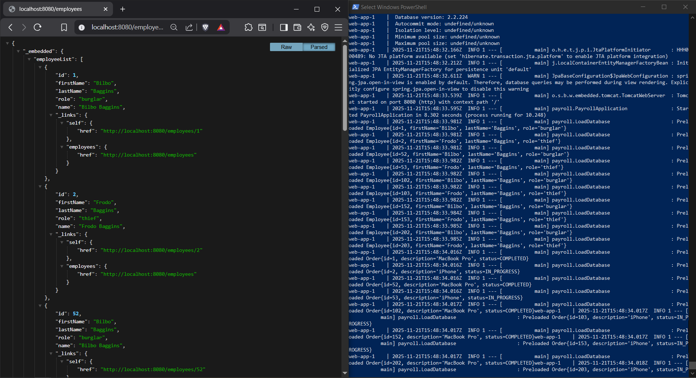
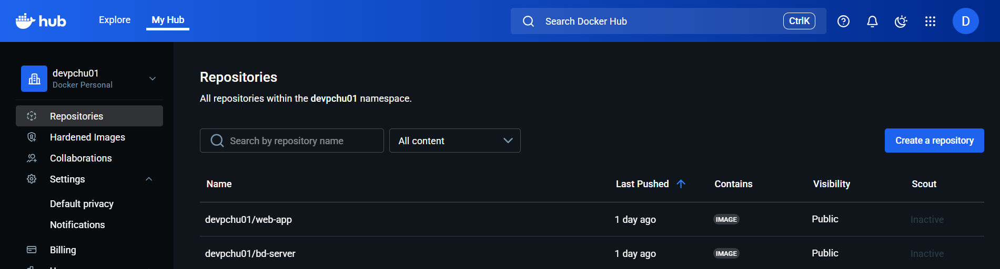
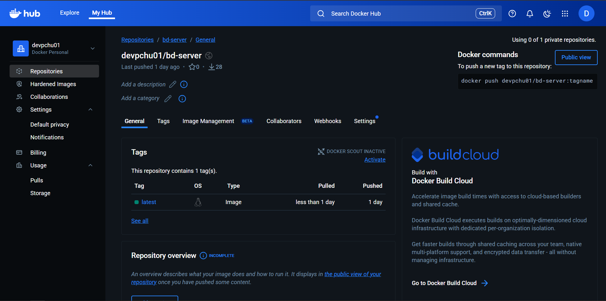

# CA5 - Containers
This class assignment will teach you how to work with containerization tools. As a container orchestration tool we will 
be using **Docker**.

Docker is an **open-source** platform that automates the **deployment of applications inside lightweight**, **portable 
containers**. A container encapsulate everything needed to consistently run an application across different 
environments.

Unlike virtual machines, Docker containers share the host operating system's kernel, providing operating-system-level 
virtualization that is **faster** and more **resource-efficient**. This allows developers to **build**, **test**, 
**deploy**, and **run applications quickly and reliably**, solving the "it works on my machine" problem.

Docker uses a **client-server architecture**, with the **Docker Engine managing containers**, **images**, **networks**, 
and **olumes**, and **Docker Desktop** providing an **easy-to-install** environment for development.

### Docker Desktop
**Docker Desktop** is a one-click-install application for Mac, Linux, or Windows environment that lets you build, 
share, and run containerized applications and microservices. It provides a straightforward Graphical User Interface 
(GUI) that lets you manage your containers, applications, and images directly from your machine.

Docker takes care of port mappings, file system concerns, and other default settings, and is regularly updated with bug 
fixes and security updates.

**Key features**:
- Ability to containerize and share any application on any cloud platform, in multiple languages and frameworks.
- Quick installation and setup of a complete Docker development environment.
- Includes the latest version of Kubernetes.
- On Windows, the ability to toggle between Linux and Windows containers to build applications.
- Fast and reliable performance with native Windows Hyper-V virtualization.
- Ability to work natively on Linux through WSL 2 on Windows machines.
- Volume mounting for code and data, including file change notifications and easy access to running containers on the 
localhost network.

### How to install Docker
This section provides the step-by-step installation instructions for Docker Desktop on Windows.

#### Install interactively
1. Download the installer from the release notes.
2. Double-click `Docker Desktop Installer.exe` to run the installer. By default, Docker Desktop is installed at 
`C:\Program Files\Docker\Docker`.
3. When prompted, ensure the **Use WSL 2 instead of Hyper-V** option on the Configuration page  is selected or not 
depending on your choice of backend - on systems that support only one backend, Docker Desktop automatically selects the 
available option.
4. Follow the instructions on the installation wizard to authorize the installer and proceed with the installation.
5. When the installation is successful, select Close to complete the installation process.

**Congratulations**! You have successfully installed Docker Desktop.

If your **administrator account is different to your user account**, you must add the user to the **docker-users group** 
to access features that require higher privileges, such as creating and managing the Hyper-V VM, or using Windows 
containers:
1. Run Computer Management as an **administrator**.
2. Navigate to **Local Users** and **Groups > Groups > docker-users**.
3. Right-click to add the user to the group.
4. Sign out and sign back in for the changes to take effect.

#### Install from the command line
After downloading `Docker Desktop Installer.exe`, run the following command in a terminal to install Docker Desktop:
```bash
"Docker Desktop Installer.exe" install
```

**If you’re using PowerShell you should run it as**:
```bash
Start-Process 'Docker Desktop Installer.exe' -Wait install
```

**NOTE**: If you're using PowerShell, you need to use the `ArgumentList` parameter before any flags.

**If using the Windows Command Prompt**:
```bash
start /w "" "Docker Desktop Installer.exe" install
```

By default, Docker Desktop is installed at `C:\Program Files\Docker\Docker`.

If your **admin account is different to your user account**, you must add the user to the **docker-users group** to 
access features that require higher privileges, such as creating and managing the Hyper-V VM, or using Windows 
containers.

```bash
net localgroup docker-users <user> /add
```

## Part I
The goal for the first part of the class assignment is to create separate images and containers for each CA2 application 
(the Simple Chat Application and the Spring Boot Rest Application).

You'll have two provide two versions for each one of the implementations, being the **first version** the one where 
you're going to build the server inside the `Dockerfile` - clone your repository and compile the application within the 
container, and the **second version**, the one where you're going to build the server on the host machine and copy the 
resulting JAR file into the Docker image.

Additionally, you'll have to implement a **multi-stage build** to separate the build and runtime stages.

Finally, publish all images to **Docker Hub**.

### Simple Chat Application
As previously mentioned, you'll be developing two versions of the Simple Chat Application for this part of the class 
assignment. Find below a reference for each one of the versions with the respective description of the used `dockerfile` 
and respective executed commands in the powershell console.

#### Version 1
In your `Dockerfile`, start by defining the **parser directive**. The **parser directive** specifies which `Dockerfile` 
syntax version to use, and is primarily required when building images with `BuildKit`.

Next, the `FROM` instruction to select the base image. In this case, we are using `Ubuntu 22.04`.

Then, utilizing the `RUN` instruction, update the existing packages and install the packages you need - in this case it 
was `git`, `openjdk-17-jdk`, and `openssh-client`. These actions can be concatenated into a single command to reduce the 
number of layers in the final Docker image and to ensure that the package installation occurs only after updating the 
system is updated.

Afterward, still with `RUN`, execute the following commands:
```bash
mkdir -p ~/.ssh
ssh-keyscan github.com >> ~/.ssh/known_hosts
```

- The first command **creates the `.ssh` directory in the container's `home` directory**. The `-p` flag ensures the 
command doesn't fail if the directory already exists. This directory store SSH configuration, private keys, and known 
hosts.
- The second command **fetches the GitHub's public SSH host key and appends it to the `known_hosts` file**.

These commands were concatenated to create only one layer and to ensure the `ssh-keyscan` command runs only if the 
`~/.ssh` directory exists.

Then, still using `RUN`, clone your repository. For **private repositories**, use the `--mount=type=ssh` flag. **This 
temporarily mounts the SSH agent or the private key only for this build step, allowing the container to authenticate 
with GitHub without embedding your private key into the final image**.

The `WORKDIR /COGSI2526_1250503_1250506_1250545/CA2/PART-I/gradle_basic_demo` instruction set the working directory 
for any `RUN`, `CMD`, `ENTRYPOINT`, `COPY`, and `ADD` instructions that follow it within the `Dockerfile`.

The `EXPOSE` instruction doesn't open any port by itself; it is primarily used to documenting which ports the container  
is expected to expose.

Next, `RUN chmod +x gradlew` is utilized to add executable permissions to the `gradlew` file, allowing the root user to 
run this script. 

Finally, the `CMD` instruction defines the default program that is run once you start the container based on this image. 
Each `Dockerfile` only has one `CMD` instance.

For the first version, your `Dockerfile` should follow the structure outlined below.

```dockerfile
# syntax=docker/dockerfile:1
FROM ubuntu:22.04

RUN apt-get update && apt-get install -y git openjdk-17-jdk openssh-client
RUN mkdir -p ~/.ssh && ssh-keyscan github.com >> ~/.ssh/known_hosts
RUN --mount=type=ssh git clone git@github.com:pchu22/COGSI2526_1250503_1250506_1250545.git /COGSI2526_1250503_1250506_1250545

WORKDIR /COGSI2526_1250503_1250506_1250545/CA2/PART-I/gradle_basic_demo

RUN chmod +x gradlew

EXPOSE 59001

CMD ["./gradlew", "runServer"]
```

After having a robust and well-structured `Dockerfile`, run the following command to build your image: 

```bash
docker buildx build --ssh default --load -t gradle_basic_demo:1.0 .
```

This command uses `docker buildx` to build a Docker image.

- The `docker buildx` extends the functionality of the `docker build` command utilizing **BuildKit**. BuildKit offers 
improved performance, better caching, and the ability to build multi-architecture images. The `build` subcommand 
instructs `buildx` to perform a build operation.
- The `--ssh default` 
- The `--load` tells BuildKit to load the built image into the local Docker image cache. Without this flag, image 
will not appear in your local docker images list
- The `-t gradle_basic_demo:1.0` assigns a tag (name:version) to the final image.
- The `.` in the final part of the command indicates the current working directory. This directory is recursively sent 
to the Docker daemon/BuildKit builder.

Once the image is built, create and start a container utilizing  the following command:

```bash
docker run --name simple-chat-application -p 59001:59001 gradle_basic_demo:1.0
```

- The flag `--name` assigns a name to the newly created container.
- The flag `-p 59001:59001` set up port forwarding. Its format is The format is `[HOST_IP:]HOST_PORT:CONTAINER_PORT` 
(if HOST_IP isn't defined, it forwards the indicated por in every interface).

After your container is running, start one (or more) client(s) by executing the `runClient` task. Your output should 
resemble the example below:


##### Image layers
By running the command `docker history gradle_basic_demo:1.0` you can display the layer-by-layer history of the 
`gradle_basic_demo:1.0` image, showing details such as the **creation time**, **size**, **command used to create 
each layer**, and **any associated comments**. 

This command helps to understand how an image is constructed, which is useful for **troubleshooting**, **auditing**, and 
**optimizing image builds**. 

Each layer corresponds to a step in the Dockerfile, and the output reveals the sequence of 
commands that built the image.

The following image is the expected output you should get after running the previously mentioned command.


##### Container resource usage
The `docker stats simple-chat-application` command provides real-time resource usage statistics for the 
`simple-chat-application` container, including **CPU percentage**, **memory usage relative to the limit**, **network 
input/output**, **block device input/output**, and the **number of processes or threads (PIDs) created by the 
container**.

The following image is the expected output you should get after running the previously mentioned command.


#### Version 2
In your `Dockerfile`, start by defining the **parser directive**. The **parser directive** specifies which `Dockerfile`
syntax version to use, and is primarily required when building images with `BuildKit`.

Next, the `FROM` instruction to select the base image. In this case, we are using `cimg/openjdk:17.0`. `cimg/openjdk` is 
a Docker image created by CircleCI. Each tag contains a version of OpenJDK and any binaries and tools that are required 
for builds to complete successfully.

Then, the `COPY` instruction **copies new files or directories from `<src>`** and **adds them to the filesystem of the 
container at the path `<dest>`**. In this case, we are copying from `/build/libs/*.jar` to `app.jar`.

The `EXPOSE` instruction doesn't open any port by itself; it is primarily used to documenting which ports the container  
is expected to expose.

Finally, the `CMD` instruction defines the default program that is run once you start the container based on this image.
Each `Dockerfile` only has one `CMD` instance.

For the second version, your `Dockerfile` should follow the structure outlined below.

```dockerfile
# syntax=docker/dockerfile:1
FROM cimg/openjdk:17.0

COPY build/libs/*.jar app.jar

EXPOSE 59001

CMD ["java", "-cp", "app.jar", "basic_demo.ChatServerApp", "59001"]
```

After having a robust and well-structured `Dockerfile`, run the following command to build your image:

```bash
docker build -t gradle_basic_demo:2.0 .
```

This command uses `docker build` to build a Docker image.

- The `-t gradle_basic_demo:2.0` assigns a tag (name:version) to the final image.
- The `.` in the final part of the command indicates the current working directory. This directory is recursively sent
  to the Docker daemon/BuildKit builder.

Once the image is built, create and start a container utilizing  the following command:

```bash
docker run --name simple-chat-application_v2.0 -p 59001:59001 gradle_basic_demo:2.0
```

- The flag `--name` assigns a name to the newly created container.
- The flag `-p 59001:59001` set up port forwarding. Its format is The format is `[HOST_IP:]HOST_PORT:CONTAINER_PORT`
  (if HOST_IP isn't defined, it forwards the indicated por in every interface).

After your container is running, start one (or more) client(s) by executing the `runClient` task. Your output should
resemble the example below:


##### Image layers
By running the command `docker history gradle_basic_demo:2.0` you can display the layer-by-layer history of the
`gradle_basic_demo:2.0` image, showing details such as the **creation time**, **size**, **command used to create
each layer**, and **any associated comments**.

This command helps to understand how an image is constructed, which is useful for **troubleshooting**, **auditing**, and
**optimizing image builds**.

Each layer corresponds to a step in the Dockerfile, and the output reveals the sequence of
commands that built the image.

The following image is the expected output you should get after running the previously mentioned command.


##### Container resource usage
The `docker stats simple-chat-application_v2.0` command provides real-time resource usage statistics for the
`simple-chat-application_v2.0` container, including **CPU percentage**, **memory usage relative to the limit**, 
**network input/output**, **block device input/output**, and the **number of processes or threads (PIDs) created by the
container**.

The following image is the expected output you should get after running the previously mentioned command.


### Spring Boot Rest Application
As previously mentioned, you'll be developing two versions of the Spring Boot Rest Application for this part of the 
class assignment. Find below a reference for each one of the versions with the respective description of the used 
`dockerfile` and respective executed commands in the powershell console.

#### Version 1
In your `Dockerfile`, start by defining the **parser directive**. The **parser directive** specifies which `Dockerfile`
syntax version to use, and is primarily required when building images with `BuildKit`.

Next, the `FROM` instruction to select the base image. In this case, we are using `Ubuntu 22.04`.

Then, utilizing the `RUN` instruction, update the existing packages and install the packages you need - in this case it
was `git`, `openjdk-17-jdk`, and `openssh-client`. These actions can be concatenated into a single command to reduce the
number of layers in the final Docker image and to ensure that the package installation occurs only after updating the
system is updated.

Afterward, still with `RUN`, execute the following commands:
```bash
mkdir -p ~/.ssh
ssh-keyscan github.com >> ~/.ssh/known_hosts
```

- The first command **creates the `.ssh` directory in the container's `home` directory**. The `-p` flag ensures the
  command doesn't fail if the directory already exists. This directory store SSH configuration, private keys, and known
  hosts.
- The second command **fetches the GitHub's public SSH host key and appends it to the `known_hosts` file**.

These commands were concatenated to create only one layer and to ensure the `ssh-keyscan` command runs only if the
`~/.ssh` directory exists.

Then, still using `RUN`, clone your repository. For **private repositories**, use the `--mount=type=ssh` flag. **This
temporarily mounts the SSH agent or the private key only for this build step, allowing the container to authenticate
with GitHub without embedding your private key into the final image**.

The `WORKDIR /COGSI2526_1250503_1250506_1250545/CA2/PART-II/gradle-tut-rest` instruction set the working directory
for any `RUN`, `CMD`, `ENTRYPOINT`, `COPY`, and `ADD` instructions that follow it within the `Dockerfile`.

The `EXPOSE` instruction doesn't open any port by itself; it is primarily used to documenting which ports the container  
is expected to expose.

Next, `RUN chmod +x gradlew` is utilized to add executable permissions to the `gradlew` file, allowing the root user to
run this script.

Finally, the `CMD` instruction defines the default program that is run once you start the container based on this image.
Each `Dockerfile` only has one `CMD` instance.

For the first version, your `Dockerfile` should follow the structure outlined below.

```dockerfile
# syntax=docker/dockerfile:1
FROM ubuntu:22.04

RUN apt-get update && apt-get install -y git openjdk-17-jdk openssh-client
RUN mkdir -p ~/.ssh && ssh-keyscan github.com >> ~/.ssh/known_hosts
RUN --mount=type=ssh git clone git@github.com:pchu22/COGSI2526_1250503_1250506_1250545.git /COGSI2526_1250503_1250506_1250545

WORKDIR /COGSI2526_1250503_1250506_1250545/CA2/PART-II/gradle-tut-rest

RUN chmod +x gradlew

EXPOSE 8080

CMD ["./gradlew", "bootRun"]
```

After having a robust and well-structured `Dockerfile`, run the following command to build your image:

```bash
docker buildx build --ssh default --load --no-cache -t gradle-tut-rest:1.0 .
```

This command uses `docker buildx` to build a Docker image.

- The `docker buildx` extends the functionality of the `docker build` command utilizing **BuildKit**. BuildKit offers
  improved performance, better caching, and the ability to build multi-architecture images. The `build` subcommand
  instructs `buildx` to perform a build operation.
- The `--ssh default`
- The `--load` tells BuildKit to load the built image into the local Docker image cache. Without this flag, image
  will not appear in your local docker images list
- The `--no-cache` flag forces Docker to **rebuild every layer from scratch, ignoring all previously cached build 
steps**.
- The `-t gradle-tut-rest:1.0` assigns a tag (name:version) to the final image.
- The `.` in the final part of the command indicates the current working directory. This directory is recursively sent
  to the Docker daemon/BuildKit builder.

Once the image is built, create and start a container utilizing  the following command:

```bash
docker run --name spirng-boot-rest-application -p 8080:8080 gradle-tut-rest:1.0
```

- The flag `--name` assigns a name to the newly created container.
- The flag `-p 8080:8080` set up port forwarding. Its format is The format is `[HOST_IP:]HOST_PORT:CONTAINER_PORT`
  (if HOST_IP isn't defined, it forwards the indicated por in every interface).

After your container is running, open your web browser and navigate to `localhost:8080/employees`. Your output should 
resemble the example below:


##### Image layers
By running the command `docker history gradle-tut-rest:1.0` you can display the layer-by-layer history of the
`gradle-tut-rest:1.0` image, showing details such as the **creation time**, **size**, **command used to create
each layer**, and **any associated comments**.

This command helps to understand how an image is constructed, which is useful for **troubleshooting**, **auditing**, and
**optimizing image builds**.

Each layer corresponds to a step in the Dockerfile, and the output reveals the sequence of
commands that built the image.

The following image is the expected output you should get after running the previously mentioned command.


##### Container resource usage
The `docker stats spring-boot-rest-application` command provides real-time resource usage statistics for the 
`sping-boot-rest-application` container, including **CPU percentage**, **memory usage relative to the limit**, **network 
input/output**, **block device input/output**, and the **number of processes or threads (PIDs) created by the 
container**.

The following image is the expected output you should get after running the previously mentioned command.


#### Version 2
In your `Dockerfile`, start by defining the **parser directive**. The **parser directive** specifies which `Dockerfile`
syntax version to use, and is primarily required when building images with `BuildKit`.

Next, the `FROM` instruction to select the base image. In this case, we are using `cimg/openjdk:21.0.9`. `cimg/openjdk` 
is a Docker image created by CircleCI. Each tag contains a version of OpenJDK and any binaries and tools that are 
required for builds to complete successfully.

Then, the `COPY` instruction **copies new files or directories from `<src>`** and **adds them to the filesystem of the
container at the path `<dest>`**. In this case, we are copying from `/build/libs/*.jar` to `app.jar`.

The `EXPOSE` instruction doesn't open any port by itself; it is primarily used to documenting which ports the container  
is expected to expose.

Finally, the `CMD` instruction defines the default program that is run once you start the container based on this image.
Each `Dockerfile` only has one `CMD` instance.

For the second version, your `Dockerfile` should follow the structure outlined below.

```dockerfile
# syntax=docker/dockerfile:1
FROM cimg/openjdk:21.0.9

COPY build/libs/*.jar app.jar

EXPOSE 8080

CMD ["java", "-jar", "app.jar"]
```

After having a robust and well-structured `Dockerfile`, run the following command to build your image:

```bash
docker build -t gradle-tut-rest:2.0 .
```

This command uses `docker build` to build a Docker image.

- The `-t gradle-tut-rest:2.0` assigns a tag (name:version) to the final image.
- The `.` in the final part of the command indicates the current working directory. This directory is recursively sent
  to the Docker daemon/BuildKit builder.

Once the image is built, create and start a container utilizing  the following command:

```bash
docker run --name sping-boot-rest-application_v2.0 -p 8080:8080 gradle-tut-rest:2.0
```

- The flag `--name` assigns a name to the newly created container.
- The flag `-p 8080:8080` set up port forwarding. Its format is The format is `[HOST_IP:]HOST_PORT:CONTAINER_PORT`
  (if HOST_IP isn't defined, it forwards the indicated por in every interface).

After your container is running, open your web browser and navigate to `localhost:8080/employees`. Your output should
resemble the example below:


##### Image layers
By running the command `docker history gradle-tut-rest:2.0` you can display the layer-by-layer history of the
`gradle-tut-rest:2.0` image, showing details such as the **creation time**, **size**, **command used to create
each layer**, and **any associated comments**.

This command helps to understand how an image is constructed, which is useful for **troubleshooting**, **auditing**, and
**optimizing image builds**.

Each layer corresponds to a step in the Dockerfile, and the output reveals the sequence of
commands that built the image.

The following image is the expected output you should get after running the previously mentioned command.


##### Container resource usage
The `docker stats spring-boot-rest-application_v2.0` command provides real-time resource usage statistics for the
`sping-boot-rest-application_v2.0` container, including **CPU percentage**, **memory usage relative to the limit**, 
**network input/output**, **block device input/output**, and the **number of processes or threads (PIDs) created by the
container**.

The following image is the expected output you should get after running the previously mentioned command.


#### Comparison between versions 1 and version 2
The main difference **between versions 1 and 2** is the **number of layers in each container** and **the amount of disk
space they occupy**. This is primarily due to the base image chosen for the second container, which is significantly
heavier than the one used in the first version.

In the next sections (using Multi-Stage builds), we will switch to a smaller and more lightweight base image. As a
result, the final containers will have fewer layers and a much smaller footprint — approximately 500 MB each instead of
1.9–2 GB.

### Multi-Stage builds
**Multi-Stage builds reduce image size and improve security by separating build and runtime environments**. With 
Multi-Stage builds, you use multiple `FROM` statements in your `Dockerfile`. Each `FROM` instruction can use a different 
base image, and each of them begins a new stage of the build. You can selectively copy artifacts from one stage to 
another, leaving behind everything you don't want in the final image.

By default, the stages aren't named, and you refer to them by their integer number, starting with 0 for the first `FROM` 
instruction. However, you can name your stages, by adding an `AS <NAME>` to the `FROM` instruction. 

**Benefits of a Multi-Stage build**:
- Final image is smaller and contains only what’s needed to run
- Keeps build tools and intermediate files out of production images
- Improves security, performance, and portability

In the following subsections, you'll find a Multi-Stage build implementation (and a detailed explanation) of the 
previously developed `Dockerfile`.

#### Simple Chat Application
In your `Dockerfile`, start by defining the **parser directive**. The **parser directive** specifies which `Dockerfile`
syntax version to use, and is primarily required when building images with `BuildKit`.

Next, the first `FROM` instruction selects the base image for the builder stage. In this case, we are using 
`gradle:8.9-jdk17-focal`.

The `WORKDIR /home/gradle/gradle-tut-rest` instruction set the working directory for any `RUN`, `CMD`, `ENTRYPOINT`, 
`COPY`, and `ADD` instructions that follow it within the `Dockerfile`.

Then, the five `COPY` instructions copy all the files needed to build the project.

- `gradle/`: Contains the Gradle Wrapper binaries.
- `gradlew`: The wrapper script.
- `build.gradle` and `settings.gradle`: Build configuration.
- `src/`: The application source code.

Next, `./gradlew build --no-daemon` is utilized to run the Gradle Wrapper inside the container to build the application 
fat JAR (`bootJar`). The `--no-daemon` flag is used because Gradle's daemon is unnecessary inside Docker's environment, 
where it can waste **permission issues**, **waste resources**, and **interfere with Multi-Stage build**, so disabling 
it ensures a clean one-time build.

Afterward, the second `FROM` instruction selects the base image for the runtime stage. In this case, we are using 
`openjdk:17.0.2-jdk-slim`.

Then, the `COPY` instruction copies the generated `.jar` during the builder stage into the runtime stage.

The `EXPOSE` instruction doesn't open any port by itself; it is primarily used to documenting which ports the container  
is expected to expose.

Finally, the `CMD` instruction defines the default program that is run once you start the container based on this image.
Each `Dockerfile` only has one `CMD` instance.

For the Multi-Stage build of the Simple Chat Application, your `Dockerfile` should follow the structure outlined below.

```dockerfile
# syntax=docker/dockerfile:1
FROM gradle:8.9-jdk17-focal AS builder

WORKDIR /home/gradle/gradle-tut-rest

COPY gradle gradle
COPY gradlew gradlew
COPY build.gradle build.gradle
COPY settings.gradle settings.gradle

COPY src src

RUN ./gradlew build --no-daemon

FROM openjdk:17.0.2-jdk-slim AS runtime

COPY --from=builder /home/gradle/gradle-tut-rest/build/libs/*.jar app.jar

EXPOSE 59001

CMD ["java", "-cp", "app.jar", "basic_demo.ChatServerApp", "59001"]
```

After having a robust and well-structured `Dockerfile`, run the following command to build your image:

```bash
docker build -t gradle_basic_demo:3.0 .
```

This command uses `docker build` to build a Docker image.

- The `-t gradle_basic_demo:3.0` assigns a tag (name:version) to the final image.
- The `.` in the final part of the command indicates the current working directory. This directory is recursively sent
  to the Docker daemon/BuildKit builder.

Once the image is built, create and start a container utilizing  the following command:

```bash
docker run --name simple-chat-application_v3.0 -p 59001:59001 gradle_basic_demo:3.0
```

- The flag `--name` assigns a name to the newly created container.
- The flag `-p 59001:59001` set up port forwarding. Its format is The format is `[HOST_IP:]HOST_PORT:CONTAINER_PORT`
  (if HOST_IP isn't defined, it forwards the indicated por in every interface).

After your container is running, start one (or more) client(s) by executing the `runClient` task. Your output should
resemble the example below:


##### Image layers
By running the command `docker history gradle_basic_demo:3.0` you can display the layer-by-layer history of the
`gradle_basic_demo:3.0` image, showing details such as the **creation time**, **size**, **command used to create
each layer**, and **any associated comments**.

This command helps to understand how an image is constructed, which is useful for **troubleshooting**, **auditing**, and
**optimizing image builds**.

Each layer corresponds to a step in the Dockerfile, and the output reveals the sequence of
commands that built the image.

The following image is the expected output you should get after running the previously mentioned command.


##### Container resource usage
The `docker stats simple-chat-application_v3.0` command provides real-time resource usage statistics for the
`simple-chat-application_v3.0` container, including **CPU percentage**, **memory usage relative to the limit**,
**network input/output**, **block device input/output**, and the **number of processes or threads (PIDs) created by the
container**.

The following image is the expected output you should get after running the previously mentioned command.


#### Spring Boot Rest Application
In your `Dockerfile`, start by defining the **parser directive**. The **parser directive** specifies which `Dockerfile`
syntax version to use, and is primarily required when building images with `BuildKit`.

Next, the first `FROM` instruction selects the base image for the builder stage. In this case, we are using
`gradle:8.9-jdk17-focal`.

The `WORKDIR /home/gradle/gradle-tut-rest` instruction set the working directory for any `RUN`, `CMD`, `ENTRYPOINT`,
`COPY`, and `ADD` instructions that follow it within the `Dockerfile`.

Then, the five `COPY` instructions copy all the files needed to build the project.

- `gradle/`: Contains the Gradle Wrapper binaries.
- `gradlew`: The wrapper script.
- `build.gradle` and `settings.gradle`: Build configuration.
- `src/`: The application source code.

Next, `./gradlew clean bootJar --no-daemon` is utilized to generate only the application fat JAR (`bootJar`). The 
`--no-daemon` flag is used because Gradle's daemon is unnecessary inside Docker's environment, where it can waste 
**permission issues**, **waste resources**, and **interfere with Multi-Stage build**, so disabling it ensures a clean 
one-time build.

Afterward, the second `FROM` instruction selects the base image for the runtime stage. In this case, we are using
`openjdk:21-ea-21-jdk-slim`.

Then, the `COPY` instruction copies the generated `.jar` during the builder stage into the runtime stage.

The `EXPOSE` instruction doesn't open any port by itself; it is primarily used to documenting which ports the container  
is expected to expose.

Finally, the `CMD` instruction defines the default program that is run once you start the container based on this image.
Each `Dockerfile` only has one `CMD` instance.

For the Multi-Stage build of the Spring Boot Rest Application, your `Dockerfile` should follow the structure outlined 
below.

```dockerfile
# syntax=docker/dockerfile:1
FROM gradle:8.9-jdk17-focal AS builder

WORKDIR /home/gradle/gradle-tut-rest

COPY gradle gradle
COPY gradlew gradlew
COPY build.gradle build.gradle
COPY settings.gradle settings.gradle

COPY src src

RUN ./gradlew clean bootJar --no-daemon

FROM openjdk:21-ea-21-jdk-slim AS runtime

COPY --from=builder /home/gradle/gradle-tut-rest/build/libs/*.jar app.jar

EXPOSE 8080

CMD ["java", "-jar", "app.jar"]
```

After having a robust and well-structured `Dockerfile`, run the following command to build your image:

```bash
docker build -t gradle-tut-rest:3.0 .
```

This command uses `docker build` to build a Docker image.

- The `-t gradle-tut-rest:3.0` assigns a tag (name:version) to the final image.
- The `.` in the final part of the command indicates the current working directory. This directory is recursively sent
  to the Docker daemon/BuildKit builder.

Once the image is built, create and start a container utilizing  the following command:

```bash
docker run --name sping-boot-rest-application_v3.0 -p 8080:8080 gradle-tut-rest:3.0
```

- The flag `--name` assigns a name to the newly created container.
- The flag `-p 8080:8080` set up port forwarding. Its format is The format is `[HOST_IP:]HOST_PORT:CONTAINER_PORT`
  (if HOST_IP isn't defined, it forwards the indicated por in every interface).

After your container is running, open your web browser and navigate to `localhost:8080/employees`. Your output should
resemble the example below:


##### Image layers
By running the command `docker history gradle-tut-rest:3.0` you can display the layer-by-layer history of the
`gradle-tut-rest:3.0` image, showing details such as the **creation time**, **size**, **command used to create
each layer**, and **any associated comments**.

This command helps to understand how an image is constructed, which is useful for **troubleshooting**, **auditing**, and
**optimizing image builds**.

Each layer corresponds to a step in the Dockerfile, and the output reveals the sequence of
commands that built the image.

The following image is the expected output you should get after running the previously mentioned command.


##### Container resource usage
The `docker stats spring-boot-rest-application_v3.0` command provides real-time resource usage statistics for the
`spring-boot-rest-application_v3.0` container, including **CPU percentage**, **memory usage relative to the limit**,
**network input/output**, **block device input/output**, and the **number of processes or threads (PIDs) created by the
container**.

The following image is the expected output you should get after running the previously mentioned command.


### Publish all images to Docker Hub
Before publishing any images, authenticate to Docker Hub using the command `docker login`.

Next, proceed by tagging your images because Docker Hub requires images to be tagged with using the format 
`username/repository:tag`. Replace `username`, `repository`, and `tag` with your own values.

To tag all the images you created during this part of the class assignment run the following command:

```bash
docker tag NAME:[TAG] USERNAME/REPOSITORY:[TAG]
```

To tag the images we created during this part of the class assignment we ran the following commands:

```bash
docker tag gradle_basic_demo:1.0 devpchu01/gradle_basic_demo:1.0
docker tag gradle_basic_demo:2.0 devpchu01/gradle_basic_demo:2.0
docker tag gradle_basic_demo:3.0 devpchu01/gradle_basic_demo:3.0
docker tag gradle-tut-rest:1.0 devpchu01/gradle-tut-rest:1.0
docker tag gradle-tut-rest:2.0 devpchu01/gradle-tut-rest:2.0
docker tag gradle-tut-rest:3.0 devpchu01/gradle-tut-rest:3.0
```

Finally, push the images to your repository using the following command:

```bash
docker push USERNAME/REPOSITORY:[TAG]
```

To push the images to Docker Hub ran the following commands:

```bash
docker push devpchu01/gradle_basic_demo:1.0
docker push devpchu01/gradle_basic_demo:2.0
docker push devpchu01/gradle_basic_demo:3.0
docker push devpchu01/gradle-tut-rest:1.0
docker push devpchu01/gradle-tut-rest:2.0
docker push devpchu01/gradle-tut-rest:3.0
```

Your Docker Hub repositories page should look similar to the one in the image below:


The following images take are a more detailed illustration of both the `gradle_basic_demo` and the `gradle-tut-rest` 
repositories, respectively.

#### gradle_basic_demo


#### gradle-tut-rest


## Part II
The goal for the second part of the class assignment is to create a containerized environment for running the Spring 
Boot Rest Application. You will implement a solution similar to CA3-P2, but this time using Docker instead of Vagrant.

To achieve this goal, you'll be using **Docker Compose** to create **two** containers. One of the containers will host 
the Spring Boot Rest Application and the other will run the H2 database server.

Additionally, ensure both containers can resolve each other's hostname, and configure a health-check on the db 
container, so that the web service only starts after the database is available.

Next, use a Docker volume in the db container to persist the database file. That way you ensure that the data is stored 
outside the container’s filesystem and can be retained and reused across container restarts.

Define environment variables in both containers to store sensitive information (database configurations to 
Spring Boot Rest Application, such as DB URL, username, password, etc...)

Finally, publish both images (db and web) to **Docker Hub**.

### Use `Docker Composer` to create two containers
The `compose.yaml` file for both the `web-app` and the `db-server` should follow the structure outlined below.

```yaml
networks:
  ca5_network:

services:
  db-server:
    build:
      context: .
      dockerfile: docker/db-server/Dockerfile
    image: db-server
    container_name: db-server
    networks:
      ca5_network:
    ports:
      - "9092:9092"
    healthcheck:
      test: ["CMD", "nc", "-z", "localhost", "9092"]
      interval: 15s
      timeout: 15s
      retries: 5
      start_period: 10s
    volumes:
      - h2-data:/h2database/payroll/data

  web-app:
    build:
      context: .
      dockerfile: docker/web-app/Dockerfile
    image: web-app
    container_name: web-app
    networks:
      ca5_network:
    ports:
      - "8080:8080"
    depends_on:
      db-server:
        condition: service_healthy

volumes:
  h2-data:
```

#### `web-app` container
The `Dockerfile` you'll use for the web app follows a structure similar to (or the same as) the Multi-Stage build you 
developed during the first part of the class assignment. 

In our setup, we have organized the `Dockerfile` files into separate directories for clarity:

```bash
docker/
├─ web-app/
│  └─ Dockerfile
└─ db-server/
   ├─ Dockerfile
   └─ h2.ajr
```

This structure keeps all Docker-related files organized by component, making it easier to manage builds.

Below you'll find the utilized `Dockerfile`, with some minor changes when comparing to the previously created one.

```dockerfile
# syntax=docker/dockerfile:1
FROM gradle:8.9-jdk17-focal AS builder

WORKDIR /home/gradle/gradle-tut-rest

COPY ../../gradle gradle
COPY ../../gradlew gradlew
COPY ../../build.gradle build.gradle
COPY ../../settings.gradle settings.gradle

COPY ../../src src

RUN ./gradlew clean bootJar --no-daemon

FROM openjdk:21-ea-21-jdk-slim AS runtime

COPY --from=builder /home/gradle/gradle-tut-rest/build/libs/*.jar app.jar

EXPOSE 8080

CMD ["java", "-jar", "app.jar"]
```

#### `db-server` container
In your `Dockerfile`, start by defining the **parser directive**. The **parser directive** specifies which `Dockerfile`
syntax version to use, and is primarily required when building images with `BuildKit`.

Next, the first `FROM` instruction selects the base image for the builder stage. In this case, we are using
`openjdk:21-ea-21-jdk-slim`.

Then, the first `RUN` instruction update the existing packages and install the packages you need - in this case it
was `netcat`, and `iputils-ping`. These actions can be concatenated into a single command to reduce the number of layers 
in the final Docker image and to ensure that the package installation occurs only after updating the
system is updated. The second `RUN` instruction creates the directory where the H2 database files will be stored. This 
ensures that the `PayrollDB.mv.db` file and any future database files have a valid, pre-created location for persistent 
storage.

Next, the two `COPY` instructions copy all the files needed to start the database.

- `h2-2.2.224.jar`: It contains the database runtime, SQL engine, and all the libraries needed for the H2 server to 
start inside the container.
- `PayrollDB.mv.db`: The actual H2 database file that stores the entire contents of the `PayrollDB` database, 
including tables, records, and schema.

Then, the `VOLUME` instruction ensures that the database files are stored in the specified directory, and persist 
outside the container’s filesystem, making restarts not losing the database data, allowing external storage backends to 
be mounted when needed.

The `EXPOSE` instruction doesn't open any port by itself; it is primarily used to documenting which ports the container  
is expected to expose.

Finally, the `CMD` instruction defines the default program that is run once you start the container based on this image.
Each `Dockerfile` only has one `CMD` instance.

For the Multi-Stage build of the Spring Boot Rest Application, your `Dockerfile` should follow the structure outlined
below.

```dockerfile
# syntax=docker/dockerfile:1
FROM openjdk:21-ea-21-jdk-slim

RUN apt-get update && apt-get install -y netcat iputils-ping
RUN mkdir -p /h2database/payroll/data

COPY docker/db-server/h2-2.2.224.jar h2.jar
COPY ../../CA2-Part2/PayrollDB.mv.db /h2database/payroll/data

VOLUME /h2database/payroll/data

EXPOSE 9092

CMD ["java", "-cp", "h2.jar", "org.h2.tools.Server", "-tcp", "-tcpAllowOthers", "-tcpPort", "9092", "-baseDir", "/h2database/payroll/data"]
```

After having robust and well-structured `Dockerfile` for both the `web-app` and the `db-server`, along with a properly 
organized `compose.yaml`, you can **build** and **run** your container using the following command:

```bash
docker compose up --build
```

- The `--build` flag forces Docker to build the images before starting the containers, ensuring that any changes in the 
`Dockerfiles` or project files are included.

After your container is running, open your web browser and navigate to `localhost:8080/employees`. Your output should
resemble the example below:



### Publish all images to Docker Hub
Proceed by tagging your images because Docker Hub requires images to be tagged with using the format 
`username/repository:tag`. Replace `username`, `repository`, and `tag` with your own values.

To tag all the images you created during this part of the class assignment run the following command:

```bash
docker tag NAME:[TAG] USERNAME/REPOSITORY:[TAG]
```

To tag the images we created during this part of the class assignment we ran the following commands:

```bash
docker tag web-app devpchu01/web-app
docker tag db-server devpchu01/db-server
```

Finally, push the images to your repository using the following command:

```bash
docker push USERNAME/REPOSITORY:[TAG]
```

To push the images to Docker Hub ran the following commands:

```bash
docker push devpchu01/web-app
docker push devpchu01/db-server
```

Your Docker Hub repositories page should look similar to the one in the image below:



The following images take are a more detailed illustration of both the `gradle_basic_demo` and the `gradle-tut-rest`
repositories, respectively.

#### web-app


#### db-server


# Alternative Technologies
In this section you'll be introduced to some alternative technologies to Docker and how one could implement 
**CA5-Part2**. 

In our case, we used `Podman` and incorporated a few additional features. Since Docker and Podman are 
very similar, the difference between the two implementations would be minimal without the additional features. 

To conclude this class assignment, we will also give an honourable mention to **Kubernetes (K8s)**. 

## Rocket
Rocket is a modern application container runtime with a focus on security for cloud-native production environments. 
In contrast with Docker's daemon-based architecture, Rocket adopts a **daemonless** approach, with each pod **running 
directly as a standard Unix process**. This **reduces the attack surface** and **increases transparency**, making Rocket 
ideal for environments that require a robust isolation and consistent behavior.

A key concept in Rocket is its pod-native architecture that aligns closely with Kubernetes’ orchestration model. Rocket 
allows users to set configuration and isolation parameters at both the **pod level** and for **individual 
applications**, providing detailed control over security, resource usage, and execution environments.

Rocket is compatible with Docker images, allowing for flexibility and interoperability with existing ecosystems. Due to 
its modular architecture and pluggable execution environments, Rocket can integrate seamlessly with other systems while 
maintaining a minimal and well-defined operational surface.

### What are Pods
A **Pod** is the smallest deployable and executable unit in several modern container runtimes and orchestration systems.
Instead of running a single container in complete isolation, a pod groups one or more containers that are meant to run 
together, share certain resources, and jointly deliver a single logical function. 

Pods exist because applications often consist of multiple closely related processes that need to share environment 
settings, communicate efficiently, or operate within the same execution context.

Containers were treated as tiny virtual machines that run one application. However, real-world workloads often require:
- Helper processes.
- Logging.
- Monitoring.
- Proxying.
- Tightly coupled microservices.
- Shared storage.
- Shared networking.

Running each one as a separate, fully isolated container and creates unnecessary complexity. Pods solve this by bundling 
these components together.

### Comparison between Docker and Rocket
<table>
  <thead>
    <tr>
      <th><strong>Aspect</strong></th>
      <th><strong>Docker</strong></th>
      <th><strong>Rcoket</strong></th>
    </tr>
  </thead>
  <tbody>
    <tr>
      <td><strong>Purpose</strong></td>
      <td>General-purpose container platform for building, shipping, and running apps.</td>
      <td>Designed for modern, cloud-native production environments with strong security and modularity.</td>
    </tr>
    <tr>
      <td><strong>Architecture</strong></td>
      <td>Uses a <strong>central daemon</strong> (<code>dockerd</code>) to manage containers.</td>
      <td><strong>Daemonless</strong> architecture; Pods run as standard Unix processes for better isolation.</td>
    </tr>
    <tr>
      <td><strong>Execution Model</strong></td>
      <td>Container-based; Each container runs a single application.</td>
      <td>Pod-based; Supports multiple applications sharing a single execution context (Kubernetes-style).</td>
    </tr>
    <tr>
      <td><strong>Image Format</strong></td>
      <td>Docker Image format.</td>
      <td>Implements the App Container (appc) specification, but can also run Docker images.</td>
    </tr>
    <tr>
      <td><strong>Integration</strong></td>
      <td>Strong integration with Docker ecosystem, Docker Hub, and Docker tooling.</td>
      <td>Designed for easy integration with orchestration systems like Kubernetes.</td>
    </tr>
    <tr>
      <td><strong>Security</strong></td>
      <td>Relies on namespaces and cgroups; Daemon introduces an additional attack surface.</td>
      <td>Smaller attack surface due to daemonless design; Strong per-pod isolation.</td>
    </tr>
    <tr>
      <td><strong>Flexibility</strong></td>
      <td>Primarily focused on Docker workflows and tooling.</td>
      <td>Pluggable execution environments; More modular for custom setups.</td>
    </tr>
    <tr>
      <td><strong>Popularity</strong></td>
      <td>Extremely popular and widely adopted across industries.</td>
      <td>Less popular; Considered a niche solution for specific cloud-native use cases.</td>
    </tr>
  </tbody>
</table>

## Podman
**Podman**, short for **pod manager**, is a **daemonless**, open source Linux-native container engine for developing, 
running and managing containers that follows the **Open Containers Initiative** (**OCI**) standard. 

Designed as a **secure alternative to Docker**, Podman works closely with **Buildah** (to build images) and **Skopeo** 
(to move/manipulate images), forming a modular ecosystem.

Because Podman implements the Docker CLI and is OCI-compliant

- Most users can alias `docker -> podman` without changes.
- Images built and run with Podman behave the same as Docker’s.
- Containers can run as root or rootless, greatly improving security.

Podman uses the `libpod` library to manage:

- Pods
- Container images
- Container execution
- Volumes
- Networking

### Buildah
**Buildah** is a **command-line tool** used to create, build, and modify OCI-compatible container images.

It allows image creation with or without `Dockerfiles` and is fully OCI and Docker compatible.

**Key capabilities**:
- Build images **from scratch** or **from existing base images**.
- Build using `Dockerfiles` or via direct commands.
- Build images rootlessly, improving security.
- Produce smaller and more optimized images.

Buildah **is ideal for CI/CD pipelines**, **automated builds**, and **security-sensitive environments**.

### Skopeo
Skopeo is a utility for **inspecting**, **copying**, **deleting**, and **signing container images** **without requiring 
a local daemon and without pulling images locally**.

Before Skopeo existed:
- Inspecting an image required pulling it completely.
- Copying from one registry to another required saving, retagging, pushing, etc.

With Skopeo, you can:
- Inspect remote images instantly (skopeo inspect docker://registry/image)
- Copy images registry-to-registry directly
- Delete images from registries
- Synchronize entire repositories
- Sign and verify images
- Move images between storage locations without Docker or Podman

Skopeo works alongside Podman and Buildah:
- Buildah builds images
- Podman runs images
- Skopeo transfers images

### Podman Desktop
Podman Desktop provides a **Graphical User Interface** (**GUI**) for interacting with Podman containers, images, pods, 
and registries across Linux, Windows, and macOS. It supports extensions and makes Kubernetes deployment more accessible.

### Podman, Buildah and Skopeo together
Podman’s modular architecture means it delegates tasks.

<table>
  <thead>
    <tr>
      <th>Task</th>
      <th>Tool</th>
    </tr>
  </thead>
  <tbody>
    <tr>
      <td>Build container images</td>
      <td><strong>Buildah</strong></td>
    </tr>
    <tr>
      <td>Run/manage containers</td>
      <td><strong>Podman</strong></td>
    </tr>
    <tr>
      <td>Move/copy/sign images</td>
      <td><strong>Skopeo</strong></td>
    </tr>
  </tbody>
</table>

This model avoids the “single giant daemon” approach used by Docker, improving:
- Security
- Performance
- Flexibility
- Maintainability

### Why is Podman different from Docker
The key difference: **Podman is daemonless**.

**Docker requires**:
- A privileged system-wide daemon (`dockerd`)
- Root permissions for many actions

**Podman**:
- Requires no daemon
- Supports fully rootless containers
- Uses `systemd` to run containers in the background
- **Is more secure by design**

<table>
  <thead>
    <tr>
      <th>Feature</th>
      <th>Docker</th>
      <th>Podman</th>
    </tr>
  </thead>
  <tbody>
    <tr>
      <td>Runs on a daemon</td>
      <td>Yes</td>
      <td>No</td>
    </tr>
    <tr>
      <td>Rootless containers</td>
      <td>Recently added</td>
      <td>Native</td>
    </tr>
    <tr>
      <td>Build tool</td>
      <td>Built-in</td>
      <td>Buildah</td>
    </tr>
    <tr>
      <td>Image transferring</td>
      <td>Docker CLI</td>
      <td>Skopeo</td>
    </tr>
    <tr>
      <td>Operates with pods</td>
      <td>No</td>
      <td>Yes (Kubernetes-like pods)</td>
    </tr>
    <tr>
      <td>Docker-compatible CLI</td>
      <td>N/A</td>
      <td>Yes</td>
    </tr>
  </tbody>
</table>

Podman can be used as a drop-in Docker alternative, but it is also more flexible, more secure, and more aligned with
Kubernetes concepts.

### Implementation
Since Podman natively supports both traditional `Dockerfiles` and `compose.yaml` files, we were able to keep the exact 
same files but changed the commands used to build, run, and push our container. No modifications to the `Dockerfiles` or 
the `compose.yaml` file were required.

#### Building and running containers with Podman
Instead of using the command `docker compose up --build` we utilized the command `podman-compose up --build`. 

This offers some advantages:
- **Buildah** is used under the hood to build the container images securely and rootlessly.
- Podman runs the containers, improving runtime security.
- No daemon is required.
 
The result is the same development workflow, but with more modularity and security.

#### Pushing images with Skopeo
Instead of tagging and pushing images with Docker we used Skopeo, which can transfer images directly from local storage 
to a remote registry without tagging and loading them into a daemon.

Instead of using the following Docker commands:

```bash
docker tag web-app devpchu01/web-app
docker tag db-server devpchu01/db-server
docker push devpchu01/web-app
docker push devpchu01/db-server
```

We utilized the following Skopeo commands:
```bash
skopeo copy containers-storage:localhost/web-app docker://devpchu01/web-app
skopeo copy containers-storage:localhost/db-server docker://devpchu01/db-server
```

##### Why is this approach better
1. Skopeo copies images directly between locations and registries, what makes tagging becomes **optional instead of 
mandatory**.
2. While Docker requires `dockerd` to store, tag, and push images, Skopeo operates directly on OCI images without Docker 
or Podman running
3. Skopeo does not pull or push through an intermediate daemon, it copies directly from the local storage to the 
registry, reducing overhead and avoiding root-level daemon access.
4. Skopeo supports registry credentials, private registries, and TLS and custom CA certificates.
5. Skopeo is for CI/CD environments, because it can sync entire registries and operate without local image storage.

## Kubernetes
**Kubernetes**, referred to as **K8s**, is an **open-source system for container orchestration** designed to **automate 
software deployment**, **scalability**, and **management**. Initially created by Google, the project is now maintained 
by a community of contributors, and the trademark is owned by the Cloud Native Computing Foundation.

Kubernetes groups one or more computers—whether virtual machines or physical servers—into a cluster capable of running 
containerized workloads. It works with various container runtimes, such as container and CRI-O. Its ability to manage 
workloads of different sizes and styles has led to widespread adoption in cloud environments and data centers. There are 
multiple distributions of this platform, both from independent vendors and as hosted cloud offerings from major public 
cloud providers.

The software consists of a control plane and nodes where applications run. It includes tools such as:
- **kubeadm**: Provides commands like kubeadm init and kubeadm join, considered best practices for quickly creating 
Kubernetes clusters. kubeadm focuses only on cluster bootstrapping, not on machine provisioning or installing add-ons 
(such as the Dashboard or monitoring solutions).
- **kubectl**: A command-line tool for interacting with Kubernetes clusters via the REST API. It allows you to deploy 
applications, inspect and manage cluster resources, and view logs.

### Kubernetes and Docker: complementary tools, not competitors
**Docker** and **K8s** are frequently misrepresented as competitors, yet **they serve different purposes** in the
containerization environment! While both deal with containers, their functions in the development and deployment 
pipeline are distinct and complementary. 

Docker is a platform designed to simplify the packaging and the management of application processes inside containers.
It allows developers to **bundle code, runtime, libraries, and dependencies into lightweight, portable units known as 
Docker images**. These images can be shared and deployed consistently across any environment that supports Docker. 

Kubernetes, on the other hand, is a powerful container orchestration platform. Instead of building or packaging 
containers, Kubernetes focuses on **deploying, scheduling, scaling, and managing them across clusters of machines**. It 
uses container images—often built with Docker, and enhances their lifecycle management with features such as **automatic 
scheduling, load balancing, auto-scaling, and self-healing**. 

Many organizations typically use Docker to create and manage containers and Kubernetes to orchestrate them. Together,
they form a complete solution for developing, deploying, scaling, and maintaining containerized applications at scale.

### Benefits of Integrating Docker + Kubernetes
- Docker ensures applications run consistently across different environments. Kubernetes reinforces this consistency by 
providing a uniform platform for deploying Docker containers.
- Teams can manually scale Docker containers, but Kubernetes automates this process, dynamically adjusting based on 
demand.
- Kubernetes improves the reliability of applications deployed in Docker containers by automatically handling failovers, 
rolling updates, and self-healing.
- Kubernetes optimizes resource usage by efficiently distributing Docker containers across the cluster.
- Kubernetes' ability to run on any infrastructure complements Docker’s portability, enabling deployments across 
multiple clouds.
- Docker simplifies creating and managing images, while Kubernetes automates container deployment, scaling, and 
management.
- The combination of Docker and Kubernetes streamlines the entire development pipeline, supporting CI/CD practices and 
faster release cycles.

# Self-Evaluation
```bash
Daniel (12500503) - 80%
Diogo (1250506) - 80%
Pedro (1250545) - 100%
```