# CA5 - Containers
This class assignment will teach you how to work with containerization tools. As a container orchestration tool we will 
be using **Docker**.

Docker is

### Docker Desktop
**Docker Desktop** is a one-click-install application for Mac, Linux, or Windows environment that lets you build, 
share, and run containerized applications and microservices. It provides a straightforward Graphical User Interface 
(GUI) that lets you manage your containers, applications, and images directly from your machine.

Docker takes care of port mappings, file system concerns, and other default settings, and is regularly updated with bug 
fixes and security updates.

**Key features**:
- Ability to containerize and share any application on any cloud platform, in multiple languages and frameworks.
- Quick installation and setup of a complete Docker development environment.
- Includes the latest version of Kubernetes.
- On Windows, the ability to toggle between Linux and Windows containers to build applications.
- Fast and reliable performance with native Windows Hyper-V virtualization.
- Ability to work natively on Linux through WSL 2 on Windows machines.
- Volume mounting for code and data, including file change notifications and easy access to running containers on the 
localhost network.

### How to install Docker
This section provides the step-by-step installation instructions for Docker Desktop on Windows.

#### Install interactively
1. Download the installer from the release notes.
2. Double-click `Docker Desktop Installer.exe` to run the installer. By default, Docker Desktop is installed at 
`C:\Program Files\Docker\Docker`.
3. When prompted, ensure the **Use WSL 2 instead of Hyper-V** option on the Configuration page  is selected or not 
depending on your choice of backend - on systems that support only one backend, Docker Desktop automatically selects the 
available option.
4. Follow the instructions on the installation wizard to authorize the installer and proceed with the installation.
5. When the installation is successful, select Close to complete the installation process.

**Congratulations**! You have successfully installed Docker Desktop.

If your **administrator account is different to your user account**, you must add the user to the **docker-users group** 
to access features that require higher privileges, such as creating and managing the Hyper-V VM, or using Windows 
containers:
1. Run Computer Management as an **administrator**.
2. Navigate to **Local Users** and **Groups > Groups > docker-users**.
3. Right-click to add the user to the group.
4. Sign out and sign back in for the changes to take effect.

#### Install from the command line
After downloading `Docker Desktop Installer.exe`, run the following command in a terminal to install Docker Desktop:
```bash
"Docker Desktop Installer.exe" install
```

**If you’re using PowerShell you should run it as**:
```bash
Start-Process 'Docker Desktop Installer.exe' -Wait install
```

**NOTE**: If you're using PowerShell, you need to use the `ArgumentList` parameter before any flags.

**If using the Windows Command Prompt**:
```bash
start /w "" "Docker Desktop Installer.exe" install
```

By default, Docker Desktop is installed at `C:\Program Files\Docker\Docker`.

If your **admin account is different to your user account**, you must add the user to the **docker-users group** to 
access features that require higher privileges, such as creating and managing the Hyper-V VM, or using Windows 
containers.

```bash
net localgroup docker-users <user> /add
```

## Part I
The goal for the first part of the class assignment is to create separate images and containers for each CA2 application 
(the Simple Chat Application and the Spring Boot Rest Application).

You'll have two provide two versions for each one of the implementations, being the **first version** the one where 
you're going to build the server inside the `Dockerfile` - clone your repository and compile the application within the 
container, and the **second version**, the one where you're going to build the server on the host machine and copy the 
resulting JAR file into the Docker image.

Additionally, you'll have to implement a **multi-stage build** to separate the build and runtime stages.

Finally, publish all images to **Docker Hub**.

### Simple Chat Application
As previously mentioned, you'll be developing two versions of the Simple Chat Application for this part of the class 
assignment. Find below a reference for each one of the versions with the respective description of the used `dockerfile` 
and respective executed commands in the powershell console.

#### Version 1
In your `Dockerfile`, start by defining the **parser directive**. The **parser directive** specifies which `Dockerfile` 
syntax version to use, and is primarily required when building images with `BuildKit`.

Next, the `FROM` instruction to select the base image. In this case, we are using `Ubuntu 22.04`.

Then, utilizing the `RUN` instruction, update the existing packages and install the packages you need - in this case it 
was `git`, `openjdk-17-jdk`, and `openssh-client`. These actions can be concatenated into a single command to reduce the 
number of layers in the final Docker image and to ensure that the package installation occurs only after updating the 
system is updated.

Afterward, still with `RUN`, execute the following commands:
```bash
mkdir -p ~/.ssh
ssh-keyscan github.com >> ~/.ssh/known_hosts
```

- The first command **creates the `.ssh` directory in the container's `home` directory**. The `-p` flag ensures the 
command doesn't fail if the directory already exists. This directory store SSH configuration, private keys, and known 
hosts.
- The second command **fetches the GitHub's public SSH host key and appends it to the `known_hosts` file**.

These commands were concatenated to create only one layer and to ensure the `ssh-keyscan` command runs only if the 
`~/.ssh` directory exists.

Then, still using `RUN`, clone your repository. For **private repositories**, use the `--mount=type=ssh` flag. **This 
temporarily mounts the SSH agent or the private key only for this build step, allowing the container to authenticate 
with GitHub without embedding your private key into the final image**.

The `WORKDIR /COGSI2526_1250503_1250506_1250545/CA2/PART-I/gradle_basic_demo` instruction set the working directory 
for any `RUN`, `CMD`, `ENTRYPOINT`, `COPY`, and `ADD` instructions that follow it within the `Dockerfile`.

The `EXPOSE` instruction doesn't open any port by itself; it is primarily used to documenting which ports the container  
is expected to expose.

Next, `RUN chmod +x gradlew` is utilized to add executable permissions to the `gradlew` file, allowing the root user to 
run this script. 

Finally, the `CMD` instruction defines the default program that is run once you start the container based on this image. 
Each `Dockerfile` only has one `CMD` instance.

For the first version, your `Dockerfile` should follow the structure outlined below.

```dockerfile
# syntax=docker/dockerfile:1
FROM ubuntu:22.04

RUN apt-get update && apt-get install -y git openjdk-17-jdk openssh-client
RUN mkdir -p ~/.ssh && ssh-keyscan github.com >> ~/.ssh/known_hosts
RUN --mount=type=ssh git clone git@github.com:pchu22/COGSI2526_1250503_1250506_1250545.git /COGSI2526_1250503_1250506_1250545

WORKDIR /COGSI2526_1250503_1250506_1250545/CA2/PART-I/gradle_basic_demo

RUN chmod +x gradlew

EXPOSE 59001

CMD ["./gradlew", "runServer"]
```

After having a robust and well-structured `Dockerfile`, run the following command to build your image: 

```bash
docker buildx build --ssh default --load -t gradle_basic_demo:1.0 .
```

This command uses `docker buildx` to build a Docker image.

- The `docker buildx` extends the functionality of the `docker build` command utilizing **BuildKit**. BuildKit offers 
improved performance, better caching, and the ability to build multi-architecture images. The `build` subcommand 
instructs `buildx` to perform a build operation.
- The `--ssh default` 
- The `--load` tells BuildKit to load the built image into the local Docker image cache. Without this flag, image 
will not appear in your local docker images list
- The `-t gradle_basic_demo:1.0` assigns a tag (name:version) to the final image.
- The `.` in the final part of the command indicates the current working directory. This directory is recursively sent 
to the Docker daemon/BuildKit builder.

Once the image is built, create and start a container utilizing  the following command:

```bash
docker run --name simple-chat-application -p 59001:59001 gradle_basic_demo:1.0
```

- The flag `--name` assigns a name to the newly created container.
- The flag `-p 59001:59001` set up port forwarding. Its format is The format is `[HOST_IP:]HOST_PORT:CONTAINER_PORT` 
(if HOST_IP isn't defined, it forwards the indicated por in every interface).

After your container is running, start one (or more) client(s) by executing the `runClient` task. Your output should 
resemble the example below:


##### Container layers
By running the command `docker history gradle_basic_demo:1.0` you can display the layer-by-layer history of the 
`gradle_basic_demo:1.0` image, showing details such as the **creation time**, **size**, **command used to create 
each layer**, and **any associated comments**. 

This command helps to understand how an image is constructed, which is useful for **troubleshooting**, **auditing**, and 
**optimizing image builds**. 

Each layer corresponds to a step in the Dockerfile, and the output reveals the sequence of 
commands that built the image.

The following image is the expected output you should get after running the previously mentioned command.

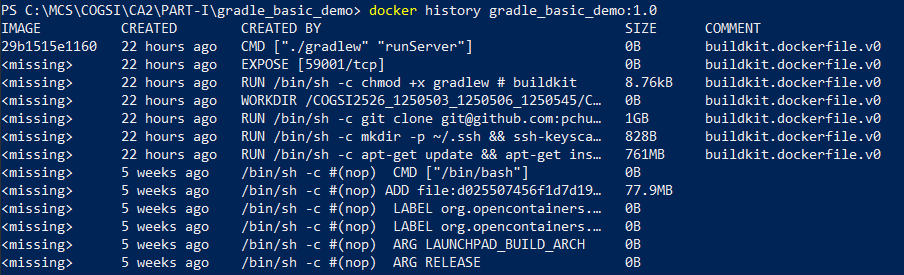

##### Container resource usage
The `docker stats simple-chat-application` command provides real-time resource usage statistics for the 
`simple-chat-application` container, including **CPU percentage**, **memory usage relative to the limit**, **network 
input/output**, **block device input/output**, and the **number of processes or threads (PIDs) created by the 
container**.

The following image is the expected output you should get after running the previously mentioned command.

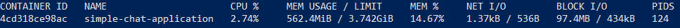

#### Version 2
In your `Dockerfile`, start by defining the **parser directive**. The **parser directive** specifies which `Dockerfile`
syntax version to use, and is primarily required when building images with `BuildKit`.

Next, the `FROM` instruction to select the base image. In this case, we are using `cimg/openjdk:17.0`. `cimg/openjdk` is 
a Docker image created by CircleCI. Each tag contains a version of OpenJDK and any binaries and tools that are required 
for builds to complete successfully.

Then, the `COPY` instruction **copies new files or directories from `<src>`** and **adds them to the filesystem of the 
container at the path `<dest>`**. In this case, we are copying from `/build/libs/*.jar` to `app.jar`.

The `EXPOSE` instruction doesn't open any port by itself; it is primarily used to documenting which ports the container  
is expected to expose.

Finally, the `CMD` instruction defines the default program that is run once you start the container based on this image.
Each `Dockerfile` only has one `CMD` instance.

For the second version, your `Dockerfile` should follow the structure outlined below.

```dockerfile
# syntax=docker/dockerfile:1
FROM cimg/openjdk:17.0

COPY build/libs/*.jar app.jar

EXPOSE 59001

CMD ["java", "-cp", "app.jar", "basic_demo.ChatServerApp", "59001"]
```

After having a robust and well-structured `Dockerfile`, run the following command to build your image:

```bash
docker build -t gradle_basic_demo:2.0 .
```

This command uses `docker build` to build a Docker image.

- The `-t gradle_basic_demo:2.0` assigns a tag (name:version) to the final image.
- The `.` in the final part of the command indicates the current working directory. This directory is recursively sent
  to the Docker daemon/BuildKit builder.

Once the image is built, create and start a container utilizing  the following command:

```bash
docker run --name simple-chat-application_v2.0 -p 59001:59001 gradle_basic_demo:2.0
```

- The flag `--name` assigns a name to the newly created container.
- The flag `-p 59001:59001` set up port forwarding. Its format is The format is `[HOST_IP:]HOST_PORT:CONTAINER_PORT`
  (if HOST_IP isn't defined, it forwards the indicated por in every interface).

After your container is running, start one (or more) client(s) by executing the `runClient` task. Your output should
resemble the example below:

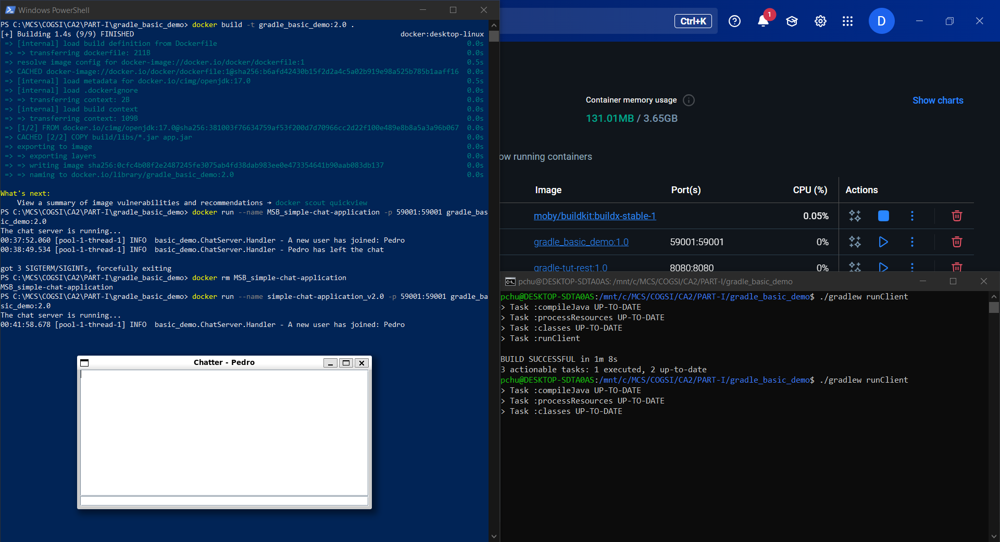

##### Container layers
By running the command `docker history gradle_basic_demo:2.0` you can display the layer-by-layer history of the
`gradle_basic_demo:2.0` image, showing details such as the **creation time**, **size**, **command used to create
each layer**, and **any associated comments**.

This command helps to understand how an image is constructed, which is useful for **troubleshooting**, **auditing**, and
**optimizing image builds**.

Each layer corresponds to a step in the Dockerfile, and the output reveals the sequence of
commands that built the image.

The following image is the expected output you should get after running the previously mentioned command.

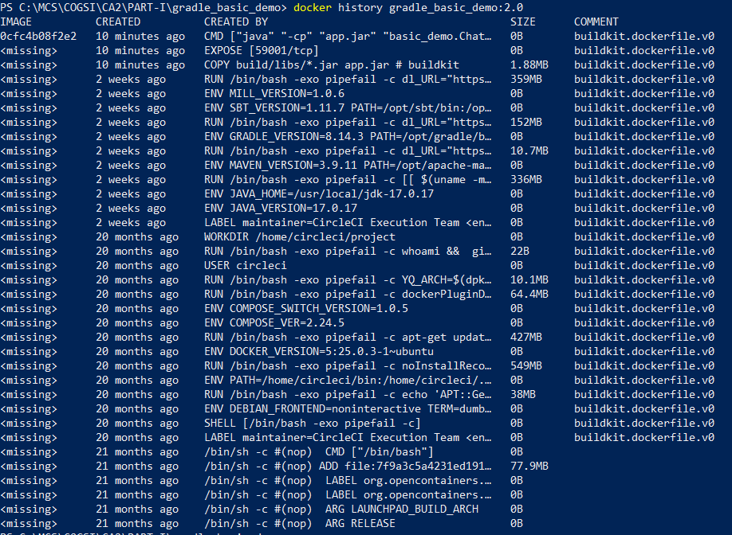

##### Container resource usage
The `docker stats simple-chat-application_v2.0` command provides real-time resource usage statistics for the
`simple-chat-application_v2.0` container, including **CPU percentage**, **memory usage relative to the limit**, 
**network input/output**, **block device input/output**, and the **number of processes or threads (PIDs) created by the
container**.

The following image is the expected output you should get after running the previously mentioned command.

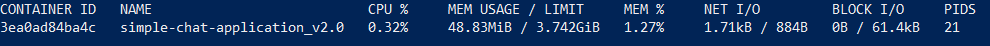

#### Comparison between versions 1 and version 2


### Spring Boot Rest Application
As previously mentioned, you'll be developing two versions of the Spring Boot Rest Application for this part of the 
class assignment. Find below a reference for each one of the versions with the respective description of the used 
`dockerfile` and respective executed commands in the powershell console.

#### Version 1

In your `Dockerfile`, start by defining the **parser directive**. The **parser directive** specifies which `Dockerfile`
syntax version to use, and is primarily required when building images with `BuildKit`.

Next, the `FROM` instruction to select the base image. In this case, we are using `Ubuntu 22.04`.

Then, utilizing the `RUN` instruction, update the existing packages and install the packages you need - in this case it
was `git`, `openjdk-17-jdk`, and `openssh-client`. These actions can be concatenated into a single command to reduce the
number of layers in the final Docker image and to ensure that the package installation occurs only after updating the
system is updated.

Afterward, still with `RUN`, execute the following commands:
```bash
mkdir -p ~/.ssh
ssh-keyscan github.com >> ~/.ssh/known_hosts
```

- The first command **creates the `.ssh` directory in the container's `home` directory**. The `-p` flag ensures the
  command doesn't fail if the directory already exists. This directory store SSH configuration, private keys, and known
  hosts.
- The second command **fetches the GitHub's public SSH host key and appends it to the `known_hosts` file**.

These commands were concatenated to create only one layer and to ensure the `ssh-keyscan` command runs only if the
`~/.ssh` directory exists.

Then, still using `RUN`, clone your repository. For **private repositories**, use the `--mount=type=ssh` flag. **This
temporarily mounts the SSH agent or the private key only for this build step, allowing the container to authenticate
with GitHub without embedding your private key into the final image**.

The `WORKDIR /COGSI2526_1250503_1250506_1250545/CA2/PART-II/gradle-tut-rest` instruction set the working directory
for any `RUN`, `CMD`, `ENTRYPOINT`, `COPY`, and `ADD` instructions that follow it within the `Dockerfile`.

The `EXPOSE` instruction doesn't open any port by itself; it is primarily used to documenting which ports the container  
is expected to expose.

Next, `RUN chmod +x gradlew` is utilized to add executable permissions to the `gradlew` file, allowing the root user to
run this script.

Finally, the `CMD` instruction defines the default program that is run once you start the container based on this image.
Each `Dockerfile` only has one `CMD` instance.

For the first version, your `Dockerfile` should follow the structure outlined below.

```dockerfile
# syntax=docker/dockerfile:1
FROM ubuntu:22.04

RUN apt-get update && apt-get install -y git openjdk-17-jdk openssh-client
RUN mkdir -p ~/.ssh && ssh-keyscan github.com >> ~/.ssh/known_hosts
RUN --mount=type=ssh git clone git@github.com:pchu22/COGSI2526_1250503_1250506_1250545.git /COGSI2526_1250503_1250506_1250545

WORKDIR /COGSI2526_1250503_1250506_1250545/CA2/PART-II/gradle-tut-rest

RUN chmod +x gradlew

EXPOSE 8080

CMD ["./gradlew", "bootRun"]
```

After having a robust and well-structured `Dockerfile`, run the following command to build your image:

```bash
docker buildx build --ssh default --load --no-cache -t gradle-tut-rest:1.0 .
```

This command uses `docker buildx` to build a Docker image.

- The `docker buildx` extends the functionality of the `docker build` command utilizing **BuildKit**. BuildKit offers
  improved performance, better caching, and the ability to build multi-architecture images. The `build` subcommand
  instructs `buildx` to perform a build operation.
- The `--ssh default`
- The `--load` tells BuildKit to load the built image into the local Docker image cache. Without this flag, image
  will not appear in your local docker images list
- The `--no-cache` flag forces Docker to **rebuild every layer from scratch, ignoring all previously cached build 
steps**.
- The `-t gradle-tut-rest:1.0` assigns a tag (name:version) to the final image.
- The `.` in the final part of the command indicates the current working directory. This directory is recursively sent
  to the Docker daemon/BuildKit builder.

Once the image is built, create and start a container utilizing  the following command:

```bash
docker run --name spirng-boot-rest-application -p 8080:8080 gradle-tut-rest:1.0
```

- The flag `--name` assigns a name to the newly created container.
- The flag `-p 8080:8080` set up port forwarding. Its format is The format is `[HOST_IP:]HOST_PORT:CONTAINER_PORT`
  (if HOST_IP isn't defined, it forwards the indicated por in every interface).

After your container is running, open your web browser and navigate to `localhost:8080/employees`. Your output should 
resemble the example below:

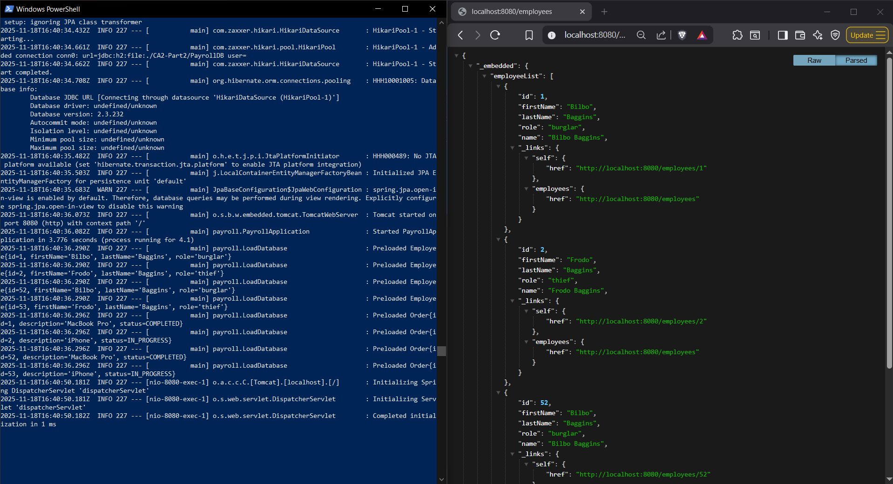

##### Container layers
By running the command `docker history gradle-tut-rest:1.0` you can display the layer-by-layer history of the
`gradle-tut-rest:1.0` image, showing details such as the **creation time**, **size**, **command used to create
each layer**, and **any associated comments**.

This command helps to understand how an image is constructed, which is useful for **troubleshooting**, **auditing**, and
**optimizing image builds**.

Each layer corresponds to a step in the Dockerfile, and the output reveals the sequence of
commands that built the image.

The following image is the expected output you should get after running the previously mentioned command.

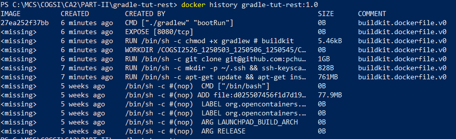

##### Container resource usage
The `docker stats spring-boot-rest-application` command provides real-time resource usage statistics for the 
`sping-boot-rest-application` container, including **CPU percentage**, **memory usage relative to the limit**, **network 
input/output**, **block device input/output**, and the **number of processes or threads (PIDs) created by the 
container**.

The following image is the expected output you should get after running the previously mentioned command.

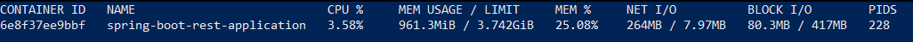

#### Version 2
In your `Dockerfile`, start by defining the **parser directive**. The **parser directive** specifies which `Dockerfile`
syntax version to use, and is primarily required when building images with `BuildKit`.

Next, the `FROM` instruction to select the base image. In this case, we are using `cimg/openjdk:21.0.9`. `cimg/openjdk` 
is a Docker image created by CircleCI. Each tag contains a version of OpenJDK and any binaries and tools that are 
required for builds to complete successfully.

Then, the `COPY` instruction **copies new files or directories from `<src>`** and **adds them to the filesystem of the
container at the path `<dest>`**. In this case, we are copying from `/build/libs/*.jar` to `app.jar`.

The `EXPOSE` instruction doesn't open any port by itself; it is primarily used to documenting which ports the container  
is expected to expose.

Finally, the `CMD` instruction defines the default program that is run once you start the container based on this image.
Each `Dockerfile` only has one `CMD` instance.

For the second version, your `Dockerfile` should follow the structure outlined below.

```dockerfile
# syntax=docker/dockerfile:1
FROM cimg/openjdk:21.0.9

COPY build/libs/*.jar app.jar

EXPOSE 8080

CMD ["java", "-jar", "app.jar"]
```

After having a robust and well-structured `Dockerfile`, run the following command to build your image:

```bash
docker build -t gradle-tut-rest:2.0 .
```

This command uses `docker build` to build a Docker image.

- The `-t gradle-tut-rest:2.0` assigns a tag (name:version) to the final image.
- The `.` in the final part of the command indicates the current working directory. This directory is recursively sent
  to the Docker daemon/BuildKit builder.

Once the image is built, create and start a container utilizing  the following command:

```bash
docker run --name sping-boot-rest-application_v2.0 -p 8080:8080 gradle-tut-rest:2.0
```

- The flag `--name` assigns a name to the newly created container.
- The flag `-p 8080:8080` set up port forwarding. Its format is The format is `[HOST_IP:]HOST_PORT:CONTAINER_PORT`
  (if HOST_IP isn't defined, it forwards the indicated por in every interface).

After your container is running, open your web browser and navigate to `localhost:8080/employees`. Your output should
resemble the example below:

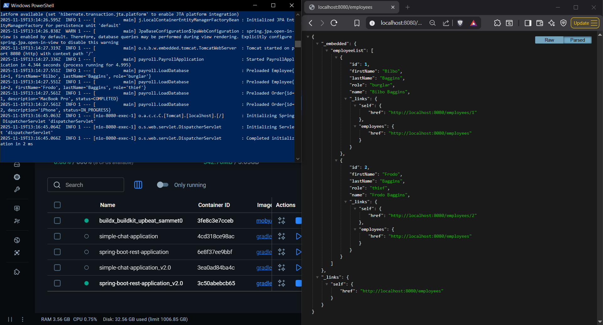

##### Container layers
By running the command `docker history gradle-tut-rest:2.0` you can display the layer-by-layer history of the
`gradle-tut-rest:2.0` image, showing details such as the **creation time**, **size**, **command used to create
each layer**, and **any associated comments**.

This command helps to understand how an image is constructed, which is useful for **troubleshooting**, **auditing**, and
**optimizing image builds**.

Each layer corresponds to a step in the Dockerfile, and the output reveals the sequence of
commands that built the image.

The following image is the expected output you should get after running the previously mentioned command.

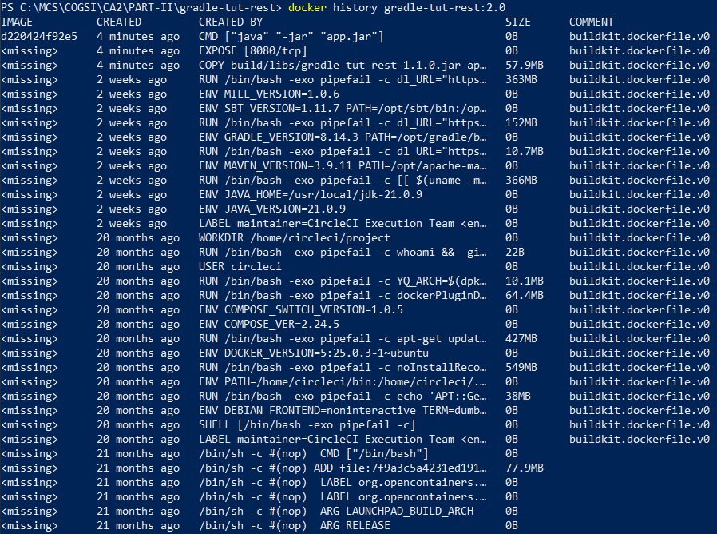

##### Container resource usage
The `docker stats spring-boot-rest-application_v2.0` command provides real-time resource usage statistics for the
`sping-boot-rest-application_v2.0` container, including **CPU percentage**, **memory usage relative to the limit**, 
**network input/output**, **block device input/output**, and the **number of processes or threads (PIDs) created by the
container**.

The following image is the expected output you should get after running the previously mentioned command.

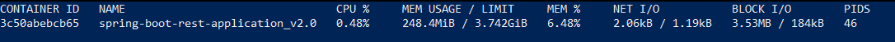

### Multi-Stage builds

#### Simple Chat Application

#### Spring Boot Rest Application

### Publish all images to Docker Hub

## Part II
The goal for the second part of the class assignment is to create a containerized environment for running the Spring 
Boot Rest Application. You will implement a solution similar to CA3-P2, but this time using Docker instead of Vagrant.

To achieve this goal, you'll be using **Docker Compose** to create **two** containers. One of the containers will host 
the Spring Boot Rest Application and the other will run the H2 database server.

Additionally, ensure both containers can resolve each other's hostname, and configure a health-check on the db 
container, so that the web service only starts after the database is available.

Next, use a Docker volume in the db container to persist the database file. That way you ensure that the data is stored 
outside the container’s filesystem and can be retained and reused across container restarts.

Define environment variables in both containers to store sensitive information (database configurations to 
Spring Boot Rest Application, such as DB URL, username, password, etc...)

Finally, publish both images (db and web) to **Docker Hub**.

# Alternative Technologies
In this section you'll be introduced to some alternative technologies to Docker and how one could implement 
**CA5-Part2**. 

In our case, we used `Podman` and incorporated a few additional features. Since Docker and Podman are 
very similar, the difference between the two implementations would be minimal without the additional features. 

To conclude this class assignment, we will also give an honourable mention to **Kubernetes (K8s)**. 

## Rocket

## Podman

### Implementation

## Kubernetes

# Self-Evaluation
```bash
Daniel (12500503) - ??%
Diogo (1250506) - ??%
Pedro (1250545) - 100%
```